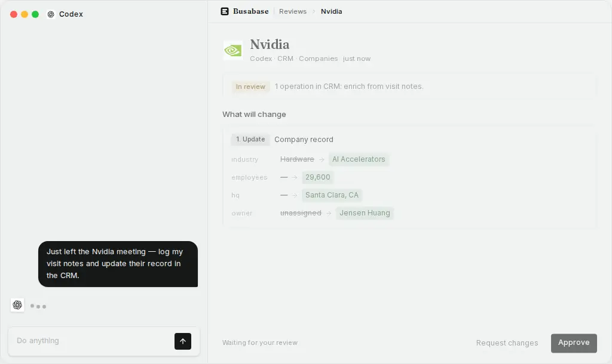
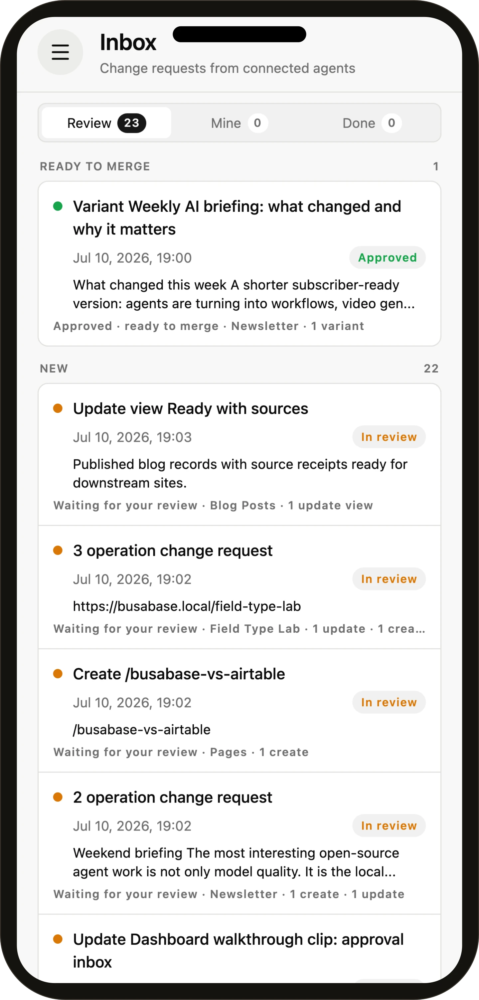
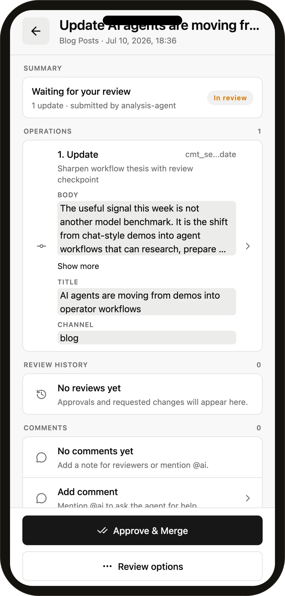
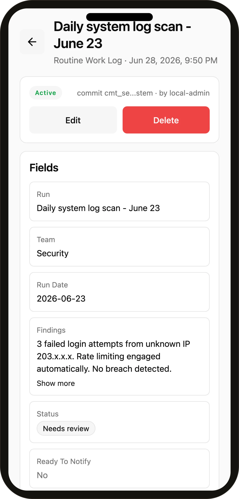

<div align="center">

<picture>
  <source media="(prefers-color-scheme: dark)" srcset="./apps/busabase/public/icon-dark.svg" />
  
</picture>

<h1>Busabase</h1>

<p><b>Database &amp; Workspace for AI Agents</b><br/>
Give Claude Code, Codex, Cursor, OpenClaw, and your own agents one place for structured data, durable knowledge, reusable skills, runnable apps, and a reviewable history of every change.</p>

<p>
<a href="./apps/busabase/docs/README_zh-CN.md">中文</a> &nbsp;·&nbsp;
<a href="./apps/busabase/docs/README_ja.md">日本語</a> &nbsp;·&nbsp;
<a href="./apps/busabase/docs/README_ko.md">한국어</a>
</p>

<p>
<a href="https://www.npmjs.com/package/busabase"></a>
<a href="https://www.npmjs.com/package/busabase-cli"></a>
<a href="https://hub.docker.com/r/busabase/busabase"></a>
<a href="https://github.com/busabase/busabase/tree/main/packages/busabase-core/tests"></a>
<a href="https://busabase.com/download"></a>
<a href="https://glama.ai/mcp/connectors/com.busabase/busabase"></a>
<a href="https://opensource.org/licenses/MIT"></a>
<a href="https://github.com/busabase/busabase/stargazers"></a>
</p>

<p>
<a href="#quick-start"><b>Quick Start</b></a> &nbsp;·&nbsp;
<a href="#one-workspace-many-building-blocks">Building Blocks</a> &nbsp;·&nbsp;
<a href="#inside-the-workspace">Screenshots</a> &nbsp;·&nbsp;
<a href="#connect-your-agent">Connect an Agent</a> &nbsp;·&nbsp;
<a href="#personal-desktop-and-cloud">Editions</a>
</p>

<br/>

<a href="#inside-the-workspace"></a>

</div>

> Busabase is an open-source database and workspace for AI agents — agents and people share the same structured data, docs, skills, and apps, and writes that matter become reviewed, trusted records.

AI agents can write code and generate output, but their useful work usually ends up scattered across chats, files, databases, and SaaS tools. On the next run, the agent has to rediscover the context. When it writes back, humans often cannot see what changed or why.

**Busabase gives agents an operational workspace, not another chat window.**

- **Database for agents** — typed Bases, records, relations, views, forms, and assets.
- **Knowledge base for agents** — Docs, Files, Drives, search, history, and provenance.
- **Workspace for agents** — Skills, AirApps, Whiteboards, Workflows, Agents, and shared activity.
- **Trust layer for agent work** — Change Requests, field-level diffs, comments, approvals, commits, and audit trails.

Agents can read the same workspace you see, use its knowledge and skills, build apps on its data, and write improvements back into it. Every write travels as a Change Request, so it carries a message, a diff, an author, and a full history — and your workspace permissions decide whether it merges on the spot or waits in the Inbox for review.

**Free and open source. Local-first. Agent-native. Every change accounted for.**

## Quick Start

### Run it now

```bash
npx busabase server
```

Open **http://localhost:15419/dashboard/local**. No external database, account, or setup is required. Busabase starts with an embedded PGlite database, local file storage, and demo workspace content.

```bash
npm i -g busabase       # install once, then run: busabase server
npx busabase-cli --help # API client for any Busabase server
```

### Docker

```bash
docker run --rm -p 15419:15419 -v ~/.busabase/data:/data busabase/busabase
```

Images are published to Docker Hub (`busabase/busabase`) and GHCR (`ghcr.io/busabase/busabase`).

### Desktop

Download the native app for **macOS, Windows, or Linux** at **[busabase.com/download](https://busabase.com/download)**. Personal Desktop runs locally and works offline; your workspace data does not need to leave your machine.

### From source

```bash
pnpm install
cp apps/busabase/.env.example apps/busabase/.env
pnpm --filter busabase dev
```

The local-start check reports missing dependencies or storage configuration before the dashboard opens. The default development setup stores PGlite data under `.data/busabase` and files under `.data/busabase-storage`.

### Where local data lives

The CLI server and Desktop share one default data root:

```text
~/.busabase/data/
├── pgdata/   # embedded PGlite database
└── storage/  # files and attachments
```

Set `BUSABASE_DATA_DIR`, `PG_DATABASE_URL`, or `STORAGE_URL` to use another location, external Postgres, or S3-compatible storage. Only one process can hold the same PGlite database at a time.

## One Workspace, Many Building Blocks

Busabase is not a database with a few AI buttons. Every building block is a first-class node in the same workspace, addressable by humans, agents, MCP, and OpenAPI.

| Building block | What it gives an agent | What you get |
| --- | --- | --- |
| **Base** | Structured records, field schemas, relations, filters, and views | A real operational database instead of unstructured chat memory |
| **Doc** | Durable Markdown knowledge and operating instructions | Editable, versioned knowledge with provenance |
| **File & Drive** | Files, attachments, and project trees | One place for the artifacts behind agent work |
| **Skill** | Reusable instructions, references, examples, and scripts | Capabilities that travel with the workspace context |
| **AirApp** | Runnable apps backed by workspace data and APIs | Purpose-built interfaces without creating another silo |
| **Whiteboard & Workflow** | Visual context and process definitions agents can read | Shared plans and processes agents can inspect and improve |
| **Inbox & Activity** | Proposed changes and workspace events | Human control, recovery, and a complete audit trail |

Current node types include Folder, Base, Doc, File, Drive, Skill, AirApp, Form, HTML, Whiteboard, and Workflow. See **[Node Types](./apps/busabase/docs/node-types.md)** for the detailed model.

### Start from a template

A template installs a whole workspace app at once — its Bases, views, Docs, sample rows, AirApps, and the Skill manual that tells an agent how the app is meant to be used.

```bash
busabase-cli install https://github.com/busabase/templates/tree/main/templates/busa-crm
```

Browse the catalog at **[busabase.com/templates](https://busabase.com/templates)**, or install any Busabase package from a GitHub URL or a local directory. `--dry-run` prints the plan first, and `--require-review` leaves the package's records and docs as change requests instead of merging them.

## Inside the Workspace


|  |  |
| :---: | :---: |
|  |  |
| **Database** — typed, related, queryable records | **Knowledge base** — durable docs with version history |
|  |  |
| **Skills** — reusable instructions and supporting files | **Apps** — focused interfaces built on workspace data |
|  |  |
| **Whiteboards** — visual context shared with agents | **Workflows** — processes kept beside their data and knowledge |
|  |  |
| **Review** — see exactly what an agent changed | **Provenance** — see the source, reviewer, commit, and history |

### On mobile

Review agent Change Requests and open trusted records from the [Busabase mobile app](https://github.com/busabase/busabase/tree/main/apps/busabase-mobile).

<p align="center">
  
  &nbsp;&nbsp;
  
  &nbsp;&nbsp;
  
</p>

## Connect Your Agent

Busabase has no built-in model. Connect the agent you already use: Claude Code, Codex, Cursor, Gemini CLI, OpenClaw, Hermes, Buda AI, n8n, or your own process.

<details>
<summary><b>Copy the local onboarding prompt</b></summary>

```text
Read and follow the Busabase Agent Skill — it is the single source of truth:
http://localhost:15419/SETUP_SKILL.md

Follow its onboarding to connect to this workspace. Don't choose a merge policy yourself unless I ask for one — submit the change and let Busabase apply my permissions to decide whether it merges now or waits for review. Reply to me in English.
```

</details>

**[Claude Code guide](./apps/busabase/docs/claude-code.md)** explains the local skill and Cloud plugin. **[DeepSeek Harness guide](./apps/busabase/docs/deepseek-harness.md)** covers the `@busabase/dsh-plugin` local integration. **[Bring Your Own Agent](./apps/busabase/docs/bring-your-agent.md)** covers the agent-neutral flow and permanent skill installation.

Agents can connect in four ways:

| Connection | Best for |
| --- | --- |
| **Agent Skill** | Coding agents and local CLIs that can follow workspace instructions |
| **MCP** | Tool-aware agents and IDEs that need typed workspace operations |
| **OpenAPI / CLI** | Apps, scripts, automations, and custom agents |
| **Agents view (ACP)** | Conversational sessions with inline tool activity and permission requests |

Open **Agent Skills** in the sidebar to get the current setup instructions, MCP endpoint, and OpenAPI specification for your running instance.

Busabase's MCP server is also listed on [Glama's MCP connector directory](https://glama.ai/mcp/connectors/com.busabase/busabase), including its live connector score.

## The Trust Loop

Agents need write access to be useful. They also make mistakes. Busabase's answer is not to make every write wait for a human — it is to make every write **accountable**:

```text
Agent reads workspace context
        ↓
Agent writes data, docs, skills, or app changes — always as a Change Request
        ↓
The Change Request carries the diff, the message, the author, and the impact
        ↓
Your permissions decide: it merges on the spot, or it waits in the Inbox
        ↓
Either way the change stays inspectable, attributable, and reversible
```

Review is a capability, not a toll booth. A credential capped at `changeRequest` level can only ever propose; a single call can opt in with `autoMerge: false`; `busabase-cli install … --require-review` holds a package's content back for approval. Anything else that is allowed to write, writes — and still leaves a diff and a history behind.

This path applies across the workspace. A record update, Doc edit, Skill file, schema change, or AirApp package all carry the same message, diff, merge, and audit history.

## What Agents Can Build Here

| Workspace | Agent operation | Trusted result |
| --- | --- | --- |
| **Team memory** | Collect notes, sources, decisions, and operating context | A durable knowledge base future agents can reuse |
| **CRM & research** | Enrich companies, deduplicate records, monitor markets | Verified business intelligence instead of hidden hallucinations |
| **Content system** | Draft posts, docs, pages, metadata, and assets | A headless CMS with an editorial approval trail |
| **Product operations** | Maintain projects, tasks, vendors, policies, and configs | An auditable operational database |
| **Dataset pipeline** | Label examples, attach evidence, score quality | Human-reviewed training and evaluation data |
| **Internal tools** | Build AirApps and workflows over workspace data | Focused apps that inherit the same source of truth |

See **[all use cases](./apps/busabase/docs/use-cases.md)** for complete examples and demo datasets.

## A Different Category

Busabase overlaps with databases and knowledge tools, but it is designed around a different primary operator: the agent.

| Product category | Primary model | Missing when agents do the work |
| --- | --- | --- |
| Human databases (Airtable, Baserow, NocoDB) | People edit rows directly | Agent context, reusable skills/apps, and a native proposal boundary |
| Human knowledge tools (Notion, Confluence, Obsidian) | People write and organize pages | Structured agent operations across data, files, tools, and review |
| Databases (Postgres) | Applications read and write storage | A workspace UI, knowledge model, review loop, and provenance |
| Agent runtimes and chat tools | Agents execute tasks and produce output | A durable system of record shared across agents and future sessions |
| **Busabase** | Agents and humans build one workspace together | Database + knowledge + skills + apps — output that accumulates instead of evaporating |

Change Requests are not the category; they are the mechanism that makes an agent workspace dependable.

## Personal Desktop and Cloud

Both editions use the same Busabase core and change model.

| Personal Desktop / local | Busabase Cloud |
| --- | --- |
| Open source and free | Hosted, multi-user workspace |
| Local PGlite and file storage | Managed Postgres and object storage |
| No login required | Authentication, Spaces, roles, and permissions |
| Works offline | Collaboration, hosted APIs, and governance |
| Data stays on your machine | Access from web and mobile |

**Cloud Connect** can link a local workspace to [Busabase Cloud](https://busabase.com) through an authenticated tunnel. The local machine keeps the data and can run local agents; Cloud and mobile become controlled windows onto that workspace.

## API Surface

Busabase exposes the workspace through **MCP**, **OpenAPI**, and `busabase-cli`. Agents can discover nodes, search content, read file trees, work with records, and create reviewable changes without scraping the UI.

Typical resources include:

- nodes, folders, and search
- Bases, fields, views, records, and forms
- Docs, files, assets, Drives, and Skills
- AirApps, Whiteboards, Workflows, and HTML nodes
- Change Requests, operations, reviews, comments, and commits
- activity, audit events, webhooks, and agent tasks

Open the machine-readable API documentation at:

```text
http://localhost:15419/api/v1/doc
```

## Architecture

<div align="center">
  
</div>

`apps/busabase` is the local, single-workspace Next.js shell. The workspace engine lives in `packages/busabase-core`: nodes, records, file trees, rich node types, review primitives, search, agents, and API contracts. [Busabase Cloud](https://busabase.com) runs the same engine with multi-tenant identity, permissions, hosted storage, and collaboration.

The local edition is login-free by construction. It uses a fixed local actor and Space, embedded PGlite by default, and local storage. Cloud supplies real actor and Space context to the shared engine.

## Security

The open-source server is designed for a trusted local machine or private network. Do not expose write endpoints directly to the public internet without authentication and a properly configured reverse proxy. Use scoped credentials and Cloud Connect when remote access is required.

## Contributing

```bash
pnpm install
pnpm --filter busabase dev
pnpm --filter busabase typecheck
pnpm --filter busabase lint:err
```

Bug reports, feature ideas, docs, and pull requests are welcome in [Issues](https://github.com/busabase/busabase/issues) and [Discussions](https://github.com/busabase/busabase/discussions).

## Community

- [Busabase website](https://busabase.com)
- [Documentation](https://busabase.com/docs)
- [Community Forum](https://busabase.com/community)
- [GitHub Discussions](https://github.com/busabase/busabase/discussions)

## Star History

<a href="https://star-history.com/#busabase/busabase&Date">
  
</a>

## License

[MIT](./LICENSE) © Busabase
