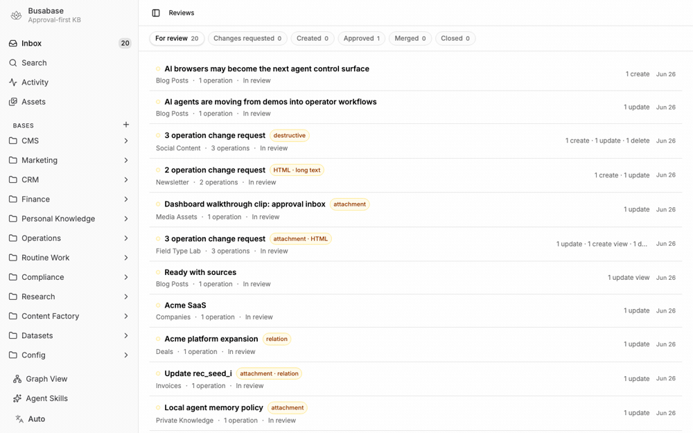
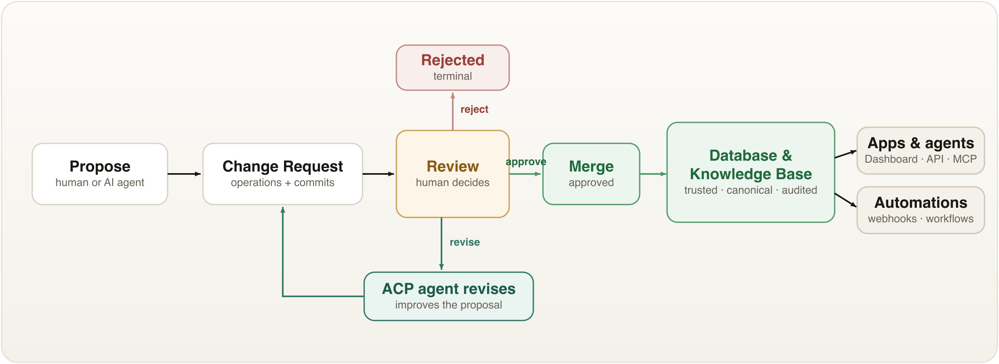

<div align="center">

<picture>
  <source media="(prefers-color-scheme: dark)" srcset="./public/icon-dark.svg" />
  
</picture>

<h1>Busabase</h1>

<p><b>Local-first review database for AI-generated content, business data, datasets &amp; multimodal knowledge.</b><br/>
AI can generate endless data — Busabase is where you <b>review, approve, and merge</b> what's good enough to trust.</p>

<p>
<a href="./docs/README_zh-CN.md">中文</a> &nbsp;·&nbsp;
<a href="./docs/README_ja.md">日本語</a> &nbsp;·&nbsp;
<a href="./docs/README_ko.md">한국어</a>
</p>

<p>
<a href="https://www.npmjs.com/package/busabase"></a>
<a href="https://www.npmjs.com/package/busabase-cli"></a>
<a href="https://hub.docker.com/r/busabase/busabase"></a>
<a href="https://busabase.com/download"></a>
<a href="https://opensource.org/licenses/MIT"></a>
<a href="https://github.com/busabase/busabase/stargazers"></a>
</p>

<p>
<a href="#quick-start"><b>Quick Start</b></a> &nbsp;·&nbsp;
<a href="#screenshots">Screenshots</a> &nbsp;·&nbsp;
<a href="#what-you-can-build-with-busabase">Use Cases</a> &nbsp;·&nbsp;
<a href="#api-surface">API</a> &nbsp;·&nbsp;
<a href="#busabase-vs-airtable-notion-and-postgresql">Compare</a> &nbsp;·&nbsp;
<a href="#roadmap">Roadmap</a>
</p>

<br/>

<a href="#screenshots"></a>

</div>

Busabase is a **free and open-source** ([MIT](https://opensource.org/licenses/MIT)) app for one simple problem:

**AI can generate endless content and data, but someone still needs to decide what is good enough to trust.**

Busabase gives that approval process a home — an approval-first database and knowledge base for AI agents. It is a private CMS, project database, and structured source of truth with built-in Change Requests, Operations, comments, audit trails, and a simple API for apps and AI agents.

```txt
AI agent or human proposes data -> review -> approve -> merge -> trusted record/API
```

**Free & open source. Local-first. Review-first. Agent-ready.**
Run it yourself — no SaaS, no account, no vendor. Your data never has to leave your machine.

## Quick Start

Pick whichever way you like — all of them give you the same review-first database.

### ⚡ Run it now — one command, zero setup

```bash
npx busabase server
```

Open **http://localhost:15419/dashboard/inbox**. That's the whole setup: a full local
instance with **embedded PGlite and local file storage — no database to run, nothing to
configure.** Busabase seeds example Bases, records, and Change Requests on first request,
so you can inspect the review workflow immediately.

```bash
npm i -g busabase     # install once, then just: busabase server
npx busabase-cli --help   # the API client on its own (talks to any busabase server)
```

### 🐳 Docker

```bash
docker run --rm -p 3000:3000 busabase/busabase
```

Open **http://localhost:3000/dashboard/inbox**. Defaults to local PGlite persistence — no
external services. Images are published to Docker Hub (`busabase/busabase`) and GHCR
(`ghcr.io/busabase/busabase`).

### 🖥️ Desktop app

Prefer a native app? Download Busabase for **macOS, Windows, and Linux** at
**[busabase.com/download](https://busabase.com/download)**. Fully native and fully offline —
**all your data stays on your computer, never online.**

### 🔧 From source

```bash
pnpm install
cp apps/busabase/.env.example apps/busabase/.env
pnpm --filter busabase dev
```

Open **http://localhost:15419/dashboard/inbox**. A local-start check runs first: if
dependencies, `PG_DATABASE_URL`, or `STORAGE_URL` are missing, it fails with a setup message
instead of a blank dashboard. The default `.env.example` uses PGlite under `.data/busabase`
and local file storage under `.data/busabase-storage`.

---

**What you get after launch:**

- an Inbox for reviewing Change Requests
- example Bases and records
- record-level history and audit trails
- local PGlite persistence under `.data/busabase`
- REST API endpoints for apps, workflows, and AI Agents

## Screenshots

|  |  |
| :---: | :---: |
|  |  |
| Inbox with pending Change Requests, reviewer status, and approval actions | Agent-proposed changes before merge, including field diffs and reviewer actions |
|  |  |
| Record detail page with fields, comments, review history, and lineage | Base table showing structured records and rich fields |
|  |  |
| Records inside a Base — typed fields, rich values, and approval status at a glance | Graph view showing relationships between seeded records across Bases |

## Why This Exists

Most databases are good at storing data. Most CMS tools are good at publishing content. Most code platforms are good at reviewing files.

Busabase is for the middle layer that AI-heavy teams now need:

| Need | Busabase gives you |
| --- | --- |
| AI drafts a blog post | Review it before it becomes a published CMS record |
| Humans clean QA data | Approve high-quality examples before training or evaluation |
| Agents label videos | Check multimodal metadata before it enters the dataset |
| Agents update project or ERP data | Human reviewers approve changes before the system of record changes |
| A local AI tool needs memory | Expose a private, audited API over approved knowledge |
| Data changes should trigger work | Fire webhooks, automations, or external agents after approved merges |
| Someone changes a record | Track who proposed, reviewed, merged, viewed, or deleted it |

It is approval-first by default, agent-friendly by design, and still small enough to run locally.

## How It Works



Core concepts:

| Concept | Meaning |
| --- | --- |
| Base | A table-like collection of records |
| Field | A typed property on a Base |
| Record | An approved row of data |
| Change Request | A reviewable proposal to change data |
| Operation | A create, update, delete, or variant action inside a Change Request |
| Commit | Immutable data snapshot behind an Operation |
| Comment | Discussion attached to records, Change Requests, operations, or commits |
| Audit Event | A trail of important reads, writes, reviews, merges, and deletes |

## What You Can Build With Busabase

### Blog CMS for Next.js

Use Busabase as a local CMS for a blog or editorial workflow.

Create a `Blog` base with fields like:

| Field | Type |
| --- | --- |
| Title | text |
| Slug | text |
| Body | markdown |
| HTML Preview | html |
| Tags | multiselect |
| Publish Date | date |
| Status | select |

Then your flow becomes:

1. AI or a writer creates a Markdown post.
2. The post enters Busabase as a Change Request.
3. A reviewer checks the content, metadata, and links.
4. The approved post is merged into the trusted base.
5. A Next.js app reads the Busabase API and renders the blog.

Screenshots (capture with `?demo=blog`):

| Blog base | Draft proposal |
| --- | --- |
|  |  |
| Blog Posts base with title, slug, status, tags, and publish date fields | Agent or writer submits a Markdown post as a Change Request |
|  |  |
| Reviewer checks body, metadata, links, and HTML preview | Approved post appears as a trusted record for the Next.js app |

### SEO Landing Pages

Use Busabase to manage and review AI-generated HTML landing pages before they go live.

Create an `SEO` folder containing a `Pages` base with fields like:

| Field | Type | Purpose |
| --- | --- | --- |
| Slug | text | URL path, e.g. `/pricing` or `/vs-notion` |
| Title | text | `<title>` tag value |
| Meta Description | text | `<meta name="description">` content |
| Target Keywords | text | Primary keyword(s) the page targets |
| HTML Body | html | Full page HTML — embedded directly by Next.js |
| Status | select | Draft, In Review, Live, Archived |
| Page Score | number | SEO or conversion quality score from the reviewer |
| Notes | text | Reviewer notes on copy, structure, or accuracy |

Then your flow becomes:

1. An AI agent generates a complete HTML landing page for a keyword or product comparison.
2. The page enters Busabase as a Change Request in the `Pages` base.
3. A reviewer checks HTML structure, copy quality, meta tags, and keyword targeting.
4. The reviewer approves or asks the agent to revise.
5. The approved record is merged into the trusted base.
6. A Next.js route reads the Busabase API by slug and renders the `html` field directly:

```tsx
// app/lp/[slug]/page.tsx
export default async function LandingPage({ params }: { params: { slug: string } }) {
  const record = await busabase.records.find({ baseSlug: "pages", slug: params.slug });
  return <div dangerouslySetInnerHTML={{ __html: record.fields.html_body }} />;
}
```

This makes it practical to maintain dozens or hundreds of high-quality SEO pages with full human oversight over what gets published, and a clear revision history for every page.

Screenshots (capture with `?demo=seo-pages`):

| Pages base | Draft proposal |
| :---: | :---: |
|  |  |
| SEO Pages base with slug, title, meta description, target keywords, and HTML body | Agent proposes a complete HTML landing page as a Change Request |
|  |  |
| Reviewer checks HTML quality, copy, meta tags, and keyword targeting | Approved page record — Next.js renders it as a live landing page |

### Configuration Management

Use Busabase to store and version service configurations as YAML and JSON. An AI agent proposes config changes — rate limit increases, feature flags, environment overrides — as Change Requests. The team reviews the exact diff before anything reaches production.

The new **Code field type** (supporting JSON, YAML, TypeScript, SQL, Bash, and more) renders configurations with full syntax highlighting directly in the table, the record detail view, and the review diff.

Example base:

| Field | Type | Purpose |
| --- | --- | --- |
| Service | Text | Service name (e.g. `api-gateway`) |
| Environment | Select | `development` / `staging` / `production` |
| Config (YAML) | Code — yaml | Main configuration file |
| Overrides (JSON) | Code — json | Runtime environment variable overrides |
| Status | Select | `active` / `degraded` / `maintenance` |
| Deployed At | Date | Last successful deploy date |
| Notes | Long Text | Context for the current config |

When `config-agent` detects traffic projections require a rate limit change, it creates a Change Request showing the exact YAML diff. The reviewer sees highlighted `before` and `after` values side-by-side and approves or requests changes — no guesswork about what changed.

```tsx
// Next.js: read a config record and apply it at startup
const config = await busabase.records.find({ baseSlug: "services", name: "api-gateway" });
const parsed = yaml.parse(config.fields.config);
applyRateLimit(parsed.rate_limit.requests_per_minute);
```

Screenshots (capture with `?demo=config-mgmt`):

| Services base | Rate limit proposal |
| :---: | :---: |
|  |  |
| Services base with YAML and JSON code fields | config-agent proposes a rate limit increase |
|  |  |
| Reviewer sees the exact YAML diff highlighted | api-gateway record with syntax-highlighted config |

### Finance and Invoice Review

Use Busabase for finance workflows where automation helps, but trust still matters.

An agent can read invoices, orders, receipts, and payment records, then propose matched records for review. A finance teammate can approve the match, reject suspicious rows, or ask the agent to explain a mismatch.

This works well for:

- invoice reconciliation
- expense review
- order-to-payment matching
- renewal checks
- vendor record cleanup

Screenshots (capture with `?demo=finance`):

| Finance records | Match proposal |
| --- | --- |
|  |  |
| Invoices, orders, receipts, payments, or vendor records in a finance base | Agent proposes invoice matching, expense categorization, or renewal cleanup |
|  |  |
| Finance reviewer checks mismatches, suspicious rows, and explanation notes | Approved reconciliation record with review and audit trail |

### Data Stewardship and CRM Hygiene

Use Busabase as a review queue for keeping business data clean.

Agents can scan records for duplicates, stale status, missing fields, inconsistent categories, or incomplete customer profiles. Instead of editing the database directly, they submit Change Requests that a human can review.

Examples:

- merge duplicate companies or contacts
- enrich CRM records with websites, industries, or owner notes
- update lifecycle stages after sales conversations
- normalize tags across messy records
- flag missing consent, contract, or billing information

Screenshots (capture with `?demo=crm`):

| CRM records | Hygiene proposal |
| --- | --- |
|  |  |
| Company or contact records with stale, duplicate, or incomplete fields | Agent proposes dedupe, enrichment, lifecycle updates, or tag normalization |
|  |  |
| Data steward reviews field-level differences before merge | Clean approved CRM record with audit history |

### Compliance and Audit Checklists

Use Busabase for recurring checks that need evidence.

Each checklist item can be a record. Each update can be a Change Request. Each approval leaves an audit event.

Examples:

- weekly access reviews
- vendor compliance checks
- policy acknowledgement logs
- data-retention checks
- security exception reviews

Screenshots (capture with `?demo=compliance`):

| Checklist base | Evidence proposal |
| --- | --- |
|  |  |
| Access review, vendor compliance, policy, retention, or exception checklist records | Agent proposes evidence, status, owner, or due-date updates |
|  |  |
| Reviewer validates evidence before approving the checklist item | Approved compliance record with immutable audit events |

### High-Quality QA and Training Datasets

Use Busabase to build datasets for model training, evaluation, RAG, and benchmark work.

Example base:

| Field | Purpose |
| --- | --- |
| Question | User input or task |
| Answer | Expected response |
| Source | Where the example came from |
| Domain | Topic or business area |
| Difficulty | Easy, medium, hard |
| Quality Score | Reviewer score |
| Reviewer Notes | Human feedback |

Instead of anonymous CSV edits, every accepted row has a review history.

Screenshots (capture with `?demo=dataset`):

| Dataset base | Agent labels |
| --- | --- |
|  |  |
| QA examples table with question, answer, source, difficulty, and quality score | Agent proposes labels, explanations, or corrected answers as a Change Request |
|  |  |
| Reviewer scores quality and requests revisions when needed | Approved examples show review history for training or evaluation export |

### Multimodal Content Review

Busabase is designed for more than text.

A `Video Clips` base can include:

| Field | Purpose |
| --- | --- |
| Video | Source video or attachment |
| Transcript | Speech-to-text result |
| Scene Description | Human or AI description |
| Detected Objects | AI-generated labels |
| Tags | Search and routing |
| Usage Rights | Legal or licensing status |
| Review Status | Approval state |

An AI agent can describe the video, extract metadata, and propose tags. A human can approve the record before it enters the final media library, search index, or training corpus.

Screenshots (capture with `?demo=media`):

| Media base | Metadata proposal |
| --- | --- |
|  |  |
| Video Clips base with transcript, scene description, detected objects, and usage rights | Agent proposes tags, captions, scene labels, and rights metadata |
|  |  |
| Reviewer inspects media fields and approves or rejects unsafe metadata | Approved clip record is ready for media library, search, or dataset use |

### Market Intelligence and Research Monitoring

Use Busabase as a human-reviewed research feed.

Agents can monitor sources, summarize changes, and propose records. Humans approve the useful findings into a trusted base.

Examples:

- competitor pricing changes
- product launch tracking
- industry news monitoring
- investment research notes
- customer research synthesis

Screenshots (capture with `?demo=research`):

| Research feed | Finding proposal |
| --- | --- |
|  |  |
| Market intelligence base with sources, topics, competitors, and importance | Agent proposes summarized findings from monitored sources |
|  |  |
| Analyst reviews citations, relevance, and confidence before approval | Approved research record ready for reports, dashboards, or agent memory |

### Content Factory Pipeline

Use Busabase to coordinate content production from idea to published asset.

Each record can represent an idea, outline, draft, image, video, SEO plan, or publishing task. Agents can produce drafts and metadata, while humans approve key transitions.

Examples:

- topic ideation
- draft review
- image or video metadata approval
- SEO title and description review
- publish-ready content records

Screenshots (capture with `?demo=content`):

| Content pipeline | Creative proposal |
| --- | --- |
|  |  |
| Ideas, outlines, drafts, assets, SEO plans, and publishing tasks in one base | Agent proposes a draft, title, metadata, or asset update |
|  |  |
| Editor reviews content quality, SEO fields, and publishing readiness | Approved publish-ready record with production history |

### Dataset Labeling Pipeline

Use Busabase to combine agent-first labeling with human review.

Agents can pre-label examples, generate tags, write explanations, or score quality. Humans review the proposed labels before they enter the final dataset.

Examples:

- image caption review
- video scene labeling
- QA pair approval
- harmful content classification
- benchmark answer verification

Screenshots (capture with `?demo=labeling`):

| Labeling queue | Pre-label proposal |
| --- | --- |
|  |  |
| Dataset items awaiting captions, tags, scores, or benchmark answers | Agent proposes labels, explanations, classifications, or quality scores |
|  |  |
| Human reviewer corrects or approves labels before they enter the dataset | Approved labeled examples with review history for export |

### Approval-Based Project Management and ERP

Use Busabase as a lightweight approval layer for operational data.

Traditional project management and ERP systems often become the single source of truth for a team. The hard part is keeping that truth clean when humans and agents are both allowed to suggest changes.

Busabase can model operational bases such as:

| Base | Example records |
| --- | --- |
| Projects | roadmap items, milestones, owners, status |
| Tasks | assignments, due dates, priority, progress |
| Vendors | contacts, contracts, renewal dates |
| Inventory | items, quantities, locations, reorder status |
| Orders | customer requests, fulfillment status, invoices |
| Assets | documents, media, equipment, licenses |

In this model:

1. Agents can collect updates, reconcile messy data, or suggest status changes.
2. Humans review the proposed changes as Change Requests.
3. Approved Operations are merged into the source of truth.
4. Downstream tools read trusted records through the API.

This makes Busabase useful as a small, auditable data operating system: humans keep authority over trust, while AI agents help with collection, cleanup, enrichment, and routine updates.

Screenshots (capture with `?demo=operations`):

| Operations base | Status proposal |
| --- | --- |
|  |  |
| Projects, tasks, vendors, inventory, orders, or assets base as operational truth | Agent proposes status changes, reconciled fields, or missing operational data |
|  |  |
| Manager reviews the proposed Operations before they affect the source of truth | Approved operational record and downstream API-ready data |

### Canonical System of Record

Use Busabase as the **system of record** — the single place that holds the canonical, approved version of each record, no matter how many humans and AI agents are writing to it.

In most AI-heavy stacks, "the data" ends up scattered: a draft in a doc, a row in a spreadsheet, an agent's output in a queue, a value in a downstream app. Nobody can say which copy is authoritative. Busabase makes that explicit:

- **Canonical records** live in a Base. They are the approved truth, and the only version downstream systems should trust.
- **Proposals are not canonical.** Drafts, agent outputs, and edits arrive as Change Requests and stay separate until a reviewer merges them.
- **Every canonical record has lineage.** Each record points at the commit it was merged from, so you can always answer who proposed it, who approved it, and what it replaced.

```txt
many writers (humans + agents) -> Change Requests -> review -> canonical record -> read by everything else
```

This makes Busabase the hub other tools read from instead of writing to:

| Consumer | Reads canonical records for |
| --- | --- |
| Apps and sites | rendering approved content and data |
| Search and RAG indexes | indexing only trusted, current values |
| AI agents and tools | grounded memory they cannot silently overwrite |
| Downstream databases | a clean, audited upstream to sync from |
| Reports and dashboards | numbers everyone agrees are official |

Because writes are reviewed and reads are canonical, Busabase can sit in front of a messier database (or several) as the **approval and truth layer** — the place where a value officially becomes real.

Screenshots (capture with `?demo=canonical`):

| Canonical records | Proposal queue |
| --- | --- |
|  |  |
| Base table with approved records as the source of truth | Change Requests from multiple writers before they become canonical |
|  |  |
| Reviewer compares proposed field changes before merge | Record lineage and audit trail after approval |

### Local Personal Knowledge Base

Run Busabase on your own machine as a private database for you and your AI tools.

- Store private notes, research, links, files, and structured records.
- Expose a local or private-network API to trusted AI agents.
- Let AI read approved knowledge without giving it uncontrolled write access.
- Audit reads, writes, reviews, merges, and deletes.
- Keep data local with PGlite persistence under `.data/busabase`.

Screenshots (capture with `?demo=knowledge`):

| Private knowledge | Local agent proposal |
| --- | --- |
|  |  |
| Local notes, research, links, and files organized in a private base | Local agent proposes a new note or enrichment without direct write access |
|  |  |
| Human reviews the proposed private knowledge update on the local dashboard | Audit trail shows approved reads, writes, reviews, and merges |

### Verified Routine Work

Use Busabase for daily or weekly work that must be completed, reviewed, and recorded.

For example, a support team can run a daily customer-service quality check:

| Step | Human or agent action |
| --- | --- |
| Assign | Create today's review task for an agent or operator |
| Execute | Agent reviews conversations, classifies issues, and flags risky replies |
| Preview | Reviewer sees the agent's proposed records before they touch the source of truth |
| Approve | Human approves, rejects, or asks the agent to revise |
| Merge | Approved results become a trusted quality log |
| Trigger | Webhook notifies the team or starts the next workflow |

This is not about forcing people to do tasks. It is about routine work that needs a reliable trail:

- what work was assigned
- who or which agent performed it
- what result was proposed
- what changed during review
- who approved it
- when it became part of the trusted database

Other good fits:

- daily content publishing checks
- weekly customer research updates
- invoice reconciliation
- inventory checks
- dataset quality reviews
- support ticket classification
- compliance checklist reviews
- agent-generated market monitoring reports

Screenshots (capture with `?demo=routine`):

| Routine task log | Agent work result |
| --- | --- |
|  |  |
| Daily or weekly review task records assigned to an agent or operator | Agent submits completed work, classifications, or flagged issues as a proposal |
|  |  |
| Reviewer approves, rejects, or asks for a revised result | Trusted quality log with trigger or notification after merge |

### Field Type Lab

Use Busabase to verify every supported field type and review operation in one local scenario.

The seeded `Field Type Lab` base includes text, long text, Markdown, HTML, attachment, relation, number, date, checkbox, select, multiselect, URL, email, phone, created/updated metadata fields, auto number, AI summary, and AI tags. Its review request shows a full field-level diff and view operations, so seed and demo data exercise the same surfaces that real bases use.

Screenshots (capture with `?demo=field-types`):

| Field type base | Coverage proposal |
| --- | --- |
|  |  |
| Field Type Lab base with every supported field type | Agent proposes all-field coverage changes for review |
|  |  |
| Reviewer checks attachment, relation, AI, system, and scalar field diffs | Approved all-field record with review history |

## Automation and ACP Agents

Busabase can become an event source for data workflows.

During review, a human can ask an ACP-compatible agent to improve the Change Request before it is merged:

- clean fields
- enrich missing metadata
- normalize categories
- rewrite a draft
- generate summaries or tags
- check policy, quality, or consistency

After merge, approved data can trigger downstream automation:

- send a webhook
- update an external system
- notify a reviewer or channel
- refresh a Next.js site
- kick off an ETL or dataset export
- call an external ACP Agent to continue the workflow

That makes Busabase more than a place to store data. It becomes a controlled handoff point between humans, applications, and agents.

## Local Agents Operate Your Knowledge Base

Busabase is built to be driven by the agents already running on your own computer.

Because the API is local and trusted, you can point coding and automation agents — **OpenClaw, Codex, Claude Code, Hermes**, and similar local skills — directly at your Busabase instance. They can read approved knowledge, run skills against it, and propose changes back as Change Requests.

What a local agent can do with Busabase:

- read your private, approved knowledge as grounded context
- run a local skill that queries or summarizes your bases
- propose new records or edits as reviewable Change Requests
- enrich, clean, or label data without uncontrolled write access
- wait for human approval before anything becomes trusted

The pattern is simple:

```txt
Local agent reads approved knowledge ->
proposes a Change Request ->
you review on your own machine ->
approve -> merged into your local source of truth
```

This keeps the loop entirely on your hardware. The agent gets a real, structured memory to work against, and you keep authority over what becomes trusted — no private data has to leave your computer for any of it to work.

> If OpenClaw is the revolution for **agents** on your local computer, then BusaBase is the revolution for the **database and knowledge base** on your local computer.

## What Busabase Cares About

Busabase is not just asking "what is the latest value in this row?"

It also asks:

- Who proposed this data?
- Why should it change?
- Which fields changed?
- Is this a create, update, delete, or variant operation?
- What did the AI Agent produce before it was accepted?
- Who reviewed the agent output?
- Did a human ask the agent to revise?
- Was the proposal merged or rejected?
- What automation ran after merge?
- Can we trace the decision later?

That makes Busabase especially useful for AI Agent work. Agents can produce drafts, labels, summaries, reconciliations, or operational updates, but Busabase gives humans a preview layer before those outputs become trusted data.

## Busabase vs Airtable, Notion, and PostgreSQL

Busabase overlaps with familiar tools, but it is optimized for a different job.

| Tool | Great for | What Busabase adds |
| --- | --- | --- |
| [Airtable](https://www.airtable.com/) | Flexible cloud tables and team workflows | Local-first ownership, approval-first data changes, agent output preview, operation history, and audit trails |
| [Notion](https://www.notion.com/) | Cloud docs, databases, and team knowledge | Local/private data workspaces with structured review flow for records that become trusted data |
| [PostgreSQL](https://www.postgresql.org/) | Reliable storage and querying | Human-readable Change Requests, reviews, comments, and automation around data changes |
| [GitHub Pull Requests](https://docs.github.com/en/pull-requests) | Code review over file diffs | Record-based review for content, datasets, CRM rows, tasks, and multimodal data |

In short:

```txt
Airtable stores flexible data.
PostgreSQL stores reliable data.
Notion organizes team knowledge.
Busabase reviews proposed data before it becomes truth.
```

Busabase is local-first. Your data can stay on your machine or private network by default. Future cloud and tunnel modes are optional ways to share selected access, not the only place your data can live.

## Busabase vs Airtable, APITable, and Database Tools

Busabase is a database with rich fields, just like [Airtable](https://www.airtable.com/), [APITable](https://github.com/apitable/apitable), [NocoDB](https://nocodb.com/), or [Baserow](https://baserow.io/). The difference is what it is optimized around: **AI agents writing data, and humans approving it.**

| Tool | Built around | What Busabase is built around |
| --- | --- | --- |
| [Airtable](https://www.airtable.com/) | Cloud tables for human teams | Local-first tables where agents propose and humans approve |
| [APITable](https://github.com/apitable/apitable) | Open-source Airtable alternative, API-first | API-first **plus** a review layer between proposal and trusted record |
| [NocoDB](https://nocodb.com/) | Self-hosted spreadsheet UI on top of your existing SQL database | A self-contained local database where every write is a reviewable Change Request, not a direct row edit |
| [Baserow](https://baserow.io/) | Self-hosted no-code database | Self-hosted database with Change Requests, audit trails, and agent hooks |
| Generic SQL admin | Direct reads and writes | Reviewed writes — agents never edit the source of truth directly |

These tools all assume the writer is a trusted human (or a script you wrote). Busabase assumes the writer is often **an AI agent**, and that not every agent write should be trusted automatically.

So Busabase adds the things an agent-driven database needs:

- **A proposal layer.** Agents submit Change Requests instead of editing rows directly.
- **A preview before merge.** You see exactly what the agent produced and which fields changed.
- **A revise loop.** You can ask the agent to fix the proposal before it is accepted.
- **An audit trail.** Every read, write, review, merge, and delete is traceable.
- **A local, trusted API.** Built for agents on your own machine, not just human spreadsheet users.

```txt
Airtable and APITable: a database for people to edit.
Busabase: a database for agents to propose and people to approve.
```

If you only need a flexible table for human teammates, [Airtable](https://www.airtable.com/) or [APITable](https://github.com/apitable/apitable) are great. If AI agents are doing the writing and you need a trustworthy gate in front of your data, that gate is what Busabase adds.

## Busabase vs Confluence, Lark, and Wiki Tools

Busabase looks a lot like a wiki or team knowledge tool at first glance. The difference is where your data lives and who can touch it.

| Tool | Where data lives | What Busabase does differently |
| --- | --- | --- |
| [Confluence](https://www.atlassian.com/software/confluence) | Vendor cloud or hosted server | Runs on your own machine first; data never has to leave it |
| [Lark](https://www.larksuite.com/en_sg/) / [Feishu Wiki](https://www.feishu.cn/hc/en-US/articles/539198317919-get-started-with-wiki) | Vendor cloud | Local-first ownership with review, audit, and an agent-ready API |
| [Notion](https://www.notion.com/) | Vendor cloud | A pure, structured local knowledge base instead of a hosted workspace |
| [Obsidian](https://obsidian.md/) | Local Markdown files | Local too, but a structured database for AI agents — with Change Requests, approval, and audit — not human notes |
| Generic team wiki | Shared server | Approval-first records and audit trails, not free-form pages |

The key idea:

```txt
Confluence and Lark host your knowledge for you.
Busabase keeps your knowledge with you.
```

[Obsidian](https://obsidian.md/) is the closest in spirit — it is local-first too. The difference is direction: Obsidian is **notes** for a human thinker (free-form Markdown files), while Busabase is a **structured database for AI agents**, where writes flow through Change Requests, approval, and audit. If Obsidian is your local brain for writing, Busabase is your local source of truth for data that agents propose and you approve.

With Busabase, the database points at your **local computer** first. When you want to reach it from outside, you turn on a tunnel (intranet penetration / controlled exposure) and connect your local instance to the cloud edge. The data itself still does not leave your machine.

That is the biggest difference:

- **Self-hostable by default.** It is meant to run on your own hardware, not someone else's cloud.
- **Your data stays yours.** Private knowledge never has to be uploaded to a vendor to be useful.
- **Tunnel, do not migrate.** Expose selected endpoints over a tunnel when you need remote or agent access, instead of copying everything into a central cloud database.
- **And it is free and open-source.**

Compared to [Notion](https://www.notion.com/) and similar tools, Busabase intentionally skips the large pile of built-in AI features. It is not trying to be an all-in-one AI workspace. It is a **pure, local-first knowledge base and database** with review and approval built in — small, private, and easy to point your own agents at.

## Busabase vs Pull Requests

Busabase is not trying to replace GitHub pull requests.

| If you review... | Use... |
| --- | --- |
| Source code, files, branches, diffs | [GitHub Pull Requests](https://docs.github.com/en/pull-requests) |
| Blog posts, QA pairs, dataset rows, video annotations, knowledge records | Busabase Change Requests |

Code review is file-based. Busabase review is record-based.

That distinction matters when the thing being reviewed is not a repository, but a growing body of structured and multimodal knowledge.

## Features

- Local-first open-source app
- Built-in review workflow
- Change Requests with multiple Operations
- Create, update, delete, and variant operations
- Commit history for record changes
- Comments on records and review objects
- Audit events for reads and writes
- Markdown, HTML, links, files, relation fields, and rich field types
- Search-ready indexed field values
- REST API for apps, workflows, and AI agents
- Human-in-the-loop collaboration for agent-proposed changes
- AI Agent output preview before merge
- Single source of truth for approved operational records
- Automation triggers after approved data changes
- ACP Agent hooks during review and after merge
- PGlite local persistence
- Docker-friendly deployment

## API Surface

Busabase exposes a simple local REST API for dashboard clients, apps, and AI agents.

Typical resources include:

- Bases and nodes
- Records
- Search
- Comments
- Change Requests
- Reviews
- Merge actions
- Activity and audit events

The API is meant for trusted local or private-network usage in the open-source version.

### Agent Proposal Example

This is the core agent loop: read the schema, submit a proposal, review it in the UI, then read the
canonical record after merge.

```bash
# 1. Find the Blog Posts base.
BLOG_BASE_ID=$(curl -s http://localhost:15419/api/v1/bases \
  | jq -r '.[] | select(.slug == "blog") | .id')

# 2. Let an agent propose a new record. This creates a Change Request, not canonical data.
CHANGE_REQUEST_ID=$(curl -s -X POST \
  "http://localhost:15419/api/v1/bases/$BLOG_BASE_ID/change-requests" \
  -H 'content-type: application/json' \
  -d '{
    "fields": {
      "title": "Agent market note",
      "body": "Drafted by an agent, waiting for human review.",
      "channel": "blog"
    },
    "message": "Agent proposed a market note",
    "submittedBy": "local-agent"
  }' | jq -r '.id')

# 3. Review it in the dashboard.
echo "Review: http://localhost:15419/dashboard/inbox/$CHANGE_REQUEST_ID"

# 4. Optional automation after a human approves: merge and read canonical records.
curl -s -X POST "http://localhost:15419/api/v1/change-requests/$CHANGE_REQUEST_ID/merge" \
  | jq '.record.id, .record.headCommit.fields.title'
curl -s "http://localhost:15419/api/v1/records?baseId=$BLOG_BASE_ID" \
  | jq '.[].headCommit.fields.title'
```

For machine-readable endpoint docs, open:

```txt
http://localhost:15419/api/v1/doc
```

## When To Use Busabase

Use Busabase when:

- AI generates content but humans approve what becomes trusted.
- AI agents propose updates, but humans keep final authority.
- You want an approval-based project management, CRM, ERP, or operations database.
- You have routine operational work that must be completed, reviewed, and logged.
- Your team needs high-quality datasets with review history.
- You need humans to preview AI Agent outputs before they become trusted records.
- You want a CMS that treats content as structured records.
- You need a private local database that AI can read safely.
- You want data to stay distributed across people's local workspaces, with selective sharing when needed.
- You need a single source of truth for approved business data.
- You want approved data changes to trigger webhooks, workflows, or external agents.
- You want agents to help refine Change Requests before humans approve them.
- Your data is multimodal, not just rows of plain text.
- You care about who viewed, changed, reviewed, merged, or deleted data.

Do not use Busabase as your primary code review system. Use GitHub pull requests for code.

## Roadmap

Busabase starts local-first, then expands outward.

### Local Busabase

The open-source version runs locally and stores data under your control.

Use it when:

- your data should stay on your machine
- AI Agents need a private API to approved knowledge
- personal or team workflows need review and audit trails
- you want a database that can work without a hosted cloud account

### Busabase Tunnel

A future tunnel mode can expose a local Busabase instance to the public internet or a controlled network without moving all data into a central cloud database.

Use it when:

- an external AI Agent needs to call your local Busabase API
- a collaborator needs temporary access to selected local data
- your company wants distributed data ownership across different people's machines
- data should remain local, but certain approved records or endpoints should be reachable

This is different from cloud-first tools like Notion or Airtable. Busabase can let data remain distributed with the people or teams who own it, while still offering controlled API access, review, automation, and audit trails.

## Open-Source Shape

The local open-source version is intentionally small:

- no login by default
- one local workspace
- app-local Drizzle schema
- PGlite persistence under `.data/busabase`
- dashboard at `/dashboard/inbox`
- REST API for local apps and trusted agents

The goal is to make a private, reviewable data workspace that anyone can run.

## Security Note

Busabase is designed for trusted local or private-network deployment.

Do not expose write endpoints to the public internet without a reverse proxy, token layer, or another access-control layer.
