<div align="center">

<picture>
  <source media="(prefers-color-scheme: dark)" srcset="./public/icon-dark.svg" />
  
</picture>

<h1>Busabase</h1>

<p><b>Local-first review database for AI-generated content, business data, datasets &amp; multimodal knowledge.</b><br/>
AI can generate endless data — Busabase is where you <b>review, approve, and merge</b> what's good enough to trust.</p>

<p>
<a href="./docs/README_zh-CN.md">中文</a> &nbsp;·&nbsp;
<a href="./docs/README_ja.md">日本語</a> &nbsp;·&nbsp;
<a href="./docs/README_ko.md">한국어</a>
</p>

<p>
<a href="https://www.npmjs.com/package/busabase"></a>
<a href="https://www.npmjs.com/package/busabase-cli"></a>
<a href="https://hub.docker.com/r/busabase/busabase"></a>
<a href="https://github.com/busabase/busabase/tree/main/packages/busabase-core/tests"></a>
<a href="https://busabase.com/download"></a>
<a href="https://opensource.org/licenses/MIT"></a>
<a href="https://github.com/busabase/busabase/stargazers"></a>
</p>

<p>
<a href="#quick-start"><b>Quick Start</b></a> &nbsp;·&nbsp;
<a href="#screenshots">Screenshots</a> &nbsp;·&nbsp;
<a href="#use-cases">Use Cases</a> &nbsp;·&nbsp;
<a href="#api-surface">API</a> &nbsp;·&nbsp;
<a href="#how-busabase-compares">Compare</a> &nbsp;·&nbsp;
<a href="#roadmap">Roadmap</a>
</p>

<br/>

<a href="#screenshots">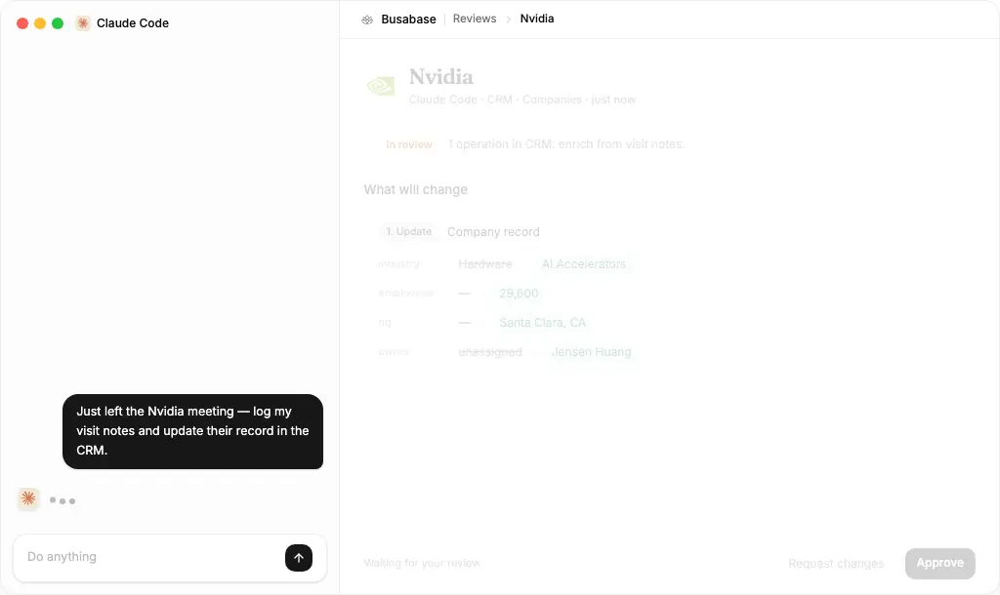</a>

</div>

Busabase is a **free and open-source** ([MIT](https://opensource.org/licenses/MIT)) app for one simple problem:

**AI can generate endless content and data, but someone still needs to decide what is good enough to trust.**

Busabase gives that approval process a home — an approval-first database and knowledge base for AI agents. It is a private CMS, project database, and structured source of truth with built-in Change Requests, Operations, comments, audit trails, and a simple API for apps and AI agents.

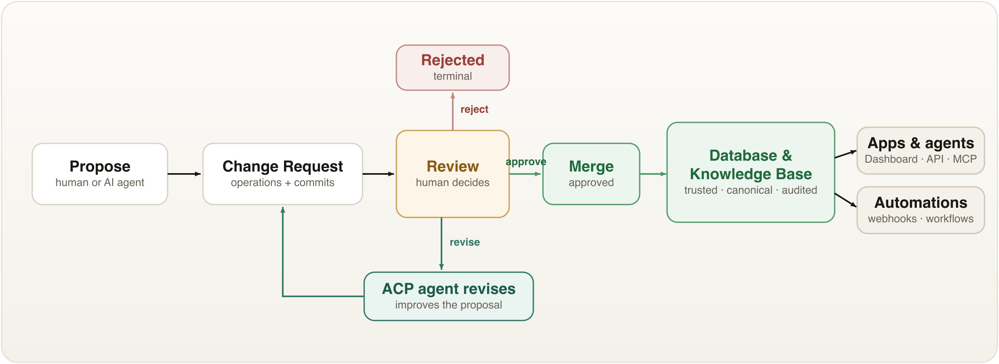

**Free & open source. Local-first. Review-first. Agent-ready.**
Run it yourself — no SaaS, no account, no vendor. Your data never has to leave your machine.

## Quick Start

Pick whichever way you like — all of them give you the same review-first database.

### ⚡ Run it now — one command, zero setup

```bash
npx busabase server
```

Open **http://localhost:15419/dashboard/inbox**. That's the whole setup: a full local
instance with **no database to run and nothing to configure.** Busabase seeds example
Bases, records, and Change Requests on first request, so you can inspect the review
workflow immediately.

```bash
npm i -g busabase     # install once, then just: busabase server
npx busabase-cli --help   # the API client on its own (talks to any busabase server)
```

### 🐳 Docker

```bash
docker run --rm -p 15419:15419 busabase/busabase
```

Open **http://localhost:15419/dashboard/inbox**. Stores everything locally — no
external services. Images are published to Docker Hub (`busabase/busabase`) and GHCR
(`ghcr.io/busabase/busabase`).

### 🖥️ Desktop app

Prefer a native app? Download Busabase for **macOS, Windows, and Linux** at
**[busabase.com/download](https://busabase.com/download)**. Fully native and fully offline —
**all your data stays on your computer, never online.**

### 🔧 From source

```bash
pnpm install
cp apps/busabase/.env.example apps/busabase/.env
pnpm --filter busabase dev
```

Open **http://localhost:15419/dashboard/inbox**. A local-start check runs first: if
dependencies, `PG_DATABASE_URL`, or `STORAGE_URL` are missing, it fails with a setup message
instead of a blank dashboard. The default `.env.example` uses PGlite under `.data/busabase`
and local file storage under `.data/busabase-storage`.

---

**What you get after launch:**

- an Inbox for reviewing Change Requests
- example Bases and records
- record-level history and audit trails
- local PGlite persistence under `.data/busabase`
- REST API endpoints for apps, workflows, and AI Agents

### Connect your AI agent

Busabase has **no built-in model** — you point your own agent (Claude Code, Cursor, Codex,
Gemini CLI, OpenClaw, Hermes…) at it. Paste one prompt and it onboards itself, then proposes
changes as Change Requests you approve.

<details>
<summary><b>Copy the onboarding prompt</b></summary>

```text
Read and follow the Busabase Agent Skill — it is the single source of truth:
http://localhost:15419/SETUP_SKILL.md

Follow its onboarding to set me up, and never merge a ChangeRequest without my approval. Reply to me in English.
```

</details>

**→** [Bring Your Own Agent](./docs/bring-your-agent.md) — the full flow, then
`npx skills add busabase/skills` installs a permanent skill so you never re-paste it.

### Where your data lives

`npx busabase server` and the desktop app share **one** local data root so you see the
same database whichever way you launch:

```
~/.busabase/data/
├── pgdata/    # embedded PGlite database
└── storage/   # uploaded attachments
```

Point them somewhere else with `BUSABASE_DATA_DIR` (or `busabase server --db <dir>`), or
set `PG_DATABASE_URL` / `STORAGE_URL` directly to use external Postgres / S3.

Docker writes to `/data` inside the container — bind-mount the same host folder to share
that one database with the CLI and desktop app:

```bash
docker run --rm -p 15419:15419 -v ~/.busabase/data:/data busabase/busabase
```

(Running from source with `pnpm dev` instead uses the repo's `.env`, i.e. `.data/busabase`.)
Only one process can hold the PGlite database at a time, so run one launcher at a time.

## Screenshots

|  |  |
| :---: | :---: |
| 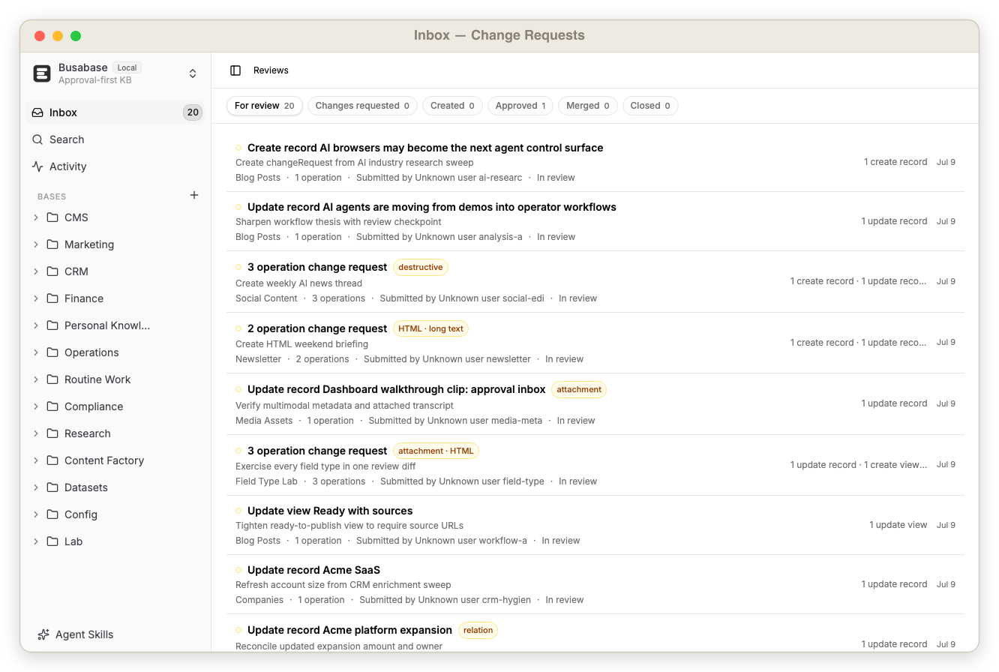 | 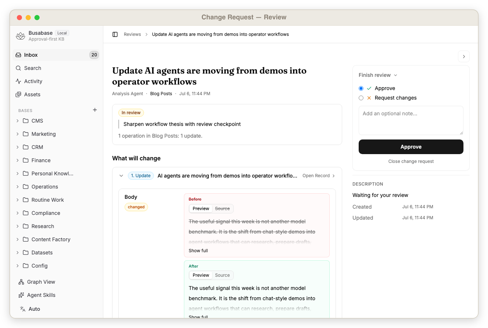 |
| Inbox with pending Change Requests, reviewer status, and approval actions | Agent-proposed changes before merge, including field diffs and reviewer actions |
| 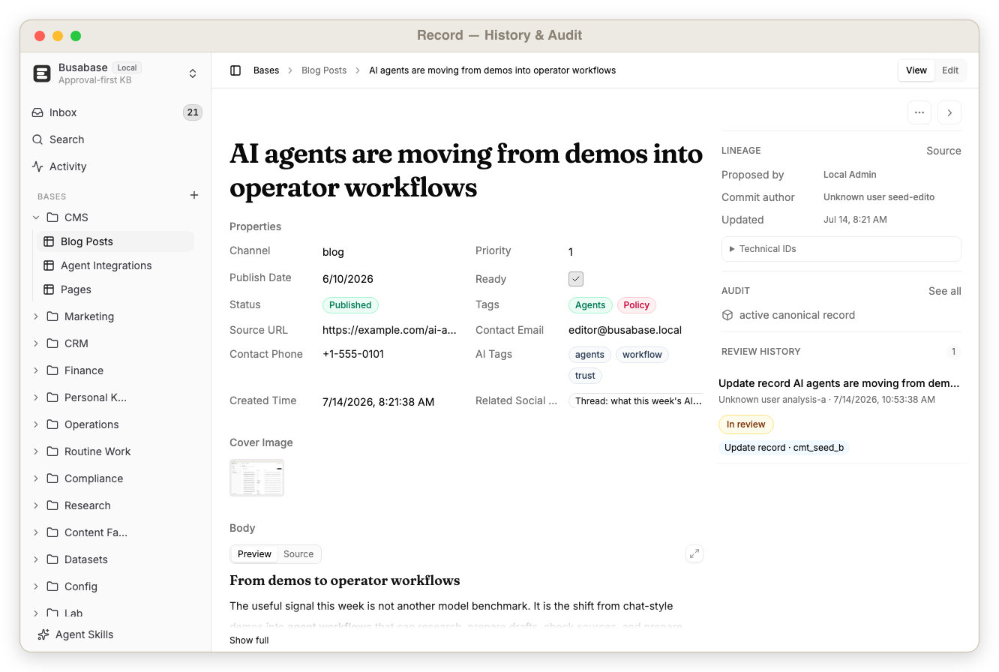 | 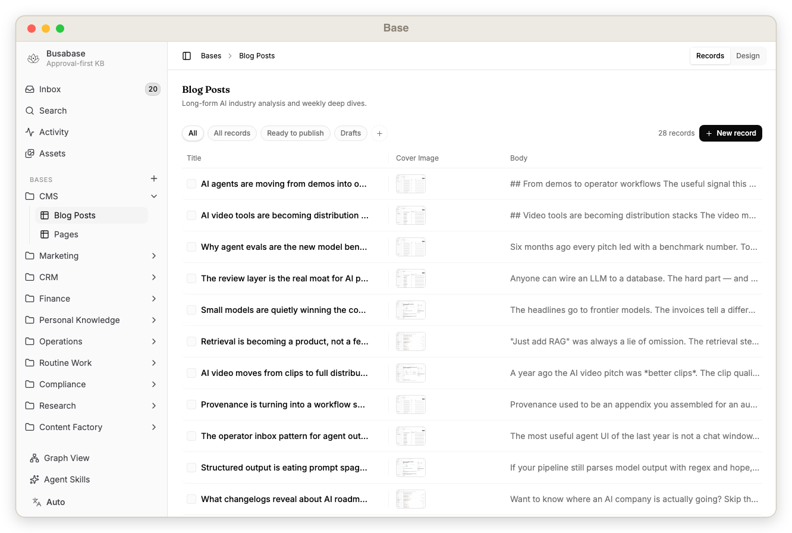 |
| Record detail page with fields, comments, review history, and lineage | Base table showing structured records and rich fields |
| 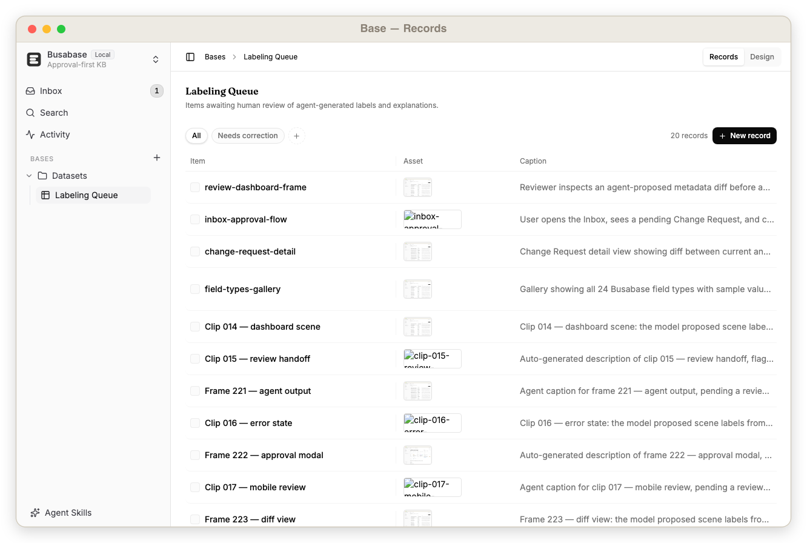 | 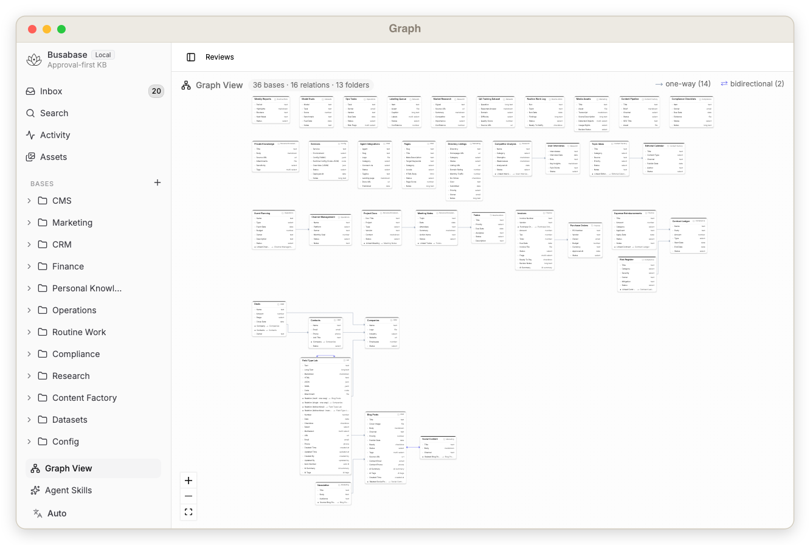 |
| Records inside a Base — typed fields, rich values, and approval status at a glance | Graph view showing relationships between seeded records across Bases |

### On mobile

Review and approve agent Change Requests from your phone — the same inbox, proposal preview, and trusted records, in the [Busabase mobile app](https://github.com/busabase/busabase/tree/main/apps/busabase-mobile).

<p align="center">
  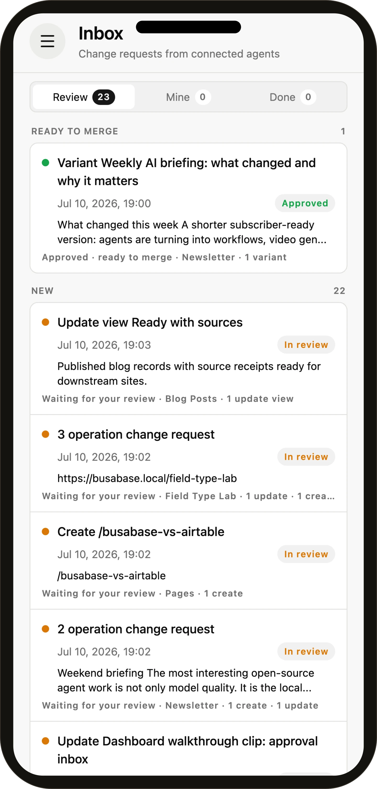
  &nbsp;&nbsp;
  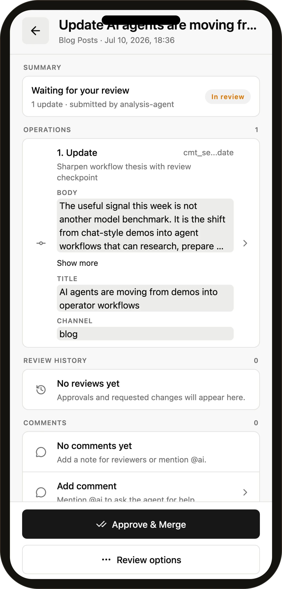
  &nbsp;&nbsp;
  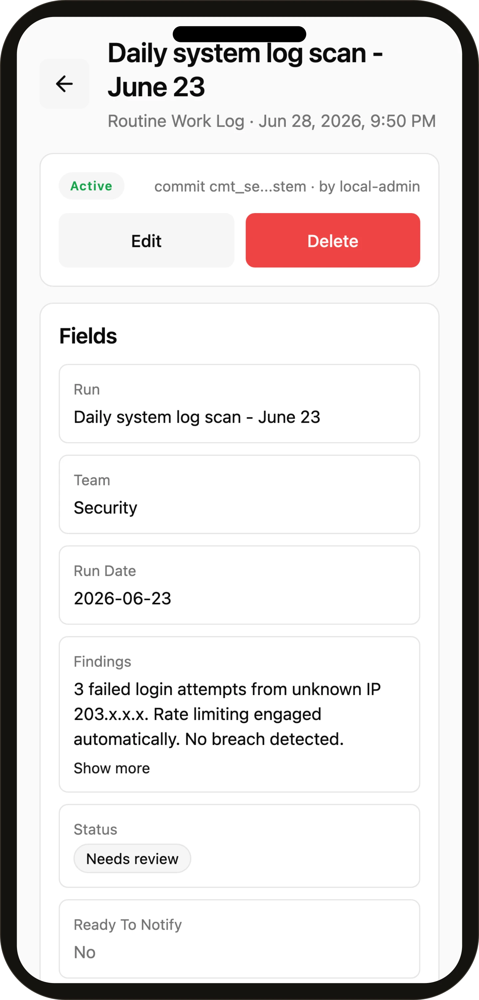
</p>

## Why This Exists

Most databases are good at storing data. Most CMS tools are good at publishing content. Most code platforms are good at reviewing files.

Busabase is for the middle layer that AI-heavy teams now need:

| Need | Busabase gives you |
| --- | --- |
| AI drafts a blog post | Review it before it becomes a published CMS record |
| Humans clean QA data | Approve high-quality examples before training or evaluation |
| Agents label videos | Check multimodal metadata before it enters the dataset |
| Agents update project or ERP data | Human reviewers approve changes before the system of record changes |
| A local AI tool needs memory | Expose a private, audited API over approved knowledge |
| Data changes should trigger work | Fire webhooks, automations, or external agents after approved merges |
| Someone changes a record | Track who proposed, reviewed, merged, viewed, or deleted it |

It is approval-first by default, agent-friendly by design, and still small enough to run locally.

## Concepts

Core concepts:

| Concept | Meaning |
| --- | --- |
| Base | A table-like collection of records |
| Field | A typed property on a Base |
| Record | An approved row of data |
| Change Request | A reviewable proposal to change data |
| Operation | A create, update, delete, or variant action inside a Change Request |
| Commit | Immutable data snapshot behind an Operation |
| Comment | Discussion attached to records, Change Requests, operations, or commits |
| Audit Event | A trail of important reads, writes, reviews, merges, and deletes |

Busabase nodes currently include Folder, Base, Skill, Drive, and Doc. See
**[Node Types](./docs/node-types.md)** for screenshots and details.

## Use Cases

Any base an agent can write — reviewed first. A few of the things people build on Busabase:

| Use case | What you review |
| --- | --- |
| **[Blog CMS for Next.js](./docs/use-cases.md#blog-cms-for-nextjs)** | AI-drafted posts, reviewed before they publish |
| **[SEO Landing Pages](./docs/use-cases.md#seo-landing-pages)** | AI-generated landing pages, approved before they go live |
| **[Configuration Management](./docs/use-cases.md#configuration-management)** | Service YAML/JSON reviewed before it ships |
| **[Finance & Invoice Review](./docs/use-cases.md#finance-and-invoice-review)** | Automated finance entries a human signs off |
| **[Data Stewardship & CRM Hygiene](./docs/use-cases.md#data-stewardship-and-crm-hygiene)** | A review queue that keeps business data clean |
| **[Compliance & Audit Checklists](./docs/use-cases.md#compliance-and-audit-checklists)** | Recurring checks with evidence and an audit trail |
| **[QA & Training Datasets](./docs/use-cases.md#high-quality-qa-and-training-datasets)** | Curated, approved examples for training / eval / RAG |
| **[Multimodal Content Review](./docs/use-cases.md#multimodal-content-review)** | Image / audio / video metadata reviewed first |
| **[Market Intelligence](./docs/use-cases.md#market-intelligence-and-research-monitoring)** | A human-reviewed research & monitoring feed |
| **[Content Factory Pipeline](./docs/use-cases.md#content-factory-pipeline)** | Idea → draft → approved asset, end to end |
| **[Dataset Labeling Pipeline](./docs/use-cases.md#dataset-labeling-pipeline)** | Agent-first labeling with human review |
| **[Project Management & ERP](./docs/use-cases.md#approval-based-project-management-and-erp)** | Operational data changes behind an approval gate |
| **[Canonical System of Record](./docs/use-cases.md#canonical-system-of-record)** | The single source of approved, canonical data |
| **[Local Personal Knowledge Base](./docs/use-cases.md#local-personal-knowledge-base)** | A private, audited database for you and your AI tools |
| **[Verified Routine Work](./docs/use-cases.md#verified-routine-work)** | Recurring work that's done, reviewed, and recorded |
| **[Field Type Lab](./docs/use-cases.md#field-type-lab)** | Every field type and review op in one local scenario |

**[→ See all 16 use cases, with screenshots](./docs/use-cases.md)**

## Automation and ACP Agents

Busabase can become an event source for data workflows.

During review, a human can ask an ACP-compatible agent to improve the Change Request before it is merged:

- clean fields
- enrich missing metadata
- normalize categories
- rewrite a draft
- generate summaries or tags
- check policy, quality, or consistency

After merge, approved data can trigger downstream automation:

- send a webhook
- update an external system
- notify a reviewer or channel
- refresh a Next.js site
- kick off an ETL or dataset export
- call an external ACP Agent to continue the workflow

That makes Busabase more than a place to store data. It becomes a controlled handoff point between humans, applications, and agents.

## Local Agents Operate Your Knowledge Base

Busabase is built to be driven by the agents already running on your own computer.

Because the API is local and trusted, you can point coding and automation agents — **OpenClaw, Codex, Claude Code, Hermes**, and similar local skills — directly at your Busabase instance. They can read approved knowledge, run skills against it, and propose changes back as Change Requests.

What a local agent can do with Busabase:

- read your private, approved knowledge as grounded context
- run a local skill that queries or summarizes your bases
- propose new records or edits as reviewable Change Requests
- enrich, clean, or label data without uncontrolled write access
- wait for human approval before anything becomes trusted

The pattern is simple:

```txt
Local agent reads approved knowledge ->
proposes a Change Request ->
you review on your own machine ->
approve -> merged into your local source of truth
```

This keeps the loop entirely on your hardware. The agent gets a real, structured memory to work against, and you keep authority over what becomes trusted — no private data has to leave your computer for any of it to work.

**→ Step-by-step:** [Bring Your Own Agent](./docs/bring-your-agent.md) — paste one prompt to onboard, then `npx skills add busabase/skills` to install a permanent skill your agent uses every session.

> If OpenClaw is the revolution for **agents** on your local computer, then BusaBase is the revolution for the **database and knowledge base** on your local computer.

## What Busabase Cares About

Busabase is not just asking "what is the latest value in this row?"

It also asks:

- Who proposed this data?
- Why should it change?
- Which fields changed?
- Is this a create, update, delete, or variant operation?
- What did the AI Agent produce before it was accepted?
- Who reviewed the agent output?
- Did a human ask the agent to revise?
- Was the proposal merged or rejected?
- What automation ran after merge?
- Can we trace the decision later?

That makes Busabase especially useful for AI Agent work. Agents can produce drafts, labels, summaries, reconciliations, or operational updates, but Busabase gives humans a preview layer before those outputs become trusted data.

## How Busabase Compares

Busabase overlaps with familiar tools, but it's optimized for a different job: **AI agents writing data, and humans approving it before it's trusted.**

| Tool | Great for | What Busabase adds |
| --- | --- | --- |
| [Airtable](https://www.airtable.com/) | Flexible cloud tables for human teams | Local-first ownership + an approval gate: agents propose, humans approve, with diff preview, history, and audit trails |
| [APITable](https://github.com/apitable/apitable) | Open-source, API-first Airtable alternative | API-first **plus** a review layer between proposal and trusted record |
| [NocoDB](https://nocodb.com/) | Spreadsheet UI on top of your SQL database | Every write is a reviewable Change Request, not a direct row edit |
| [Baserow](https://baserow.io/) | Self-hosted no-code database | Change Requests, audit trails, and agent hooks |
| [Notion](https://www.notion.com/) | Cloud docs, databases, and team knowledge | A pure, local, structured knowledge base with a built-in review flow — no vendor cloud |
| [Confluence](https://www.atlassian.com/software/confluence) / [Lark](https://www.larksuite.com/en_sg/) | Vendor-hosted team wikis | Runs on your machine first; data never has to leave it |
| [Obsidian](https://obsidian.md/) | Local-first Markdown notes for a human | Local too — but a structured database for agents: Change Requests, approval, and audit, not free-form notes |
| [PostgreSQL](https://www.postgresql.org/) | Reliable storage and querying | Human-readable Change Requests, reviews, comments, and automation around every change |
| [GitHub Pull Requests](https://docs.github.com/en/pull-requests) | Code review over file diffs | Record-based review for content, datasets, CRM rows, tasks, and multimodal data |

Most of these assume the writer is a trusted human (or a script you wrote). Busabase assumes the writer is often **an AI agent** — and that not every agent write should be trusted automatically. So it adds what an agent-driven database needs:

- **A proposal layer** — agents submit Change Requests instead of editing rows directly.
- **A preview before merge** — see exactly what the agent produced, field by field.
- **A revise loop** — ask the agent to fix the proposal before it's accepted.
- **An audit trail** — every read, write, review, merge, and delete is traceable.
- **A local, trusted API** — built for agents on your own machine, not just human spreadsheet users.

```txt
Airtable / APITable: a database for people to edit.
Busabase: a database for agents to propose and people to approve.
```

**Local-first, not cloud-first.** Your data stays on your machine or private network by default. Need remote or agent access? Open a **tunnel** to expose selected endpoints instead of copying everything into a central cloud database. Self-hostable, free, and open-source.

## Features

- Local-first open-source app
- Built-in review workflow
- Change Requests with multiple Operations
- Create, update, delete, and variant operations
- Commit history for record changes
- Comments on records and review objects
- Audit events for reads and writes
- Markdown, HTML, links, files, relation fields, and rich field types
- Search-ready indexed field values
- REST API for apps, workflows, and AI agents
- Human-in-the-loop collaboration for agent-proposed changes
- AI Agent output preview before merge
- Single source of truth for approved operational records
- Automation triggers after approved data changes
- ACP Agent hooks during review and after merge
- PGlite local persistence
- Docker-friendly deployment

## API Surface

Busabase exposes a simple local REST API for dashboard clients, apps, and AI agents.

Typical resources include:

- Bases and nodes
- Records
- Search
- Comments
- Change Requests
- Reviews
- Merge actions
- Activity and audit events

The API is meant for trusted local or private-network usage in the open-source version.

### Agent Proposal Example

This is the core agent loop: read the schema, submit a proposal, review it in the UI, then read the
canonical record after merge.

```bash
# 1. Find the Blog Posts base.
BLOG_BASE_ID=$(curl -s http://localhost:15419/api/v1/bases \
  | jq -r '.[] | select(.slug == "blog") | .id')

# 2. Let an agent propose a new record. This creates a Change Request, not canonical data.
CHANGE_REQUEST_ID=$(curl -s -X POST \
  "http://localhost:15419/api/v1/bases/$BLOG_BASE_ID/change-requests" \
  -H 'content-type: application/json' \
  -d '{
    "fields": {
      "title": "Agent market note",
      "body": "Drafted by an agent, waiting for human review.",
      "channel": "blog"
    },
    "message": "Agent proposed a market note",
    "submittedBy": "local-agent"
  }' | jq -r '.id')

# 3. Review it in the dashboard.
echo "Review: http://localhost:15419/dashboard/inbox/$CHANGE_REQUEST_ID"

# 4. Optional automation after a human approves: merge and read canonical records.
curl -s -X POST "http://localhost:15419/api/v1/change-requests/$CHANGE_REQUEST_ID/merge" \
  | jq '.record.id, .record.headCommit.fields.title'
curl -s "http://localhost:15419/api/v1/records?baseId=$BLOG_BASE_ID" \
  | jq '.[].headCommit.fields.title'
```

For machine-readable endpoint docs, open:

```txt
http://localhost:15419/api/v1/doc
```

## When To Use Busabase

Use Busabase when:

- AI generates content but humans approve what becomes trusted.
- AI agents propose updates, but humans keep final authority.
- You want an approval-based project management, CRM, ERP, or operations database.
- You have routine operational work that must be completed, reviewed, and logged.
- Your team needs high-quality datasets with review history.
- You need humans to preview AI Agent outputs before they become trusted records.
- You want a CMS that treats content as structured records.
- You need a private local database that AI can read safely.
- You want data to stay distributed across people's local workspaces, with selective sharing when needed.
- You need a single source of truth for approved business data.
- You want approved data changes to trigger webhooks, workflows, or external agents.
- You want agents to help refine Change Requests before humans approve them.
- Your data is multimodal, not just rows of plain text.
- You care about who viewed, changed, reviewed, merged, or deleted data.

Do not use Busabase as your primary code review system. Use GitHub pull requests for code.

## Roadmap

Busabase starts local-first, then expands outward.

### Local Busabase

The open-source version runs locally and stores data under your control.

Use it when:

- your data should stay on your machine
- AI Agents need a private API to approved knowledge
- personal or team workflows need review and audit trails
- you want a database that can work without a hosted cloud account

### Busabase Tunnel

A future tunnel mode can expose a local Busabase instance to the public internet or a controlled network without moving all data into a central cloud database.

Use it when:

- an external AI Agent needs to call your local Busabase API
- a collaborator needs temporary access to selected local data
- your company wants distributed data ownership across different people's machines
- data should remain local, but certain approved records or endpoints should be reachable

This is different from cloud-first tools like Notion or Airtable. Busabase can let data remain distributed with the people or teams who own it, while still offering controlled API access, review, automation, and audit trails.

## Open-Source Shape

The local open-source version is intentionally small:

- no login by default
- one local workspace
- app-local Drizzle schema
- PGlite persistence under `.data/busabase`
- dashboard at `/dashboard/inbox`
- REST API for local apps and trusted agents

The goal is to make a private, reviewable data workspace that anyone can run.

## Security Note

Busabase is designed for trusted local or private-network deployment.

Do not expose write endpoints to the public internet without a reverse proxy, token layer, or another access-control layer.

## Contributing

Busabase is built in the open — bug reports, feature ideas, docs, and PRs are all welcome.

```bash
pnpm install
pnpm --filter busabase dev   # http://localhost:15419/dashboard/inbox
```

Before sending a PR, run `pnpm --filter busabase typecheck && pnpm --filter busabase lint`. Found a bug or have an idea? [Open an issue](https://github.com/busabase/busabase/issues) or start a [discussion](https://github.com/busabase/busabase/discussions).

## Community

- ⭐ **Star the repo** if Busabase is useful to you — it genuinely helps others find it.
- 🐛 [Issues](https://github.com/busabase/busabase/issues) &nbsp;·&nbsp; 💬 [Discussions](https://github.com/busabase/busabase/discussions) &nbsp;·&nbsp; 🌐 [busabase.com](https://busabase.com)

## Star History

<a href="https://star-history.com/#busabase/busabase&Date">
  
</a>

## License

[MIT](./LICENSE) © Busabase
