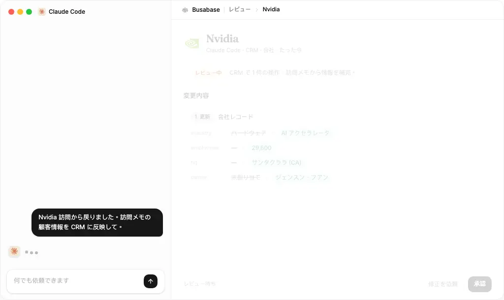
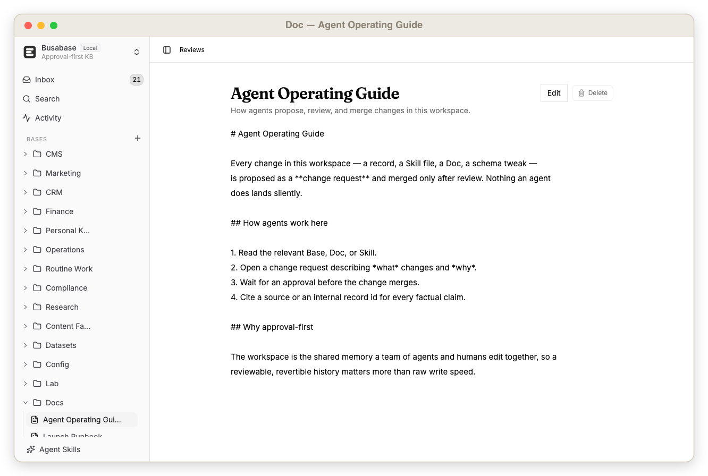
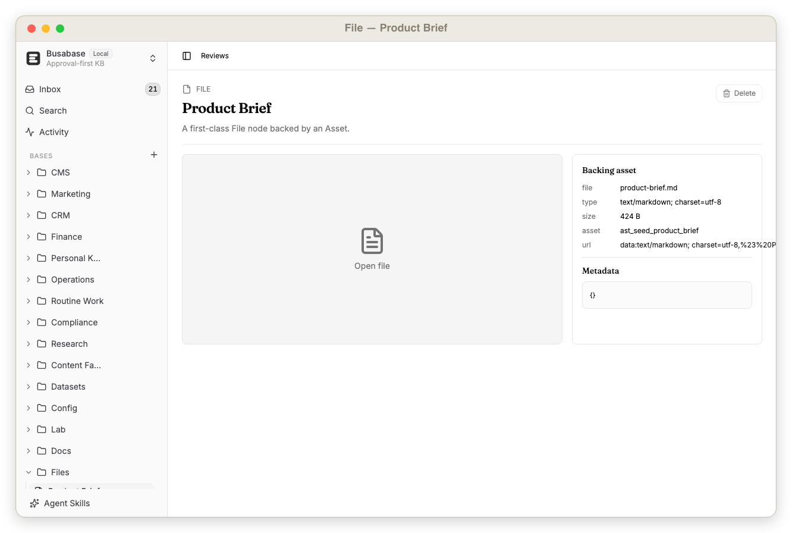

<div align="center">

<picture>
  <source media="(prefers-color-scheme: dark)" srcset="../public/icon-dark.svg" />
  
</picture>

<h1>Busabase</h1>

<p><b>AIが生成したコンテンツ、ビジネスデータ、データセット、マルチモーダルナレッジのための、ローカルファーストなレビューデータベース。</b><br/>
AI は無限にデータを生成できます —— Busabase は、信頼できるものだけを <b>レビュー・承認・マージ</b> する場所です。</p>

<p>
<a href="../README.md">English</a> &nbsp;·&nbsp; <a href="./README_zh-CN.md">中文</a> &nbsp;·&nbsp; <b>日本語</b> &nbsp;·&nbsp; <a href="./README_ko.md">한국어</a>
</p>

<p>
<a href="https://www.npmjs.com/package/busabase"></a>
<a href="https://www.npmjs.com/package/busabase-cli"></a>
<a href="https://hub.docker.com/r/busabase/busabase"></a>
<a href="https://busabase.com/download"></a>
<a href="https://opensource.org/licenses/MIT"></a>
<a href="https://github.com/busabase/busabase/stargazers"></a>
</p>

<br/>



</div>

Busabaseはシンプルな課題を解決するオープンソースアプリです。

**AIは無限のコンテンツやデータを生成できますが、それを信頼できるものとして扱うかどうかは、最終的に人間が判断する必要があります。**

Busabaseはその承認プロセスに専用の場所を提供します。プライベートCMS、ナレッジベース、プロジェクトデータベース、そして構造化された信頼できる情報源として機能し、変更リクエスト、オペレーション、コメント、監査証跡、およびアプリやAIエージェント向けのシンプルなAPIを備えています。


**ローカルファースト。レビューファースト。エージェント対応。**

## クイックスタート

Busabaseをローカルで実行する:

```bash
pnpm install
cp apps/busabase/.env.example apps/busabase/.env
pnpm --filter busabase dev
```

ダッシュボードを開く:

```txt
http://localhost:15419/dashboard/inbox
```

Busabaseは開発サーバーが起動する前にローカル起動チェックを実行します。依存関係、`PG_DATABASE_URL`、または`STORAGE_URL`が不足している場合、空のダッシュボードを開く代わりにセットアップメッセージとともにコマンドが失敗します。デフォルトの`.env.example`は`.data/busabase`以下のPGliteと`.data/busabase-storage`以下のローカルファイルストレージを使用します。

Busabaseは最初のリクエスト時にサンプルのベース、レコード、変更リクエストをシードするため、すぐにレビューワークフローを確認できます。

起動後に利用できるもの:

- 変更リクエストをレビューするための受信トレイ
- サンプルのベースとレコード
- レコードレベルの履歴と監査証跡
- `.data/busabase`以下のローカルPGliteによる永続化
- アプリ、ワークフロー、AIエージェント向けのREST APIエンドポイント

Docker:

```bash
docker build -f apps/busabase/Dockerfile -t busabase:local .
docker run --rm -p 15419:15419 busabase:local
```

コンテナを開く:

```txt
http://localhost:15419/dashboard/inbox
```

## スクリーンショット

|  |  |
| :---: | :---: |
|  |  |
| 受信トレイ（保留中の変更リクエスト、レビュアーステータス、承認アクション） | マージ前のエージェント提案（フィールド差分とレビュアーアクションを含む） |
|  |  |
| フィールド、コメント、レビュー履歴、系譜を含むレコード詳細ページ | 構造化レコードとリッチフィールドを表示するベーステーブル |
|  |  |
| ベース内のレコード — 型付きフィールド、リッチな値、承認ステータスが一目でわかる | ベース間のシードレコードの関係を示すグラフビュー |
|  |  |
| レビューを通じてバージョン管理される長文 Markdown Doc | Asset ライブラリに支えられた一級 File ノード |

## なぜ作られたのか

ほとんどのデータベースはデータの保存が得意です。ほとんどのCMSツールはコンテンツの公開が得意です。ほとんどのコードプラットフォームはファイルのレビューが得意です。

Busabaseは、AIを多用するチームが今必要としている中間レイヤーのためのツールです:

| ニーズ | Busabaseが提供するもの |
| --- | --- |
| AIがブログ記事を下書きする | 公開済みCMSレコードになる前にレビューする |
| 人間がQAデータをクリーニングする | トレーニングや評価の前に高品質なサンプルを承認する |
| エージェントが動画にラベルを付ける | データセットに入る前にマルチモーダルメタデータを確認する |
| エージェントがプロジェクトやERPデータを更新する | システムオブレコードが変更される前に人間のレビュアーが承認する |
| ローカルAIツールがメモリを必要とする | 承認済みナレッジに対してプライベートな監査済みAPIを公開する |
| データの変更がワークを引き起こすべき | 承認済みマージ後にWebhook、自動化、または外部エージェントを発火させる |
| 誰かがレコードを変更する | 提案、レビュー、マージ、閲覧、削除した人物を追跡する |

デフォルトで承認ファーストであり、エージェントフレンドリーな設計で、ローカルで実行できるほどコンパクトです。

## コンセプト

コアコンセプト:

| コンセプト | 意味 |
| --- | --- |
| ベース | レコードのテーブル形式のコレクション |
| フィールド | ベース上の型付きプロパティ |
| レコード | 承認済みデータの1行 |
| 変更リクエスト | データ変更のレビュー可能な提案 |
| オペレーション | 変更リクエスト内の作成、更新、削除、またはバリアントアクション |
| コミット | オペレーションの背後にある不変のデータスナップショット |
| コメント | レコード、変更リクエスト、オペレーション、またはコミットに添付されたディスカッション |
| 監査イベント | 重要な読み取り、書き込み、レビュー、マージ、削除の追跡記録 |

## ユースケース

エージェントが書き込めるあらゆるベース —— すべて先にレビュー。Busabaseで作られている例：

| ユースケース | レビュー対象 |
| --- | --- |
| **Next.js向けブログCMS** | Busabaseをブログや編集ワークフローのローカルCMSとして使用します。 |
| **SEOランディングページ** | Busabaseを使用して、AIが生成したHTMLランディングページを公開前にレビュー・管理します。 |
| **設定管理** | BusabaseをYAMLおよびJSONでサービス設定をバージョン管理・保存するために使用します。AIエージェントがレー |
| **財務と請求書レビュー** | 自動化が役立つが信頼性が求められる財務ワークフローにBusabaseを使用します。 |
| **データスチュワードシップとCRMの整理** | ビジネスデータをクリーンに保つためのレビューキューとしてBusabaseを使用します。 |
| **コンプライアンスと監査チェックリスト** | 証拠が必要な繰り返しのチェックにBusabaseを使用します。 |
| **高品質なQAとトレーニングデータセット** | モデルのトレーニング、評価、RAG、ベンチマーク作業のためのデータセット構築にBusabaseを使用します。 |
| **マルチモーダルコンテンツレビュー** | Busabaseはテキスト以上のコンテンツ向けに設計されています。 |
| **マーケットインテリジェンスとリサーチモニタリング** | 人間がレビューするリサーチフィードとしてBusabaseを使用します。 |
| **コンテンツファクトリーパイプライン** | アイデアから公開済みアセットまでのコンテンツ制作を調整するためにBusabaseを使用します。 |
| **データセットラベリングパイプライン** | エージェントによる一次ラベリングと人間によるレビューを組み合わせるためにBusabaseを使用します。 |
| **承認ベースのプロジェクト管理とERP** | 運用データの軽量な承認レイヤーとしてBusabaseを使用します。 |
| **正式なシステムオブレコード** | Busabaseを**システムオブレコード**として使用します — 何人の人間やAIエージェントが書き込んでいても、各レ |
| **ローカルパーソナルナレッジベース** | 自分のマシンでBusabaseを実行し、自分とAIツールのためのプライベートデータベースとして使用します。 |
| **確認済みルーティンワーク** | 完了、レビュー、記録が必要な日次または週次の作業にBusabaseを使用します。 |
| **フィールドタイプラボ** | 1つのローカルシナリオで、すべてのサポートされたフィールドタイプとレビューオペレーションを確認するためにBusabase |

**[→ 全16ユースケースを見る（スクリーンショット付き）](./use-cases_ja.md)**

## 自動化とACPエージェント

Busabaseはデータワークフローのイベントソースになれます。

レビュー中に、人間はマージ前に変更リクエストを改善するようACP互換エージェントに依頼できます。

マージ後、承認済みデータが下流の自動化をトリガーできます:

- Webhookを送信する
- 外部システムを更新する
- レビュアーやチャンネルに通知する
- Next.jsサイトを更新する
- ETLまたはデータセットエクスポートを開始する
- 外部ACPエージェントを呼び出してワークフローを継続する

これによりBusabaseは単なるデータの保存場所以上の存在になります。人間、アプリケーション、エージェント間の制御されたハンドオフポイントになります。

## ローカルエージェントがナレッジベースを操作する

Busabaseはあなた自身のコンピューターで動作するエージェントによって駆動されるよう設計されています。

APIがローカルで信頼されているため、コーディングや自動化エージェント — **OpenClaw、Codex、Claude Code、Hermes** などのローカルスキル — をBusabaseインスタンスに直接向けることができます。

```txt
ローカルエージェントが承認済みナレッジを読み取る ->
変更リクエストを提案する ->
自分のマシンでレビューする ->
承認 -> ローカルの信頼できる情報源にマージされる
```

> OpenClawがあなたのローカルコンピューター上の**エージェント**にとっての革命であるなら、BusaBaseはあなたのローカルコンピューター上の**データベースとナレッジベース**にとっての革命です。

## Busabaseが大切にしていること

Busabaseは「この行の最新の値は何か？」だけを問いません。

以下も問います:

- 誰がこのデータを提案したか？
- なぜ変更されるべきか？
- どのフィールドが変更されたか？
- これは作成、更新、削除、またはバリアントのオペレーションか？
- 承認される前にAIエージェントは何を生成したか？
- 誰がエージェントの出力をレビューしたか？
- 人間はエージェントに修正を依頼したか？
- 提案はマージされたか却下されたか？
- マージ後にどの自動化が実行されたか？
- 後で意思決定を追跡できるか？

## Busabase の比較

Busabase は身近なツールと重なる部分もありますが、最適化している目的が異なります：**AI エージェントがデータを書き込み、それが信頼されるデータになる前に人間が承認する。**

| ツール | 得意なこと | Busabase が加えるもの |
| --- | --- | --- |
| [Airtable](https://www.airtable.com/) | 人間のチーム向けの柔軟なクラウドテーブル | ローカルファーストの所有権 + 承認ゲート：エージェントが提案し、人間が差分プレビュー・履歴・監査証跡とともに承認 |
| [APITable](https://github.com/apitable/apitable) | オープンソースで API ファーストの Airtable 代替 | API ファースト**に加えて**、提案と信頼されたレコードの間にレビュー層を設ける |
| [NocoDB](https://nocodb.com/) | 既存の SQL データベース上のスプレッドシート UI | すべての書き込みが、直接の行編集ではなくレビュー可能な変更リクエストになる |
| [Baserow](https://baserow.io/) | セルフホスト可能なノーコードデータベース | 変更リクエスト、監査証跡、エージェントフック |
| [Notion](https://www.notion.com/) | クラウドのドキュメント、データベース、チームナレッジ | 純粋でローカルな構造化ナレッジベースにレビューフローを内蔵——ベンダークラウド不要 |
| [Confluence](https://www.atlassian.com/software/confluence) / [Lark](https://www.larksuite.com/en_sg/) | ベンダーがホストするチーム Wiki | まず自分のマシン上で動作；データはローカルから出る必要がない |
| [Obsidian](https://obsidian.md/) | 個人向けのローカルファースト Markdown ノート | こちらもローカル——ただしエージェント向けの構造化データベース：自由記述のノートではなく、変更リクエスト・承認・監査 |
| [PostgreSQL](https://www.postgresql.org/) | 信頼性の高い保存とクエリ | すべての変更を取り巻く、人間が読める変更リクエスト・レビュー・コメント・自動化 |
| [GitHub Pull Requests](https://docs.github.com/en/pull-requests) | ファイル差分に対するコードレビュー | コンテンツ、データセット、CRM 行、タスク、マルチモーダルデータに対するレコードベースのレビュー |

これらの多くは、書き込み手が信頼された人間（または自分で書いたスクリプト）であることを前提とします。Busabase は、書き込み手がしばしば **AI エージェント**であり、すべてのエージェントの書き込みを自動的に信頼すべきではないと想定します。そこで、エージェント駆動のデータベースに必要なものを追加します：

- **提案レイヤー**——エージェントは行を直接編集する代わりに変更リクエストを送信します。
- **マージ前のプレビュー**——エージェントが生成したものをフィールドごとに正確に確認します。
- **修正ループ**——承認される前にエージェントに提案を修正させます。
- **監査証跡**——すべての読み取り、書き込み、レビュー、マージ、削除が追跡可能です。
- **ローカルで信頼された API**——人間のスプレッドシートユーザーだけでなく、自分のマシン上のエージェント向けに構築されています。

```txt
Airtable / APITable: 人が編集するためのデータベース。
Busabase: エージェントが提案し人間が承認するためのデータベース。
```

**クラウドファーストではなく、ローカルファースト。** デフォルトでは、データは自分のマシンやプライベートネットワーク上に留まります。リモートやエージェントからのアクセスが必要ですか？すべてを中央のクラウドデータベースにコピーする代わりに、**トンネル**を開いて選択したエンドポイントだけを公開します。セルフホスト可能、無料、オープンソース。

## 機能

- ローカルファーストのオープンソースアプリ
- 組み込みのレビューワークフロー
- 複数のオペレーションを持つ変更リクエスト
- 作成、更新、削除、バリアントのオペレーション
- レコード変更のコミット履歴
- レコードとレビューオブジェクトへのコメント
- 読み取りと書き込みの監査イベント
- Markdown、HTML、リンク、ファイル、リレーションフィールド、リッチフィールドタイプ
- 検索対応のインデックス付きフィールド値
- アプリ、ワークフロー、AIエージェント向けのREST API
- エージェントが提案した変更に対する人間参加型コラボレーション
- マージ前のAIエージェント出力プレビュー
- 承認済み運用レコードの信頼できる唯一の情報源
- 承認済みデータ変更後の自動化トリガー
- レビュー中およびマージ後のACPエージェントフック
- PGliteによるローカル永続化
- Dockerフレンドリーなデプロイ

## APIサーフェス

BusabaseはダッシュボードクライアントアプリおよびAIエージェント向けにシンプルなローカルREST APIを公開します。

### エージェント提案の例

```bash
# 1. Blog PostsベースのIDを取得する。
BLOG_BASE_ID=$(curl -s http://localhost:15419/api/v1/bases \
  | jq -r '.[] | select(.slug == "blog") | .id')

# 2. エージェントに新しいレコードを提案させる。
CHANGE_REQUEST_ID=$(curl -s -X POST \
  "http://localhost:15419/api/v1/bases/$BLOG_BASE_ID/change-requests" \
  -H 'content-type: application/json' \
  -d '{
    "fields": {
      "title": "Agent market note",
      "body": "Drafted by an agent, waiting for human review.",
      "channel": "blog"
    },
    "message": "Agent proposed a market note",
    "submittedBy": "local-agent"
  }' | jq -r '.id')

echo "Review: http://localhost:15419/dashboard/inbox/$CHANGE_REQUEST_ID"

curl -s -X POST "http://localhost:15419/api/v1/change-requests/$CHANGE_REQUEST_ID/merge" \
  | jq '.record.id, .record.headCommit.fields.title'
```

機械可読なエンドポイントドキュメントは以下で確認できます:

```txt
http://localhost:15419/api/v1/doc
```

## Busabaseを使うべき場面

以下の場合にBusabaseを使用します:

- AIがコンテンツを生成するが、信頼できるものとして扱うかどうかは人間が承認する。
- AIエージェントが更新を提案するが、最終的な権限は人間が持つ。
- 承認ベースのプロジェクト管理、CRM、ERP、または運用データベースが欲しい。
- 完了、レビュー、記録が必要な定期的な運用作業がある。
- チームがレビュー履歴付きの高品質なデータセットを必要としている。
- AIエージェントの出力が信頼されたレコードになる前に人間がプレビューする必要がある。
- コンテンツを構造化されたレコードとして扱うCMSが欲しい。
- AIが安全に読み取れるプライベートなローカルデータベースが必要。
- 承認済みビジネスデータの唯一の信頼できる情報源が必要。
- 誰がデータを閲覧、変更、レビュー、マージ、削除したかを気にしている。

コードレビューの主要システムとしてBusabaseを使用しないでください。コードにはGitHubプルリクエストを使用してください。

## ロードマップ

### ローカル Busabase

オープンソース版はローカルで動作し、あなたの管理下にデータを保存します。

### Busabase Cloud

将来のクラウドホスト版では、管理されたコラボレーション、ホスト型ストレージ、チームアクセス制御、より簡単なデプロイが提供される予定です。

### Busabase Tunnel

将来のトンネルモードでは、すべてのデータを中央のクラウドデータベースに移動することなく、ローカルのBusabaseインスタンスをパブリックインターネットまたは制御されたネットワークに公開できる予定です。

## オープンソースの形

ローカルオープンソース版は意図的にシンプルです:

- デフォルトでログイン不要
- 1つのローカルワークスペース
- アプリローカルのDrizzleスキーマ
- `.data/busabase`以下のPGliteによる永続化
- `/dashboard/inbox`のダッシュボード
- ローカルアプリと信頼されたエージェント向けのREST API

## セキュリティに関する注意

Busabaseは信頼されたローカルまたはプライベートネットワークへのデプロイを想定して設計されています。

リバースプロキシ、トークンレイヤー、またはその他のアクセス制御レイヤーなしに書き込みエンドポイントをパブリックインターネットに公開しないでください。
