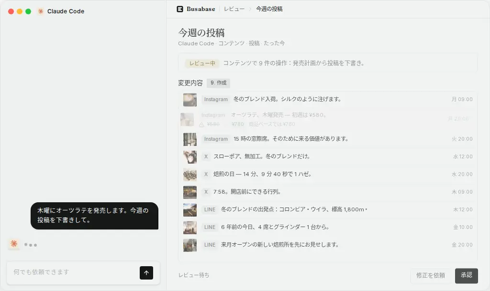

<div align="center">

<picture>
  <source media="(prefers-color-scheme: dark)" srcset="../public/icon-dark.svg" />
  
</picture>

<h1>Busabase</h1>

<p><b>AI エージェントのためのデータベース＆ワークスペース</b><br/>
Claude Code、Codex、Cursor、OpenClaw、独自エージェントに、構造化データ、永続的な知識、再利用可能な Skill、実行可能なアプリ、そしてすべての変更をたどれる履歴を一つの場所で提供します。</p>

<p>
<a href="../README.md">English</a> &nbsp;·&nbsp; <a href="./README_zh-CN.md">中文</a> &nbsp;·&nbsp; <b>日本語</b> &nbsp;·&nbsp; <a href="./README_ko.md">한국어</a>
</p>

<p>
<a href="https://www.npmjs.com/package/busabase"></a>
<a href="https://hub.docker.com/r/busabase/busabase"></a>
<a href="https://busabase.com/download"></a>
<a href="https://glama.ai/mcp/connectors/com.busabase/busabase"></a>
<a href="https://opensource.org/licenses/MIT"></a>
<a href="https://github.com/busabase/busabase/stargazers"></a>
</p>

<br/>



</div>

> Busabase は AI エージェントのためのオープンソースのデータベース＆ワークスペースです。エージェントと人が同じ構造化データ、ドキュメント、スキル、アプリを共有し、重要な書き込みはレビューを経て信頼できる記録になります。

AI エージェントはコードを書き、成果物を生成できます。しかし有用な結果はチャット、ファイル、データベース、SaaS に散らばりがちです。次のセッションでは文脈を探し直し、書き戻した変更も人から見えにくくなります。

**Busabase は、もう一つのチャット画面ではなく、エージェントが実際に働くためのワークスペースです。**

- **エージェントのデータベース**：Base、フィールド、レコード、リレーション、ビュー、フォーム、アセット。
- **エージェントのナレッジベース**：Doc、File、Drive、検索、履歴、出所情報。
- **エージェントのワークスペース**：Skill、AirApp、Whiteboard、Workflow、Agents、共有アクティビティ。
- **エージェント作業の信頼レイヤー**：Change Request、フィールド単位の diff、コメント、承認、commit、監査ログ。

エージェントは人と同じワークスペースを読み、知識や Skill を使い、データ上にアプリを作り、改善を書き戻せます。すべての書き込みは Change Request として行われ、メッセージ、diff、作成者、完全な履歴を伴います。そのまま merge されるか、Inbox でレビューを待つかは、あなたのワークスペース権限が決めます。

**無料・オープンソース。ローカルファースト。エージェントネイティブ。すべての変更をたどれる。**

## クイックスタート

```bash
npx busabase server
```

**http://localhost:15419/dashboard/local** を開きます。外部データベース、アカウント、追加設定は不要です。組み込み PGlite、ローカルファイルストレージ、デモ用ワークスペースで起動します。

```bash
npm i -g busabase
npx busabase-cli --help
```

### Docker

```bash
docker run --rm -p 15419:15419 -v ~/.busabase/data:/data busabase/busabase
```

### デスクトップ版

macOS、Windows、Linux 版は **[busabase.com/download](https://busabase.com/download)** から入手できます。Personal Desktop はローカルで動作し、オフラインでも利用できます。

### ソースから起動

```bash
pnpm install
cp apps/busabase/.env.example apps/busabase/.env
pnpm --filter busabase dev
```

CLI server と Desktop は既定で同じローカルデータを共有します。

```text
~/.busabase/data/
├── pgdata/   # 組み込み PGlite
└── storage/  # ファイルと添付
```

## 一つのワークスペース、多様な構成要素

Busabase は「AI ボタン付きデータベース」ではありません。すべての構成要素が同じワークスペースの第一級ノードであり、人、エージェント、MCP、OpenAPI が同じ対象を扱います。

| 構成要素 | エージェントが得るもの | 人が得るもの |
| --- | --- | --- |
| **Base** | 構造化レコード、schema、リレーション、フィルター、ビュー | チャット履歴ではない実用的なデータベース |
| **Doc** | 永続的な Markdown 知識と運用手順 | 編集・版管理・追跡可能な知識 |
| **File / Drive** | ファイル、添付、プロジェクトツリー | エージェント作業の根拠を一か所に集約 |
| **Skill** | 指示、参考資料、例、スクリプト | ワークスペース文脈とともに再利用できる能力 |
| **AirApp** | ワークスペースのデータと API を使うアプリ | 新しいデータサイロを作らない専用 UI |
| **Whiteboard / Workflow** | 視覚的な文脈と、エージェントが読めるプロセス定義 | エージェントも理解・改善できる共有計画 |
| **Inbox / Activity** | 提案された変更とイベント | 人による制御、復旧性、監査証跡 |

現在のノードタイプは Folder、Base、Doc、File、Drive、Skill、AirApp、Form、HTML、Whiteboard、Workflow です。詳細は **[Node Types](./node-types.md)** を参照してください。

### テンプレートから始める

テンプレートはワークスペースアプリ一式をまとめてインストールします。Base、ビュー、Doc、サンプルデータ、AirApp、そしてそのアプリの使い方をエージェントに伝える Skill マニュアルが一緒に入ります。

```bash
busabase-cli install https://github.com/busabase/templates/tree/main/templates/busa-crm
```

カタログは **[busabase.com/templates](https://busabase.com/templates)** にあります。任意の GitHub URL やローカルディレクトリからも Busabase package をインストールできます。`--dry-run` はインストール計画だけを表示し、`--require-review` は package のレコードと Doc を merge せず change request として残します。

## ワークスペースの画面


|  |  |
| :---: | :---: |
|  |  |
| **Database**：型、関連、検索を備えたレコード | **Knowledge base**：履歴を持つ永続的な Doc |
|  |  |
| **Skills**：再利用可能な指示と関連ファイル | **Apps**：同じデータを使う専用インターフェース |
|  |  |
| **Whiteboards**：人とエージェントの視覚的な文脈 | **Workflows**：データや知識と並ぶプロセス |
|  |  |
| **Review**：エージェントが何を変えたかを正確に確認 | **Provenance**：出所、reviewer、commit、履歴を保持 |

## エージェントを接続

Busabase はモデルを内蔵しません。Claude Code、Codex、Cursor、Gemini CLI、OpenClaw、Hermes、Buda AI、n8n、独自エージェントを接続できます。

<details>
<summary><b>ローカル接続プロンプト</b></summary>

```text
Busabase Agent Skill を読み、唯一の操作ルールとして従ってください：
http://localhost:15419/SETUP_SKILL.md

onboarding に従ってこのワークスペースへ接続してください。私が明示的に指示しない限り、merge の方針を自分で決めないでください。変更を送信すれば、今 merge するかレビューを待つかは Busabase が私の権限に従って判断します。日本語で返答してください。
```

</details>

**[Claude Code ガイド](./claude-code.md)**、**[DeepSeek Harness ガイド](./deepseek-harness.md)**（`@busabase/dsh-plugin` のローカル連携）、**[Bring Your Own Agent](./bring-your-agent.md)** に詳しい接続手順があります。

| 接続方法 | 用途 |
| --- | --- |
| **Agent Skill** | ワークスペースの手順を読める coding agent / ローカル CLI |
| **MCP** | 型付きのワークスペース操作が必要な agent / IDE |
| **OpenAPI / CLI** | アプリ、スクリプト、自動化、独自 agent |
| **Agents view (ACP)** | ツール操作と権限確認を表示する対話セッション |

Busabase の MCP サーバーは [Glama の MCP コネクタディレクトリ](https://glama.ai/mcp/connectors/com.busabase/busabase)にも、リアルタイムのコネクタスコア付きで掲載されています。

## 信頼できる結果になるまで

Busabase の答えは、すべての書き込みを人待ちにすることではなく、すべての書き込みを**説明できる**状態にすることです。

```text
Agent がワークスペースの文脈を読む
        ↓
データ、Doc、Skill、App を変更する — 必ず Change Request として
        ↓
Change Request が diff、メッセージ、作成者、影響を示す
        ↓
あなたの権限が決める：その場で merge か、Inbox でレビュー待ちか
        ↓
どちらでも、その変更は確認でき、誰の変更かが分かり、元に戻せる
```

レビューは通行料ではなく、選べる機能です。権限を `changeRequest` に制限した資格情報は提案しかできず、個別の呼び出しは `autoMerge: false` でレビューに回せ、`busabase-cli install … --require-review` は package の内容を承認待ちにします。それ以外で書き込み権限があるものはそのまま書き込み、それでも diff と履歴は残ります。

Change Request は Busabase のカテゴリそのものではなく、エージェント・ワークスペースを信頼できるものにする仕組みです。

## Personal Desktop と Cloud

| Personal Desktop / ローカル | Busabase Cloud |
| --- | --- |
| 無料・オープンソース | ホストされた複数人ワークスペース |
| ローカル PGlite とファイル | 管理された Postgres とオブジェクトストレージ |
| ログイン不要 | 認証、Space、ロール、権限 |
| オフライン対応 | 共同作業、ホスト API、ガバナンス |
| データは端末内 | Web とモバイルからアクセス |

**Cloud Connect** は認証済み tunnel でローカルワークスペースを [Busabase Cloud](https://busabase.com) に接続します。データとローカルエージェントは端末側に残り、Cloud とモバイルが制御されたリモート画面になります。

## API とアーキテクチャ

Busabase は **MCP**、**OpenAPI**、`busabase-cli` でワークスペース全体を公開します。

```text
http://localhost:15419/api/v1/doc
```

<div align="center">
  
</div>

`apps/busabase` はローカルの単一ワークスペース用 Next.js shell です。共有エンジンは `packages/busabase-core` にあり、[Busabase Cloud](https://busabase.com) も同じ core に認証、権限、ホストストレージ、共同作業を追加して利用します。

## セキュリティ

オープンソース server は信頼できるローカル環境またはプライベートネットワーク向けです。認証と reverse proxy なしで書き込み endpoint を公開インターネットへ直接出さないでください。

## コントリビューション

```bash
pnpm install
pnpm --filter busabase dev
pnpm --filter busabase typecheck
pnpm --filter busabase lint:err
```

[Issues](https://github.com/busabase/busabase/issues) と [Discussions](https://github.com/busabase/busabase/discussions) でバグ報告、アイデア、PR を歓迎します。

## License

[MIT](../../../LICENSE) © Busabase
