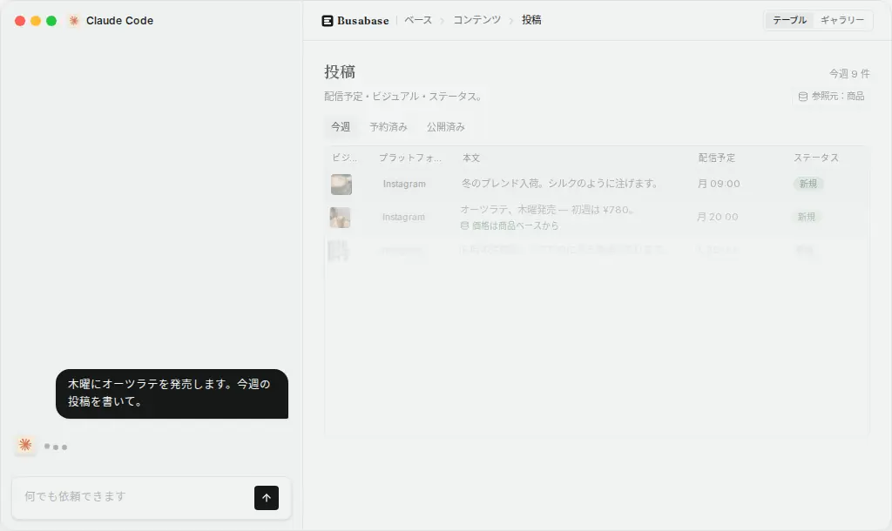

<div align="center">

<picture>
  <source media="(prefers-color-scheme: dark)" srcset="../public/icon-dark.svg" />
  
</picture>

<h1>Busabase</h1>

<h3>AIエージェントのシステムオブレコード</h3>

<p>エージェントはそれぞれ違っても、ベースは一つ。<br/>
Claude Code、Codex、Cursor、そして独自のエージェントが、次のタスクの土台になるレコード、ドキュメント、Skill、アプリを残しておけるオープンソースのデータベース＆ワークスペースです。</p>

<p>
<a href="../README.md">English</a> &nbsp;·&nbsp; <a href="./README_zh-CN.md">中文</a> &nbsp;·&nbsp; <b>日本語</b> &nbsp;·&nbsp; <a href="./README_ko.md">한국어</a>
</p>

<p>
<a href="https://www.npmjs.com/package/busabase"></a>
<a href="https://www.npmjs.com/package/busabase-cli"></a>
<a href="https://hub.docker.com/r/busabase/busabase"></a>
<a href="https://github.com/busabase/busabase/tree/main/packages/busabase-core/tests"></a>
<a href="https://busabase.com/download"></a>
<a href="https://glama.ai/mcp/connectors/com.busabase/busabase"></a>
<a href="https://opensource.org/licenses/MIT"></a>
<a href="https://github.com/busabase/busabase/stargazers"></a>
</p>

<p>
<a href="#クイックスタート"><b>クイックスタート</b></a> &nbsp;·&nbsp;
<a href="#機能">機能</a> &nbsp;·&nbsp;
<a href="#エージェントを接続">エージェントを接続</a> &nbsp;·&nbsp;
<a href="#ユースケース">ユースケース</a> &nbsp;·&nbsp;
<a href="https://busabase.com/docs">ドキュメント</a> &nbsp;·&nbsp;
<a href="https://community.busabase.com/community">コミュニティ</a>
</p>

<br/>

<a href="#機能"></a>

</div>

<br/>

> Busabase は AI エージェントのためのオープンソースのデータベース＆ワークスペースです。エージェントと人が同じ構造化データ、ドキュメント、スキル、アプリを共有し、重要な書き込みはレビューを経て信頼できる記録になります。

エージェントのセッションは毎回ゼロから始まります。`CLAUDE.md` は一つのリポジトリに閉じ、最高の成果はチャットの中で消え、ツールを替えればプロジェクトの説明をまた一からやり直すことになります。

Busabase はエージェントをステートレスのまま、仕事だけを残します。どのエージェントを接続しても、チームや他のエージェントがすでに残したレコード、ドキュメント、Skill、アプリを同じように読み、自分の仕事を diff と履歴付きで書き戻します。

## クイックスタート

```bash
npx busabase server
```

**http://localhost:15419/dashboard/local** を開きます。データベース、アカウント、設定は不要です。組み込み PGlite、ローカルファイルストレージ、デモ用ワークスペースで起動します。

次にエージェントを接続します。Claude Code、Codex、Cursor、Gemini CLI など、URL を読めるエージェントに次を貼り付けてください。

```text
Read and follow the Busabase Agent Skill — it is the single source of truth:
http://localhost:15419/SETUP_SKILL.md

Follow its onboarding to connect to this workspace. Don't choose a merge policy yourself unless I ask for one — submit the change and let Busabase apply my permissions to decide whether it merges now or waits for review. Reply to me in Japanese.
```

**試してみましょう：** あるエージェントにプロジェクトの進捗と規約を記録させ、別のエージェントを開いて *「今週このプロジェクトで何が変わった？」* と聞いてみてください。あなたのクリップボードではなく、ワークスペースから答えが返ってきます。

<details>
<summary><b>Docker · デスクトップ版 · グローバルインストール · ソースから</b></summary>

```bash
# Docker（Docker Hub: busabase/busabase · GHCR: ghcr.io/busabase/busabase）
docker run --rm -p 15419:15419 -v ~/.busabase/data:/data busabase/busabase

# グローバルインストール
npm i -g busabase       # その後: busabase server
npx busabase-cli --help # 任意の Busabase server 向けの API クライアント

# ソースから
pnpm install
cp apps/busabase/.env.example apps/busabase/.env
pnpm --filter busabase dev
```

**デスクトップ版**（macOS、Windows、Linux）：**[busabase.com/download](https://busabase.com/download)** — ローカルで動作し、オフラインでも使えます。

ローカルデータは `~/.busabase/data/` に保存されます（組み込み PGlite データベースは `pgdata/`、ファイルは `storage/`）。別の場所、外部 Postgres、S3 互換ストレージを使う場合は `BUSABASE_DATA_DIR`、`PG_DATABASE_URL`、`STORAGE_URL` を設定してください。同じ PGlite データベースを同時に開けるプロセスは一つだけです。

</details>

## 機能

- **あらゆるエージェントの成果物を一つのワークスペースに** — Base（型付きレコード、リレーション、ビュー、フォーム）、Doc、File、Drive、Skill、AirApp、Whiteboard、Workflow が、一つのツリーの第一級ノードです。[Node Types →](./node-types.md)
- **エージェント間で共有する Skill** — `SKILL.md` の手順書やカスタムプロンプトをワークスペースに置いておけます。**Playbooks** はそれらを一つのカタログにまとめ、接続されたすべてのエージェントが動く前に参照できます。
- **すべての書き込みに説明がつく** — エージェントの書き込みは Change Request として届きます。メッセージ、フィールド単位の diff、作成者、履歴付きです。その場で merge されるか、レビューを待つかは権限が決めます。
- **ライブデータの上で動くアプリ** — エージェントに頼めば、Base をダッシュボード、CRM、コンテンツデスクに変えられます。AirApp は Busabase の中でワークスペースのデータを使って動き、次のエージェントが読める `SKILL.md` を同梱します。
- **好きなエージェントを** — モデルの内蔵もロックインもありません。Agent Skill、MCP、OpenAPI、CLI、または ACP のチャットセッションで接続できます。
- **テンプレート** — Base、ビュー、Doc、サンプルデータ、アプリ、そしてエージェント向けマニュアルまで、動く構成一式をコマンド一つでインストールできます。
- **ローカルファースト・オープンソース** — MIT、組み込みデータベース、オフライン対応。[Busabase Cloud](https://busabase.com) も同じエンジンで動いています。


|  |  |
| :---: | :---: |
|  |  |
| **データベース** — 型付きで、関連し、検索できるレコード | **ナレッジベース** — 版履歴を持つ永続的な Doc |
|  |  |
| **Skill** — 再利用可能な指示と関連ファイル | **アプリ** — ワークスペースのデータ上に作られた専用インターフェース |
|  |  |
| **Change Request** — エージェントが何を変えたかを正確に確認 | **履歴** — ソース、reviewer、commit、タイムライン |
|  |  |
| **Whiteboard** — エージェントと共有する視覚的な文脈 | **Workflow** — データと並べて管理するプロセス |

<details>
<summary><b>モバイルで</b></summary>

[Busabase モバイルアプリ](https://github.com/busabase/busabase/tree/main/apps/busabase-mobile)から、エージェントの Change Request をレビューし、レコードを開けます。

<p align="center">
  
  &nbsp;&nbsp;
  
  &nbsp;&nbsp;
  
</p>

</details>

## エージェントを接続

**Claude Code · Codex · Cursor · Gemini CLI · OpenCode · OpenClaw · Hermes · Buda AI · n8n** — あるいは独自のプロセスでも使えます。

| 接続方法 | 用途 |
| --- | --- |
| **Agent Skill** | ワークスペースの手順に従える coding agent / ローカル CLI |
| **MCP** | 型付きのワークスペース操作が必要なツール対応エージェント / IDE |
| **OpenAPI / CLI** | アプリ、スクリプト、自動化、独自エージェント |
| **Agents view (ACP)** | ツール操作と権限確認をインラインで表示する対話セッション |

ガイド：[Claude Code](./claude-code.md) · [DeepSeek Harness](./deepseek-harness.md) · [Bring Your Own Agent](./bring-your-agent.md)。サイドバーの **Agent Skills** を開くと、起動中のインスタンスの MCP エンドポイントと OpenAPI spec（`/api/v1/doc`）を確認できます。[Glama の MCP ディレクトリ](https://glama.ai/mcp/connectors/com.busabase/busabase)にも掲載されています。

<details>
<summary><b>書き込みの仕組み</b></summary>

```text
エージェントがワークスペースの文脈を読む
        ↓
エージェントがデータ、Doc、Skill、アプリの変更を書く — 常に Change Request として
        ↓
権限が決める：その場で merge されるか、Inbox で待つか
        ↓
どちらの場合も、変更は確認でき、作成者をたどれ、元に戻せる
```

`changeRequest` レベルに制限された資格情報は提案しかできません。個々の呼び出しは `autoMerge: false` で提案に回せます。`busabase-cli install … --require-review` は package の内容を承認待ちにします。それ以外で書き込みを許可されたものはそのまま書き込みますが、それでも diff と履歴は残ります。

</details>

## ユースケース

| ワークスペース | エージェントがやること | Busabase に残るもの |
| --- | --- | --- |
| **ソフトウェア開発** | フィードバックをタスクにし、コードを書いてテストし、リリースし、次のサイクルを始める | フィードバック、タスク、仕様、規約、リリースノート |
| **SEO・コンテンツ** | 検索トレンドを追い、計画を立て、共有 CMS で次の記事の下書きを書く | キーワード調査、ブリーフ、下書き、公開ページ |
| **CRM** | 見込み客を調べ、フォローし、訪問をすべて記録する | 企業、連絡先、訪問メモ、フォローアップ |
| **チームの記憶** | 決定事項、情報源、運用の文脈を残す | 次のエージェントが出発点にするナレッジベース |
| **データセット** | 例にラベルを付け、根拠を添付し、品質を採点する | レビュー済みの学習・評価データ |

テンプレートから始めましょう。アプリ一式、そのデータ、そしてエージェントに使い方を伝えるマニュアルが入っています。

```bash
busabase-cli install https://github.com/busabase/templates/tree/main/templates/busa-crm
```

[busabase.com/templates](https://busabase.com/templates) と [すべてのユースケース](./use-cases_ja.md) を参照してください。

## ほかのツールとの比較

| | 想定している使い方 | エージェントが仕事をするときに足りないもの |
| --- | --- | --- |
| Airtable、Notion、Baserow、NocoDB | 人が直接編集する | エージェントネイティブなアクセス、共有 Skill とアプリ、提案の境界 |
| Postgres | アプリケーションがストレージを読み書きする | ワークスペース UI、知識モデル、レビューループ、出所 |
| エージェントのメモリ、ベクトル DB | 一つのエージェントが文脈を思い出す | 人が開いて、引用し、修正できる構造化された事実 |
| **Busabase** | **人とエージェントが一つのワークスペースを作り上げる** | — |

Busabase 自体が Postgres（または組み込み PGlite）の上で動いています。その上に載るワークスペースであって、アプリのデータベースを置き換えるものではありません。

## エディション

| オープンソース / Personal Desktop | Busabase Cloud |
| --- | --- |
| MIT ライセンスで無料 | ホストされた複数人ワークスペース |
| ローカル PGlite とファイルストレージ | 管理された Postgres とオブジェクトストレージ |
| ログイン不要、オフライン対応 | Space、ロール、権限、Team Insights |
| データは端末内に保存 | Web とモバイルからのアクセス |

**Cloud Connect** は認証済み tunnel でローカルワークスペースを [Busabase Cloud](https://busabase.com) に接続します。データは端末側に残り、ローカルエージェントもそのまま動かせます。[料金](https://busabase.com/pricing)を参照してください。

## アーキテクチャ

<div align="center">
  
</div>

`apps/busabase` はローカルの単一ワークスペース用 Next.js shell です。ワークスペースエンジンは `packages/busabase-core` にあり、ノード、レコード、ファイルツリー、各種ノードタイプ、レビューの基本機能、検索、エージェント、API contract を担い、MCP、OpenAPI、`busabase-cli` を通じて公開されます。Cloud は同じエンジンを、マルチテナントの ID、権限、ホストストレージとともに動かしています。

**セキュリティ：** オープンソース server は、信頼できるローカル環境またはプライベートネットワークでの利用を想定しています。認証と reverse proxy なしで、書き込み endpoint を公開インターネットへ出さないでください。リモートアクセスにはスコープを限定した資格情報と Cloud Connect を使ってください。

## コントリビューション

```bash
pnpm install
pnpm --filter busabase dev
pnpm --filter busabase typecheck
pnpm --filter busabase lint:err
```

[Issues](https://github.com/busabase/busabase/issues) と [Discussions](https://github.com/busabase/busabase/discussions) で、バグ報告、アイデア、ドキュメント、PR を歓迎します。

## コミュニティ

[Web サイト](https://busabase.com) · [ドキュメント](https://busabase.com/docs) · [フォーラム](https://community.busabase.com/community) · [YouTube](https://www.youtube.com/@BusabaseAI) · [X](https://x.com/Busabase4agent) · [LinkedIn](https://www.linkedin.com/company/busabase/)

Busabase が役に立ったら、⭐ を付けてもらえると、ほかのエージェント開発者が見つけやすくなります。

<a href="https://github.com/busabase/busabase/graphs/contributors"></a>

## License

[MIT](../../../LICENSE) © Busabase
