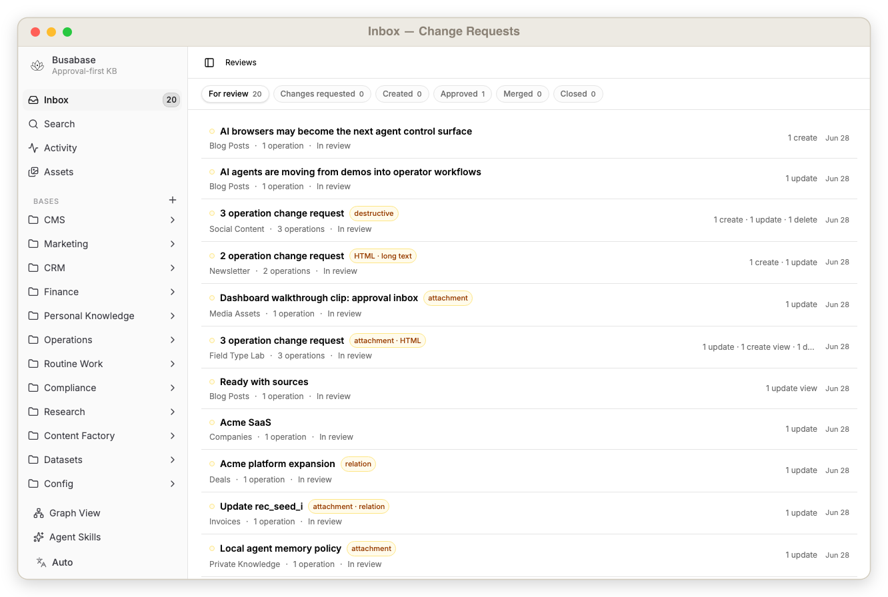
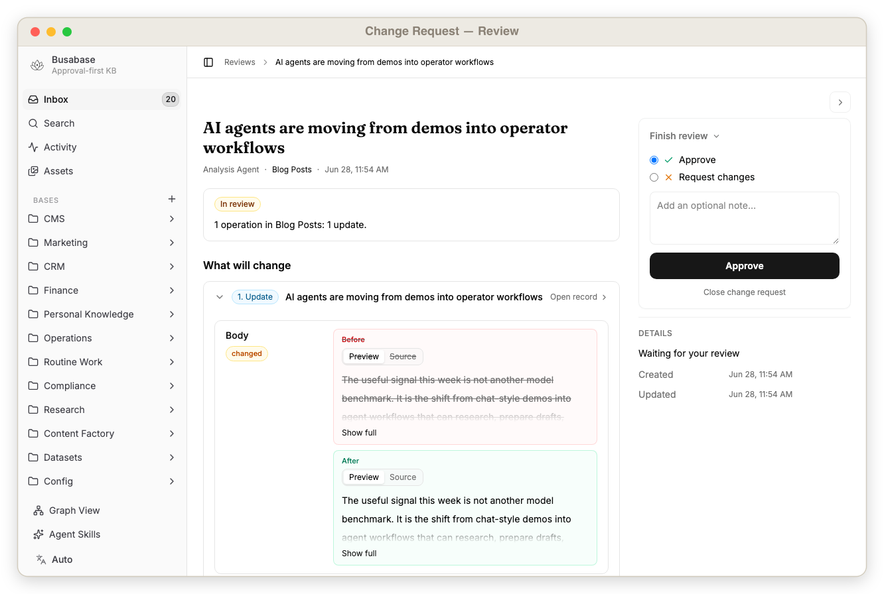
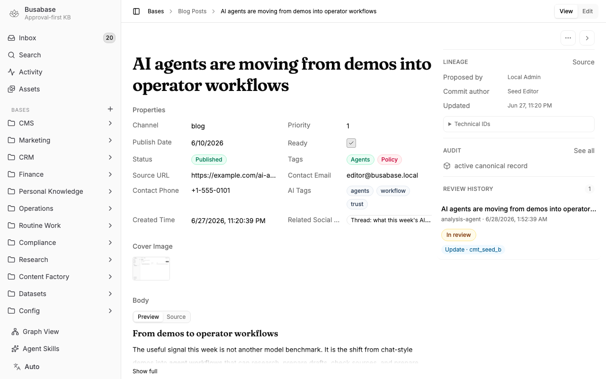
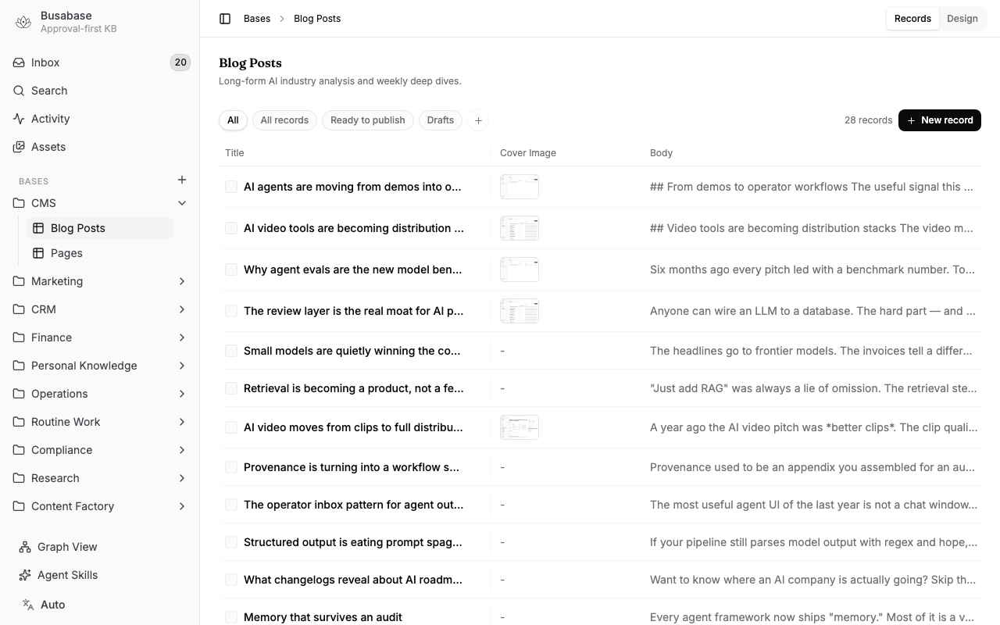
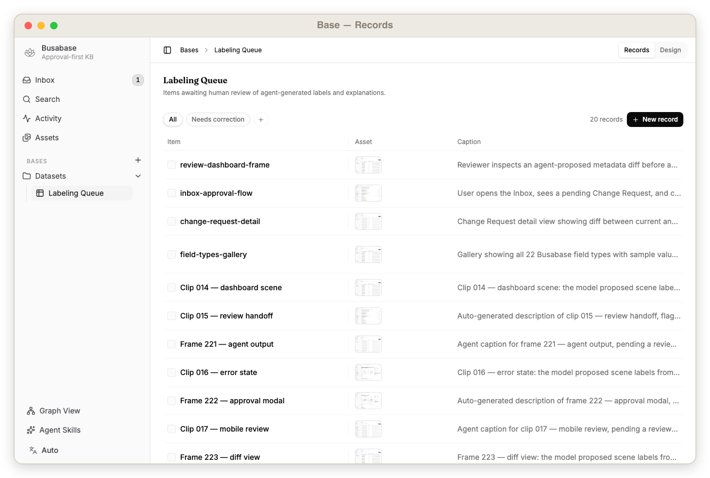
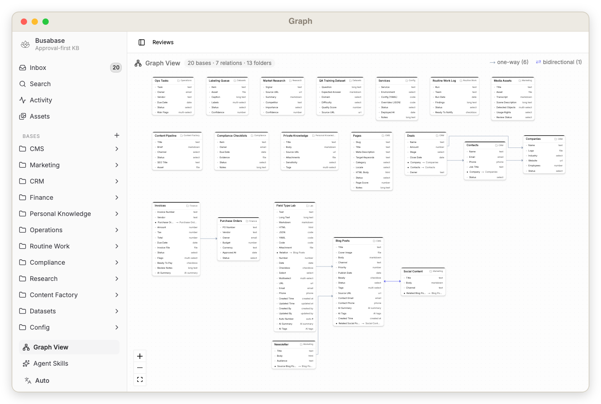
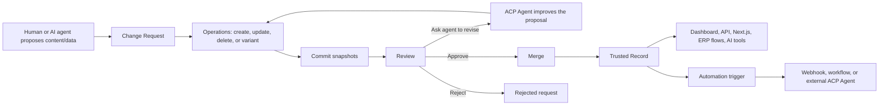

[English](../README.md) · [中文](./README_zh-CN.md) · [日本語](./README_ja.md) · **한국어**

# Busabase

> AI 생성 콘텐츠, 비즈니스 데이터, 데이터셋, 멀티모달 지식을 위한 로컬 우선 검토 데이터베이스.

Busabase는 단 하나의 문제를 해결하기 위한 오픈소스 앱입니다.

**AI는 끝없이 콘텐츠와 데이터를 생성할 수 있지만, 그것이 신뢰할 수 있는지 결정하는 것은 여전히 사람의 몫입니다.**

Busabase는 그 승인 프로세스를 위한 공간입니다. 내장된 변경 요청, 작업, 댓글, 감사 추적, 그리고 앱과 AI 에이전트를 위한 간단한 API를 갖춘 프라이빗 CMS, 지식 베이스, 프로젝트 데이터베이스이자 구조화된 신뢰 소스입니다.

```txt
AI 에이전트 또는 사람이 데이터를 제안 -> 검토 -> 승인 -> 병합 -> 신뢰된 레코드/API
```

**로컬 우선. 검토 우선. 에이전트 준비 완료.**

## 빠른 시작

Busabase를 로컬에서 실행하세요:

```bash
pnpm install
cp apps/busabase/.env.example apps/busabase/.env
pnpm --filter busabase dev
```

대시보드를 열어보세요:

```txt
http://localhost:15419/dashboard/inbox
```

Busabase는 개발 서버가 시작되기 전에 로컬 시작 검사를 실행합니다. 의존성, `PG_DATABASE_URL`, 또는 `STORAGE_URL`이 없으면 빈 대시보드를 열지 않고 설정 메시지와 함께 명령이 실패합니다. 기본 `.env.example`은 `.data/busabase` 하위에 PGlite를, `.data/busabase-storage` 하위에 로컬 파일 스토리지를 사용합니다.

Busabase는 첫 요청 시 예시 베이스, 레코드, 변경 요청을 시드하므로 검토 워크플로를 즉시 확인할 수 있습니다.

실행 후 제공되는 것들:

- 변경 요청 검토를 위한 받은 편지함
- 예시 베이스와 레코드
- 레코드 수준의 히스토리 및 감사 추적
- `.data/busabase` 하위의 로컬 PGlite 영구 저장소
- 앱, 워크플로, AI 에이전트를 위한 REST API 엔드포인트

Docker:

```bash
docker build -f apps/busabase/Dockerfile -t busabase:local .
docker run --rm -p 3000:3000 busabase:local
```

컨테이너 접속:

```txt
http://localhost:3000/dashboard/inbox
```

## 스크린샷

|  |  |
| :---: | :---: |
|  |  |
| 대기 중인 변경 요청, 검토자 상태, 승인 액션이 있는 받은 편지함 | 병합 전 에이전트 제안 변경사항(필드 차이 및 검토자 액션 포함) |
|  |  |
| 필드, 댓글, 검토 기록, 계보가 있는 레코드 상세 페이지 | 구조화된 레코드와 풍부한 필드를 보여주는 베이스 테이블 |
|  |  |
| 베이스 내 레코드 — 타입이 지정된 필드, 풍부한 값, 한눈에 보이는 승인 상태 | 베이스 간 시드 레코드 관계를 보여주는 그래프 뷰 |

## 왜 만들었나요

대부분의 데이터베이스는 데이터 저장을 잘합니다. 대부분의 CMS 도구는 콘텐츠 퍼블리싱을 잘합니다. 대부분의 코드 플랫폼은 파일 검토를 잘합니다.

Busabase는 AI 중심 팀에게 필요한 중간 레이어를 위해 만들어졌습니다:

| 필요 상황 | Busabase가 제공하는 것 |
| --- | --- |
| AI가 블로그 포스트를 초안 작성 | 공개 CMS 레코드가 되기 전에 검토 |
| 사람이 QA 데이터를 정리 | 훈련 또는 평가 전에 고품질 예시를 승인 |
| 에이전트가 동영상에 레이블 지정 | 데이터셋에 들어가기 전에 멀티모달 메타데이터를 확인 |
| 에이전트가 프로젝트 또는 ERP 데이터를 업데이트 | 시스템이 변경되기 전에 사람 검토자가 변경 사항을 승인 |
| 로컬 AI 도구에 메모리가 필요 | 승인된 지식에 대한 프라이빗하고 감사 가능한 API를 노출 |
| 데이터 변경이 작업을 트리거해야 할 때 | 승인된 병합 후 웹훅, 자동화, 또는 외부 에이전트를 실행 |
| 누군가 레코드를 변경했을 때 | 누가 제안하고, 검토하고, 병합하고, 조회하거나 삭제했는지 추적 |

기본적으로 승인 우선, 설계적으로 에이전트 친화적이며, 로컬에서 실행할 수 있을 만큼 여전히 가볍습니다.

## 작동 방식



핵심 개념:

| 개념 | 의미 |
| --- | --- |
| 베이스 | 레코드의 테이블 형태 컬렉션 |
| 필드 | 베이스의 타입이 지정된 속성 |
| 레코드 | 승인된 데이터 행 |
| 변경 요청 | 데이터 변경을 위한 검토 가능한 제안 |
| 작업 | 변경 요청 내의 생성, 수정, 삭제, 또는 변형 액션 |
| 커밋 | 작업 뒤에 있는 불변 데이터 스냅샷 |
| 댓글 | 레코드, 변경 요청, 작업, 또는 커밋에 첨부된 토론 |
| 감사 이벤트 | 중요한 읽기, 쓰기, 검토, 병합, 삭제에 대한 추적 기록 |

## Busabase로 무엇을 만들 수 있나요

### Next.js용 블로그 CMS

Busabase를 블로그 또는 편집 워크플로를 위한 로컬 CMS로 사용하세요.

다음과 같은 필드로 `Blog` 베이스를 만드세요:

| 필드 | 타입 |
| --- | --- |
| Title | text |
| Slug | text |
| Body | markdown |
| HTML Preview | html |
| Tags | multiselect |
| Publish Date | date |
| Status | select |

그러면 워크플로는 다음과 같아집니다:

1. AI 또는 작성자가 Markdown 포스트를 작성합니다.
2. 포스트가 변경 요청으로 Busabase에 들어옵니다.
3. 검토자가 콘텐츠, 메타데이터, 링크를 확인합니다.
4. 승인된 포스트가 신뢰된 베이스로 병합됩니다.
5. Next.js 앱이 Busabase API를 읽어 블로그를 렌더링합니다.

### SEO 랜딩 페이지

AI가 생성한 HTML 랜딩 페이지를 게시하기 전에 Busabase에서 관리하고 검토하세요.

워크플로는 다음과 같습니다:

1. AI 에이전트가 키워드 또는 제품 비교를 위한 완전한 HTML 랜딩 페이지를 생성합니다.
2. 페이지가 `Pages` 베이스의 변경 요청으로 Busabase에 들어옵니다.
3. 검토자가 HTML 구조, 카피 품질, 메타 태그, 키워드 타겟팅을 확인합니다.
4. 검토자가 승인하거나 에이전트에게 수정을 요청합니다.
5. 승인된 레코드가 신뢰된 베이스로 병합됩니다.
6. Next.js 라우트가 슬러그로 Busabase API를 읽어 `html` 필드를 직접 렌더링합니다.

### 설정 관리

Busabase를 사용해 서비스 설정을 YAML 및 JSON으로 저장하고 버전 관리하세요. AI 에이전트가 속도 제한 증가, 피처 플래그, 환경 오버라이드 등 설정 변경을 변경 요청으로 제안합니다. 팀이 프로덕션에 반영되기 전에 정확한 차이를 검토합니다.

새로운 **코드 필드 타입**(JSON, YAML, TypeScript, SQL, Bash 등 지원)은 완전한 구문 강조로 설정을 렌더링합니다.

### 재무 및 인보이스 검토

자동화가 도움이 되지만 신뢰가 여전히 중요한 재무 워크플로에 Busabase를 활용하세요.

다음과 같은 경우에 잘 작동합니다:

- 인보이스 대사(reconciliation)
- 비용 검토
- 주문-결제 매칭
- 갱신 확인
- 벤더 레코드 정리

### 데이터 스튜어드십과 CRM 정합성 관리

비즈니스 데이터를 깨끗하게 유지하기 위한 검토 큐로 Busabase를 사용하세요.

예시:

- 중복 기업 또는 연락처 병합
- 웹사이트, 산업, 담당자 메모로 CRM 레코드 보강
- 영업 대화 후 라이프사이클 단계 업데이트
- 지저분한 레코드 전반에 걸친 태그 정규화
- 누락된 동의, 계약, 또는 결제 정보 플래그

### 컴플라이언스 및 감사 체크리스트

증거가 필요한 반복적인 확인 작업에 Busabase를 사용하세요.

각 체크리스트 항목이 레코드가 될 수 있습니다. 각 업데이트는 변경 요청이 될 수 있습니다. 각 승인은 감사 이벤트를 남깁니다.

### 고품질 QA 및 훈련 데이터셋

모델 훈련, 평가, RAG, 벤치마크 작업을 위한 데이터셋을 Busabase로 구축하세요.

익명의 CSV 편집 대신, 승인된 모든 행에는 검토 기록이 남습니다.

### 멀티모달 콘텐츠 검토

Busabase는 텍스트 그 이상을 위해 설계되었습니다.

AI 에이전트가 동영상을 설명하고, 메타데이터를 추출하고, 태그를 제안할 수 있습니다. 사람이 레코드를 승인한 후 최종 미디어 라이브러리, 검색 인덱스, 또는 훈련 코퍼스에 들어갑니다.

### 시장 인텔리전스 및 리서치 모니터링

사람이 검토한 리서치 피드로 Busabase를 활용하세요.

예시:

- 경쟁사 가격 변동
- 제품 출시 추적
- 업계 뉴스 모니터링
- 투자 리서치 메모
- 고객 리서치 종합

### 콘텐츠 팩토리 파이프라인

아이디어에서 게시된 에셋까지 콘텐츠 제작을 조율하는 데 Busabase를 활용하세요.

### 데이터셋 레이블링 파이프라인

에이전트 우선 레이블링과 사람의 검토를 결합하는 데 Busabase를 활용하세요.

### 승인 기반 프로젝트 관리 및 ERP

운영 데이터를 위한 경량 승인 레이어로 Busabase를 활용하세요.

이 모델에서:

1. 에이전트가 업데이트를 수집하거나, 지저분한 데이터를 대사하거나, 상태 변경을 제안할 수 있습니다.
2. 사람이 변경 요청으로 제안된 변경 사항을 검토합니다.
3. 승인된 작업이 신뢰 소스로 병합됩니다.
4. 다운스트림 도구가 API를 통해 신뢰된 레코드를 읽습니다.

### 공식 시스템 오브 레코드

Busabase를 **시스템 오브 레코드**로 활용하세요 — 각 레코드의 공식적이고 승인된 버전을 보관하는 단일 장소입니다.

```txt
많은 작성자(사람 + 에이전트) -> 변경 요청 -> 검토 -> 공식 레코드 -> 다른 모든 곳에서 읽기
```

### 로컬 개인 지식 베이스

자신과 AI 도구를 위한 프라이빗 데이터베이스로 본인 머신에서 Busabase를 실행하세요.

- 프라이빗 메모, 리서치, 링크, 파일, 구조화된 레코드를 저장합니다.
- 신뢰된 AI 에이전트에게 로컬 또는 프라이빗 네트워크 API를 노출합니다.
- 통제되지 않은 쓰기 권한을 주지 않고 AI가 승인된 지식을 읽도록 합니다.
- 읽기, 쓰기, 검토, 병합, 삭제를 감사합니다.
- `.data/busabase` 하위에 PGlite 영구 저장소로 데이터를 로컬에 보관합니다.

### 검증된 루틴 업무

완료, 검토, 기록이 필요한 일일 또는 주간 업무에 Busabase를 활용하세요.

### 필드 타입 실험실

하나의 로컬 시나리오에서 지원되는 모든 필드 타입과 검토 작업을 확인하는 데 Busabase를 활용하세요.

## 자동화 및 ACP 에이전트

Busabase는 데이터 워크플로의 이벤트 소스가 될 수 있습니다.

병합 후, 승인된 데이터가 다운스트림 자동화를 트리거할 수 있습니다:

- 웹훅 전송
- 외부 시스템 업데이트
- 검토자 또는 채널 알림
- Next.js 사이트 새로고침
- ETL 또는 데이터셋 내보내기 시작
- 워크플로를 계속하기 위한 외부 ACP 에이전트 호출

## 로컬 에이전트가 지식 베이스를 운영합니다

Busabase는 본인 컴퓨터에서 이미 실행 중인 에이전트가 구동할 수 있도록 설계되었습니다.

```txt
로컬 에이전트가 승인된 지식을 읽음 ->
변경 요청을 제안 ->
본인 머신에서 검토 ->
승인 -> 로컬 신뢰 소스로 병합
```

> OpenClaw가 로컬 컴퓨터의 **에이전트**를 위한 혁명이라면, BusaBase는 로컬 컴퓨터의 **데이터베이스와 지식 베이스**를 위한 혁명입니다.

## Busabase가 중요하게 생각하는 것

Busabase는 단순히 "이 행의 최신 값은 무엇인가?"를 묻지 않습니다.

다음도 함께 묻습니다:

- 누가 이 데이터를 제안했나요?
- 왜 변경되어야 하나요?
- 어떤 필드가 변경되었나요?
- 이것은 생성, 수정, 삭제, 또는 변형 작업인가요?
- 수락되기 전에 AI 에이전트가 무엇을 생성했나요?
- 누가 에이전트 출력을 검토했나요?
- 사람이 에이전트에게 수정을 요청했나요?
- 제안이 병합되었나요, 거부되었나요?
- 병합 후 어떤 자동화가 실행되었나요?
- 나중에 결정을 추적할 수 있나요?

## Busabase vs Airtable, Notion, PostgreSQL

```txt
Airtable은 유연한 데이터를 저장합니다.
PostgreSQL은 신뢰할 수 있는 데이터를 저장합니다.
Notion은 팀 지식을 정리합니다.
Busabase는 제안된 데이터가 진실이 되기 전에 검토합니다.
```

## Busabase vs Airtable, APITable, 데이터베이스 도구

Busabase는 에이전트 중심 데이터베이스에 필요한 것들을 추가합니다:

- **제안 레이어.** 에이전트가 행을 직접 편집하는 대신 변경 요청을 제출합니다.
- **병합 전 미리보기.** 에이전트가 생성한 내용과 변경된 필드를 정확히 확인합니다.
- **수정 루프.** 수락되기 전에 에이전트에게 제안을 수정하도록 요청할 수 있습니다.
- **감사 추적.** 모든 읽기, 쓰기, 검토, 병합, 삭제를 추적할 수 있습니다.
- **로컬의 신뢰된 API.** 단순한 인간 스프레드시트 사용자가 아닌, 본인 머신의 에이전트를 위해 설계되었습니다.

```txt
Airtable과 APITable: 사람이 편집하는 데이터베이스.
Busabase: 에이전트가 제안하고 사람이 승인하는 데이터베이스.
```

## Busabase vs Confluence, Lark, 위키 도구

```txt
Confluence와 Lark는 지식을 대신 호스팅합니다.
Busabase는 지식을 본인이 보관하도록 합니다.
```

- **기본적으로 셀프 호스팅 가능.**
- **데이터는 본인 것.**
- **마이그레이션이 아닌 터널링.**
- **무료 오픈소스.**

## Busabase vs 풀 리퀘스트

| 검토 대상 | 사용 도구 |
| --- | --- |
| 소스 코드, 파일, 브랜치, 차이 | [GitHub Pull Requests](https://docs.github.com/en/pull-requests) |
| 블로그 포스트, QA 쌍, 데이터셋 행, 동영상 어노테이션, 지식 레코드 | Busabase 변경 요청 |

코드 검토는 파일 기반입니다. Busabase 검토는 레코드 기반입니다.

## 기능

- 로컬 우선 오픈소스 앱
- 내장 검토 워크플로
- 다중 작업을 포함한 변경 요청
- 생성, 수정, 삭제, 변형 작업
- 레코드 변경에 대한 커밋 히스토리
- 레코드 및 검토 객체에 대한 댓글
- 읽기 및 쓰기에 대한 감사 이벤트
- Markdown, HTML, 링크, 파일, 관계 필드 및 풍부한 필드 타입
- 검색에 최적화된 인덱싱된 필드 값
- 앱, 워크플로, AI 에이전트를 위한 REST API
- 에이전트 제안 변경에 대한 사람 참여(Human-in-the-loop) 협업
- 병합 전 AI 에이전트 출력 미리보기
- 승인된 운영 레코드를 위한 단일 신뢰 소스
- 승인된 데이터 변경 후 자동화 트리거
- 검토 중 및 병합 후 ACP 에이전트 훅
- PGlite 로컬 영구 저장소
- Docker 친화적 배포

## API 인터페이스

Busabase는 대시보드 클라이언트, 앱, AI 에이전트를 위한 간단한 로컬 REST API를 제공합니다.

### 에이전트 제안 예시

```bash
# 1. Blog Posts 베이스를 찾습니다.
BLOG_BASE_ID=$(curl -s http://localhost:15419/api/v1/bases \
  | jq -r '.[] | select(.slug == "blog") | .id')

# 2. 에이전트가 새 레코드를 제안합니다.
CHANGE_REQUEST_ID=$(curl -s -X POST \
  "http://localhost:15419/api/v1/bases/$BLOG_BASE_ID/change-requests" \
  -H 'content-type: application/json' \
  -d '{
    "fields": {
      "title": "Agent market note",
      "body": "Drafted by an agent, waiting for human review.",
      "channel": "blog"
    },
    "message": "Agent proposed a market note",
    "submittedBy": "local-agent"
  }' | jq -r '.id')

echo "Review: http://localhost:15419/dashboard/inbox/$CHANGE_REQUEST_ID"

curl -s -X POST "http://localhost:15419/api/v1/change-requests/$CHANGE_REQUEST_ID/merge" \
  | jq '.record.id, .record.headCommit.fields.title'
```

기계 판독 가능한 엔드포인트 문서를 보려면 아래 주소를 여세요:

```txt
http://localhost:15419/api/v1/doc
```

## Busabase를 언제 사용하나요

다음과 같은 경우에 Busabase를 사용하세요:

- AI가 콘텐츠를 생성하지만 신뢰할 수 있는 것을 결정하는 것은 사람인 경우.
- AI 에이전트가 업데이트를 제안하지만 최종 권한은 사람이 갖는 경우.
- 승인 기반 프로젝트 관리, CRM, ERP, 또는 운영 데이터베이스가 필요한 경우.
- 완료, 검토, 기록이 필요한 루틴 운영 업무가 있는 경우.
- 팀이 검토 기록이 있는 고품질 데이터셋이 필요한 경우.
- AI 에이전트 출력이 신뢰된 레코드가 되기 전에 사람이 미리볼 필요가 있는 경우.
- 콘텐츠를 구조화된 레코드로 취급하는 CMS가 필요한 경우.
- AI가 안전하게 읽을 수 있는 프라이빗 로컬 데이터베이스가 필요한 경우.
- 승인된 비즈니스 데이터를 위한 단일 신뢰 소스가 필요한 경우.
- 누가 데이터를 조회하고, 변경하고, 검토하고, 병합하거나, 삭제했는지 추적하고 싶은 경우.

Busabase를 기본 코드 검토 시스템으로 사용하지 마세요. 코드에는 GitHub 풀 리퀘스트를 사용하세요.

## 로드맵

### 로컬 Busabase

오픈소스 버전은 로컬에서 실행되며 데이터를 본인이 통제하는 위치에 저장합니다.

### Busabase Cloud

향후 클라우드 호스팅 버전은 관리형 협업, 호스팅 스토리지, 팀 접근 제어, 더 쉬운 배포를 제공할 수 있습니다.

### Busabase Tunnel

향후 터널 모드는 모든 데이터를 중앙 클라우드 데이터베이스로 이전하지 않고 로컬 Busabase 인스턴스를 공개 인터넷 또는 통제된 네트워크에 노출할 수 있습니다.

## 오픈소스 구성

로컬 오픈소스 버전은 의도적으로 작게 유지됩니다:

- 기본적으로 로그인 없음
- 하나의 로컬 워크스페이스
- 앱 로컬 Drizzle 스키마
- `.data/busabase` 하위의 PGlite 영구 저장소
- `/dashboard/inbox`의 대시보드
- 로컬 앱과 신뢰된 에이전트를 위한 REST API

## 보안 참고 사항

Busabase는 신뢰된 로컬 또는 프라이빗 네트워크 배포를 위해 설계되었습니다.

리버스 프록시, 토큰 레이어, 또는 다른 접근 제어 레이어 없이 쓰기 엔드포인트를 공개 인터넷에 노출하지 마세요.
