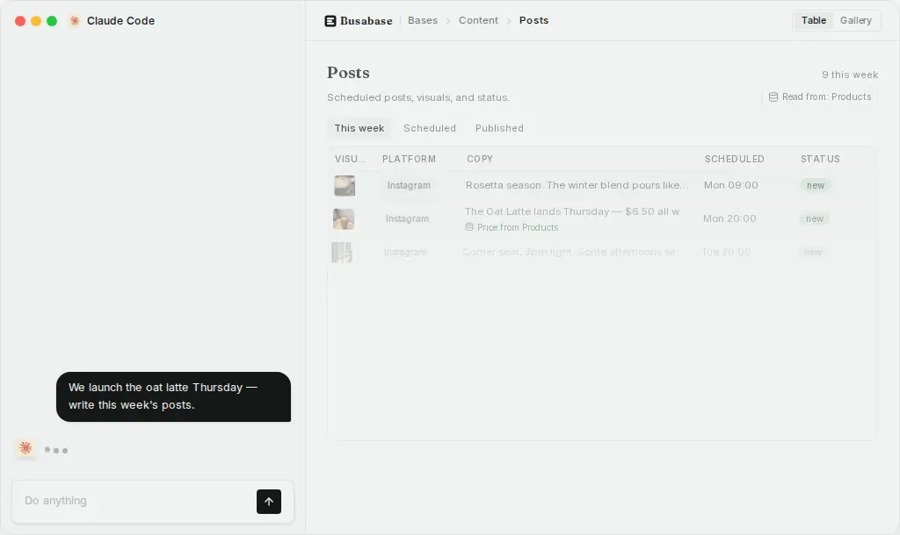

<div align="center">

<picture>
  <source media="(prefers-color-scheme: dark)" srcset="../public/icon-dark.svg" />
  
</picture>

<h1>Busabase</h1>

<h3>AI 에이전트를 위한 시스템 오브 레코드</h3>

<p>에이전트는 달라도, 베이스는 하나.<br/>
Claude Code, Codex, Cursor, 그리고 직접 만든 에이전트가 다음 작업의 토대가 될 레코드, 문서, Skill, 앱을 보관하는 오픈소스 데이터베이스 &amp; 워크스페이스입니다.</p>

<p>
<a href="../README.md">English</a> &nbsp;·&nbsp; <a href="./README_zh-CN.md">中文</a> &nbsp;·&nbsp; <a href="./README_ja.md">日本語</a> &nbsp;·&nbsp; <b>한국어</b>
</p>

<p>
<a href="https://www.npmjs.com/package/busabase"></a>
<a href="https://www.npmjs.com/package/busabase-cli"></a>
<a href="https://hub.docker.com/r/busabase/busabase"></a>
<a href="https://github.com/busabase/busabase/tree/main/packages/busabase-core/tests"></a>
<a href="https://busabase.com/download"></a>
<a href="https://glama.ai/mcp/connectors/com.busabase/busabase"></a>
<a href="https://opensource.org/licenses/MIT"></a>
<a href="https://github.com/busabase/busabase/stargazers"></a>
</p>

<p>
<a href="#빠른-시작"><b>빠른 시작</b></a> &nbsp;·&nbsp;
<a href="#기능">기능</a> &nbsp;·&nbsp;
<a href="#에이전트-연결">에이전트 연결</a> &nbsp;·&nbsp;
<a href="#사용-사례">사용 사례</a> &nbsp;·&nbsp;
<a href="https://busabase.com/docs">문서</a> &nbsp;·&nbsp;
<a href="https://community.busabase.com/community">커뮤니티</a>
</p>

<br/>

<a href="#기능"></a>

</div>

<br/>

> Busabase는 AI 에이전트를 위한 오픈소스 데이터베이스이자 워크스페이스입니다. 에이전트와 사람이 같은 구조화 데이터, 문서, 스킬, 앱을 공유하고, 중요한 쓰기는 검토를 거쳐 신뢰할 수 있는 기록이 됩니다.

에이전트 세션은 매번 0에서 시작합니다. `CLAUDE.md`는 한 repo에만 있고, 가장 좋은 결과물은 채팅 속에서 사라지며, 도구를 바꾸면 프로젝트를 처음부터 다시 설명해야 합니다.

Busabase는 에이전트는 상태 없이, 일은 오래 남도록 합니다. 어떤 에이전트든 연결하면 팀과 다른 에이전트가 이미 남겨 둔 레코드, 문서, Skill, 앱을 똑같이 읽고 — 자신의 작업을 diff와 이력과 함께 다시 기록합니다.

## 빠른 시작

```bash
npx busabase server
```

**http://localhost:15419/dashboard/local** 을 여세요. 데이터베이스, 계정, 설정이 필요하지 않습니다. 내장 PGlite, 로컬 파일 저장소, 데모 워크스페이스로 시작합니다.

그다음 에이전트를 연결하세요. Claude Code, Codex, Cursor, Gemini CLI 등 URL을 읽을 수 있는 에이전트에 아래 내용을 붙여 넣으세요.

```text
Read and follow the Busabase Agent Skill — it is the single source of truth:
http://localhost:15419/SETUP_SKILL.md

Follow its onboarding to connect to this workspace. Don't choose a merge policy yourself unless I ask for one — submit the change and let Busabase apply my permissions to decide whether it merges now or waits for review. Reply to me in Korean.
```

**이렇게 해 보세요:** 한 에이전트에게 프로젝트의 업데이트와 컨벤션을 기록하게 한 뒤, 다른 에이전트를 열어 *"이번 주에 이 프로젝트에서 뭐가 바뀌었어?"* 라고 물어보세요. 여러분의 클립보드가 아니라 워크스페이스를 바탕으로 답합니다.

<details>
<summary><b>Docker · 데스크톱 · 전역 설치 · 소스에서 실행</b></summary>

```bash
# Docker (Docker Hub: busabase/busabase · GHCR: ghcr.io/busabase/busabase)
docker run --rm -p 15419:15419 -v ~/.busabase/data:/data busabase/busabase

# 전역 설치
npm i -g busabase       # 그다음 실행: busabase server
npx busabase-cli --help # 모든 Busabase 서버용 API 클라이언트

# 소스에서 실행
pnpm install
cp apps/busabase/.env.example apps/busabase/.env
pnpm --filter busabase dev
```

**데스크톱** — macOS, Windows, Linux용: **[busabase.com/download](https://busabase.com/download)** — 로컬에서 실행되고 오프라인으로도 동작합니다.

로컬 데이터는 `~/.busabase/data/` 에 저장됩니다(내장 PGlite 데이터베이스는 `pgdata/`, 파일은 `storage/`). 다른 위치, 외부 Postgres, S3 호환 저장소를 쓰려면 `BUSABASE_DATA_DIR`, `PG_DATABASE_URL`, `STORAGE_URL`을 설정하세요. 같은 PGlite 데이터베이스는 한 번에 하나의 프로세스만 열 수 있습니다.

</details>

## 기능

- **모든 종류의 에이전트 결과물을 위한 하나의 워크스페이스** — Base(타입이 있는 레코드, 관계, 뷰, 폼), Doc, File, Drive, Skill, AirApp, Whiteboard, Workflow가 하나의 트리 안의 일급 노드입니다. [Node Types →](./node-types.md)
- **에이전트 간에 공유되는 Skill** — `SKILL.md` 플레이북과 커스텀 프롬프트를 워크스페이스에 보관하세요. **Playbooks** 는 이를 하나의 카탈로그로 모아, 연결된 모든 에이전트가 행동하기 전에 찾아볼 수 있게 합니다.
- **모든 쓰기를 추적** — 에이전트의 쓰기는 메시지, 필드 단위 diff, 작성자, 이력을 갖춘 Change Request로 전달됩니다. 변경이 바로 병합될지 검토를 기다릴지는 권한이 결정합니다.
- **실시간 데이터 위의 앱** — 에이전트에게 Base를 대시보드, CRM, 콘텐츠 데스크로 바꿔 달라고 요청하세요. AirApp은 Busabase 안에서 워크스페이스 데이터 위에 실행되며, 다음 에이전트가 읽을 수 있는 `SKILL.md`를 함께 가집니다.
- **원하는 에이전트를 그대로** — 내장 모델도, 종속도 없습니다. Agent Skill, MCP, OpenAPI, CLI, 또는 ACP 채팅 세션으로 연결하세요.
- **템플릿** — Base, 뷰, Doc, 샘플 데이터, 앱, 그리고 에이전트용 설명서까지 갖춘 작업 환경 한 벌을 명령 하나로 설치합니다.
- **로컬 우선, 오픈소스** — MIT 라이선스, 내장 데이터베이스, 오프라인 동작. 같은 엔진이 [Busabase Cloud](https://busabase.com)를 구동합니다.


|  |  |
| :---: | :---: |
|  |  |
| **데이터베이스** — 타입과 관계가 있고 질의할 수 있는 레코드 | **지식 베이스** — 버전 이력이 있는 지속 가능한 문서 |
|  |  |
| **Skill** — 재사용 가능한 지침과 관련 파일 | **앱** — 워크스페이스 데이터 위에 만든 전용 인터페이스 |
|  |  |
| **Change Request** — 에이전트가 무엇을 바꿨는지 정확히 확인 | **이력** — 출처, 검토자, commit, 타임라인 |
|  |  |
| **Whiteboard** — 에이전트와 공유하는 시각적 맥락 | **Workflow** — 데이터 옆에 보관되는 프로세스 |

<details>
<summary><b>모바일에서</b></summary>

[Busabase 모바일 앱](https://github.com/busabase/busabase/tree/main/apps/busabase-mobile)에서 에이전트의 Change Request를 검토하고 레코드를 열어 볼 수 있습니다.

<p align="center">
  
  &nbsp;&nbsp;
  
  &nbsp;&nbsp;
  
</p>

</details>

## 에이전트 연결

**Claude Code · Codex · Cursor · Gemini CLI · OpenCode · OpenClaw · Hermes · Buda AI · n8n** — 또는 직접 만든 프로세스와 함께 동작합니다.

| 연결 방식 | 적합한 용도 |
| --- | --- |
| **Agent Skill** | 워크스페이스 지침을 따를 수 있는 코딩 에이전트와 로컬 CLI |
| **MCP** | 타입이 있는 워크스페이스 작업이 필요한 도구 인식 에이전트와 IDE |
| **OpenAPI / CLI** | 앱, 스크립트, 자동화, 자체 에이전트 |
| **Agents view (ACP)** | 도구 활동과 권한 요청이 인라인으로 표시되는 대화 세션 |

가이드: [Claude Code](./claude-code.md) · [DeepSeek Harness](./deepseek-harness.md) · [Bring Your Own Agent](./bring-your-agent.md). 사이드바의 **Agent Skills** 를 열면 실행 중인 인스턴스의 MCP endpoint와 OpenAPI spec(`/api/v1/doc`)을 볼 수 있습니다. [Glama MCP 디렉터리](https://glama.ai/mcp/connectors/com.busabase/busabase)에도 등록되어 있습니다.

<details>
<summary><b>쓰기는 어떻게 동작하나요</b></summary>

```text
에이전트가 워크스페이스 맥락을 읽음
        ↓
에이전트가 데이터, 문서, Skill, 앱 변경을 기록 — 항상 Change Request로
        ↓
권한이 결정: 바로 병합되거나, Inbox에서 대기
        ↓
어느 쪽이든 변경은 살펴볼 수 있고, 작성자가 남고, 되돌릴 수 있음
```

`changeRequest` 수준으로 제한된 자격 증명은 제안만 할 수 있고, 개별 호출은 `autoMerge: false` 로 검토를 선택할 수 있으며, `busabase-cli install … --require-review` 는 package의 콘텐츠를 승인 전까지 보류합니다. 그 밖에 쓰기가 허용된 주체는 바로 기록하며 — 그래도 diff와 이력은 남습니다.

</details>

## 사용 사례

| 워크스페이스 | 에이전트가 하는 일 | Busabase에 쌓이는 것 |
| --- | --- | --- |
| **소프트웨어 딜리버리** | 피드백을 태스크로 바꾸고, 코드를 작성·테스트하고, 배포한 뒤 다음 사이클 시작 | 피드백, 태스크, 스펙, 컨벤션, 릴리스 노트 |
| **SEO & 콘텐츠** | 검색 트렌드를 살피고, 계획하고, 공유 CMS에서 다음 글 초안 작성 | 키워드 리서치, 브리프, 초안, 발행된 페이지 |
| **CRM** | 잠재 고객을 조사하고, 팔로업하고, 모든 방문을 기록 | 회사, 연락처, 방문 기록, 팔로업 |
| **팀 메모리** | 결정, 출처, 운영 맥락을 기록 | 다음 에이전트가 출발점으로 삼는 지식 베이스 |
| **데이터셋** | 예시에 라벨을 붙이고, 근거를 첨부하고, 품질을 채점 | 검토를 거친 학습·평가 데이터 |

템플릿으로 시작하세요 — 앱 전체, 데이터, 그리고 에이전트에게 사용법을 알려 주는 설명서가 함께 들어옵니다.

```bash
busabase-cli install https://github.com/busabase/templates/tree/main/templates/busa-crm
```

[busabase.com/templates](https://busabase.com/templates)와 [전체 사용 사례](./use-cases_ko.md)를 둘러보세요.

## 비교

| | 설계 대상 | 에이전트가 일할 때 부족한 것 |
| --- | --- | --- |
| Airtable, Notion, Baserow, NocoDB | 사람이 직접 편집 | 에이전트 네이티브 접근, 공유 Skill과 앱, 제안 경계 |
| Postgres | 애플리케이션의 저장소 읽기·쓰기 | 워크스페이스 UI, 지식 모델, 검토 루프, 출처 추적 |
| 에이전트 메모리, 벡터 DB | 한 에이전트의 맥락 회상 | 사람이 열어 보고, 인용하고, 고칠 수 있는 구조화된 사실 |
| **Busabase** | **사람과 에이전트가 함께 만드는 하나의 워크스페이스** | — |

Busabase 자체가 Postgres(또는 내장 PGlite) 위에서 동작합니다. 앱 데이터베이스를 대체하는 것이 아니라 그 위의 워크스페이스입니다.

## 에디션

| 오픈소스 / Personal Desktop | Busabase Cloud |
| --- | --- |
| MIT 라이선스, 무료 | 호스팅된 다중 사용자 워크스페이스 |
| 로컬 PGlite와 파일 저장소 | 관리형 Postgres와 객체 저장소 |
| 로그인 불필요, 오프라인 동작 | Space, 역할, 권한, Team Insights |
| 데이터가 기기에 유지 | Web과 모바일 접근 |

**Cloud Connect** 는 인증된 tunnel로 로컬 워크스페이스를 [Busabase Cloud](https://busabase.com)에 연결합니다. 데이터는 로컬 기기에 남고 로컬 에이전트도 그대로 실행됩니다. [요금제](https://busabase.com/pricing)를 참고하세요.

## 아키텍처

<div align="center">
  
</div>

`apps/busabase`는 로컬 단일 워크스페이스 Next.js shell입니다. 워크스페이스 엔진은 `packages/busabase-core`에 있습니다: 노드, 레코드, 파일 트리, 리치 노드 유형, 검토 기본 요소, 검색, 에이전트, API 계약 — 이를 MCP, OpenAPI, `busabase-cli`로 제공합니다. Cloud는 같은 엔진에 멀티테넌트 신원, 권한, 호스팅 저장소를 더해 실행합니다.

**보안:** 오픈소스 서버는 신뢰할 수 있는 로컬 기기나 사설 네트워크를 위해 설계되었습니다. 인증과 reverse proxy 없이 쓰기 endpoint를 공개 인터넷에 노출하지 마세요. 원격 접근에는 범위를 제한한 자격 증명과 Cloud Connect를 사용하세요.

## 기여하기

```bash
pnpm install
pnpm --filter busabase dev
pnpm --filter busabase typecheck
pnpm --filter busabase lint:err
```

버그 리포트, 아이디어, 문서, PR은 [Issues](https://github.com/busabase/busabase/issues)와 [Discussions](https://github.com/busabase/busabase/discussions)에서 환영합니다.

## 커뮤니티

[웹사이트](https://busabase.com) · [문서](https://busabase.com/docs) · [포럼](https://community.busabase.com/community) · [YouTube](https://www.youtube.com/@BusabaseAI) · [X](https://x.com/Busabase4agent) · [LinkedIn](https://www.linkedin.com/company/busabase/)

Busabase가 유용했다면 ⭐ 하나가 다른 에이전트 개발자들이 이 프로젝트를 찾는 데 도움이 됩니다.

<a href="https://github.com/busabase/busabase/graphs/contributors"></a>

## 라이선스

[MIT](../../../LICENSE) © Busabase
