<div align="center">

<picture>
  <source media="(prefers-color-scheme: dark)" srcset="../public/icon-dark.svg" />
  
</picture>

<h1>Busabase</h1>

<p><b>面向 AI Agent 的数据库与工作空间</b><br/>
让 Claude Code、Codex、Cursor、OpenClaw 和你的自研 Agent，在同一个地方使用结构化数据、长期知识、可复用 Skill、可运行应用和人类审核。</p>

<p>
<a href="../README.md">English</a> &nbsp;·&nbsp; <b>中文</b> &nbsp;·&nbsp; <a href="./README_ja.md">日本語</a> &nbsp;·&nbsp; <a href="./README_ko.md">한국어</a>
</p>

<p>
<a href="https://www.npmjs.com/package/busabase"></a>
<a href="https://hub.docker.com/r/busabase/busabase"></a>
<a href="https://busabase.com/download"></a>
<a href="https://opensource.org/licenses/MIT"></a>
<a href="https://github.com/busabase/busabase/stargazers"></a>
</p>

<br/>

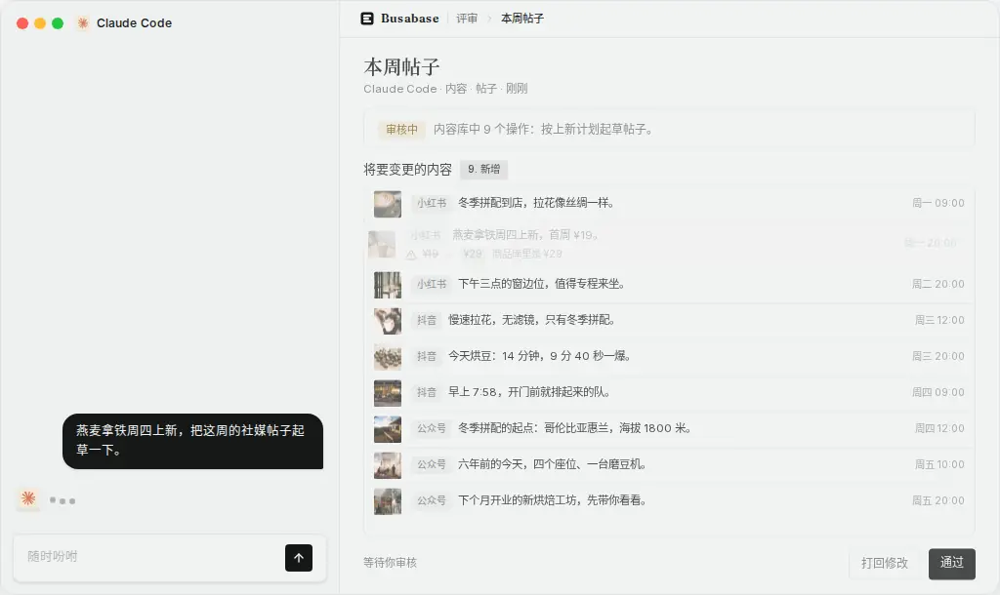

</div>

AI Agent 会写代码、生成内容、执行任务，但真正有价值的结果经常散落在聊天、文件、数据库和各种 SaaS 里。下一次运行时，Agent 又要重新寻找上下文；当它写回数据时，人也很难看清它改了什么、为什么改。

**Busabase 给 Agent 一个真正的工作空间，而不是又一个聊天窗口。**

- **Agent 的数据库**：Base、字段、记录、关系、视图、表单和资产。
- **Agent 的知识库**：Doc、File、Drive、搜索、历史和来源追踪。
- **Agent 的 Workspace**：Skill、AirApp、白板、工作流、Agents 和共享活动。
- **Agent 工作的信任层**：变更请求、字段级 diff、评论、审核、commit 和审计记录。

Agent 可以读取你看到的同一个工作空间，使用里面的知识和 Skill，基于其中的数据构建应用，再把改进提议写回。重要写入先成为 Change Request，由人确认后才进入正式数据。

**免费开源。本地优先。Agent 原生。所有重要变化都可审核。**

## 快速开始

```bash
npx busabase server
```

打开 **http://localhost:15419/dashboard/local**。不需要外部数据库、账号或额外配置；Busabase 会使用内嵌 PGlite、本地文件存储和示例工作空间启动。

```bash
npm i -g busabase       # 全局安装后直接运行：busabase server
npx busabase-cli --help # 连接任意 Busabase 服务的 API 客户端
```

### Docker

```bash
docker run --rm -p 15419:15419 -v ~/.busabase/data:/data busabase/busabase
```

### 桌面版

前往 **[busabase.com/download](https://busabase.com/download)** 下载 macOS、Windows 或 Linux 客户端。Personal Desktop 在本机运行、支持离线使用，工作空间数据无需离开你的电脑。

### 从源码运行

```bash
pnpm install
cp apps/busabase/.env.example apps/busabase/.env
pnpm --filter busabase dev
```

CLI server 和 Desktop 默认共享同一份本地数据：

```text
~/.busabase/data/
├── pgdata/   # 内嵌 PGlite 数据库
└── storage/  # 文件与附件
```

可通过 `BUSABASE_DATA_DIR`、`PG_DATABASE_URL` 或 `STORAGE_URL` 切换目录、外部 Postgres 或 S3 兼容存储。

## 一个工作空间，多种构件

Busabase 不是“数据库加几个 AI 按钮”。每种构件都是同一个工作空间里的一级节点，人、Agent、MCP 和 OpenAPI 访问的是同一套对象。

| 构件 | Agent 得到什么 | 你得到什么 |
| --- | --- | --- |
| **Base** | 结构化记录、字段 schema、关系、筛选与视图 | 真正的业务数据库，而不是松散的聊天记忆 |
| **Doc** | 长期 Markdown 知识和操作说明 | 可编辑、可版本化、可追溯的知识 |
| **File 与 Drive** | 文件、附件和项目目录树 | Agent 工作所依赖的资料集中在一处 |
| **Skill** | 指令、参考资料、示例和脚本 | 跟随工作空间上下文一起复用的能力 |
| **AirApp** | 基于工作空间数据和 API 的可运行应用 | 不制造新数据孤岛的专用界面 |
| **白板与工作流** | 可视化上下文和可执行流程 | Agent 也能理解和改进的共同计划 |
| **Inbox 与 Activity** | 待审提议和工作空间事件 | 人类控制、恢复路径和完整审计轨迹 |

当前节点类型包括 Folder、Base、Doc、File、Drive、Skill、AirApp、Form、HTML、Whiteboard 和 Workflow。详见 **[节点类型](./node-types.md)**。

## 工作空间界面

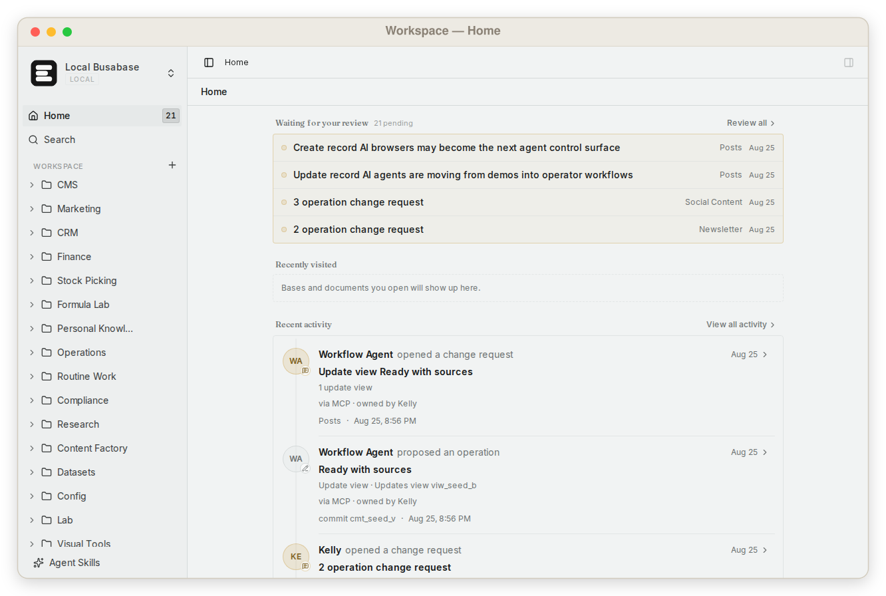

|  |  |
| :---: | :---: |
| 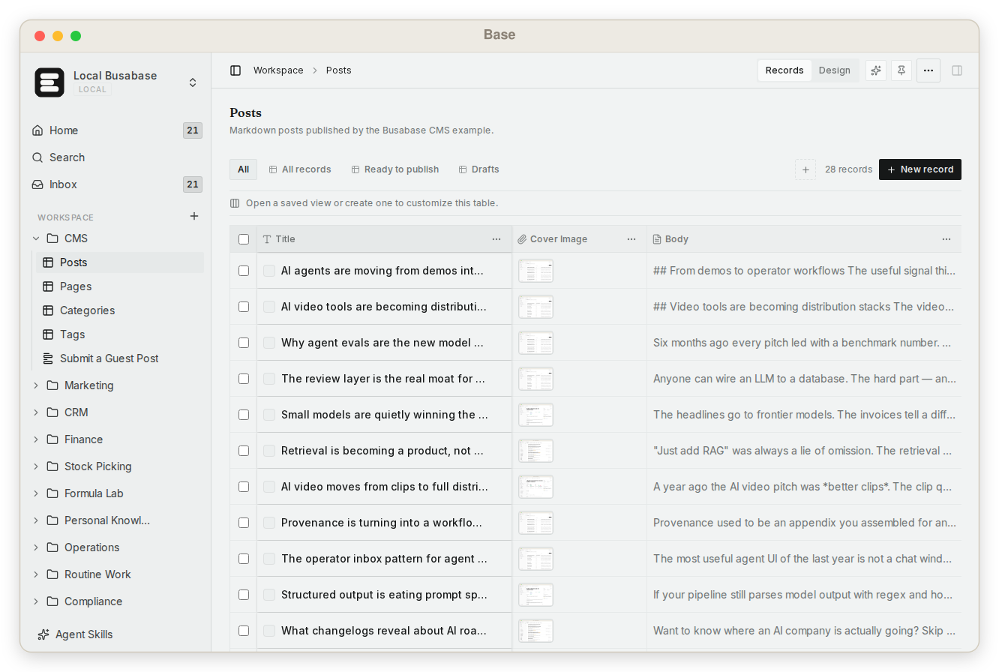 | 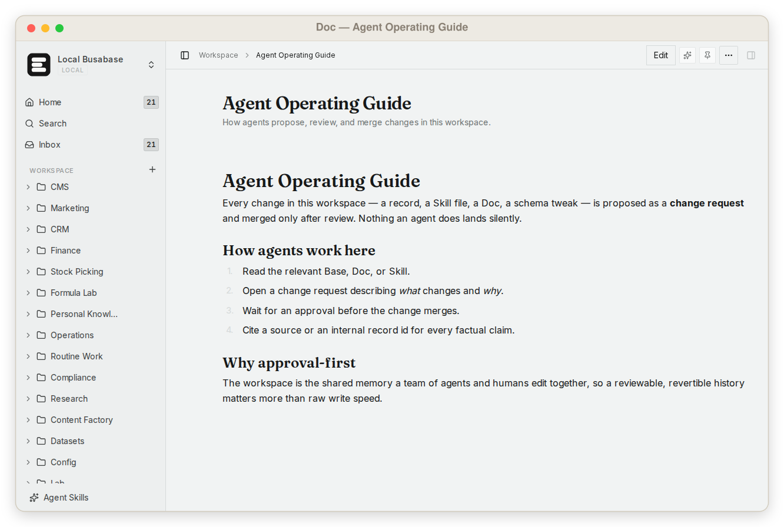 |
| **数据库**：有类型、有关联、可查询的记录 | **知识库**：带版本历史的长期 Doc |
| 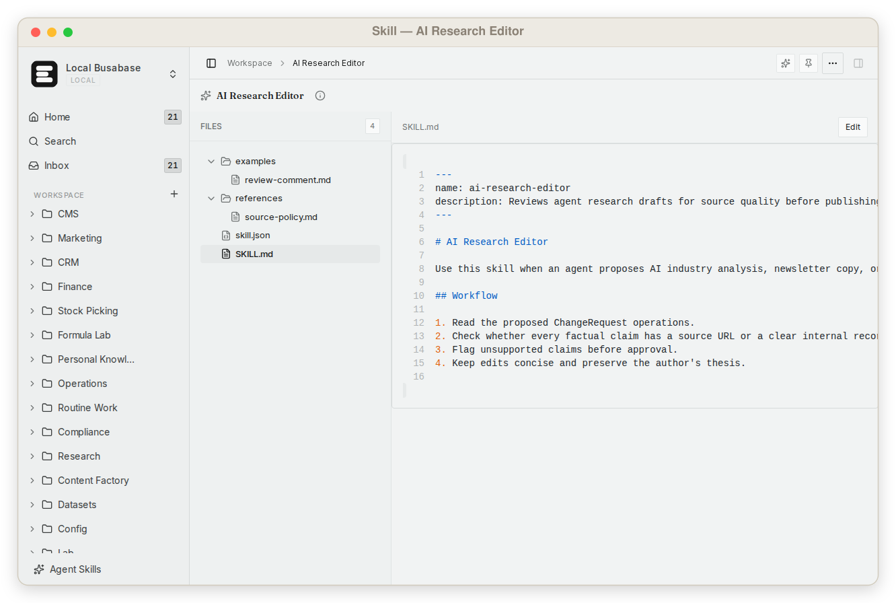 | 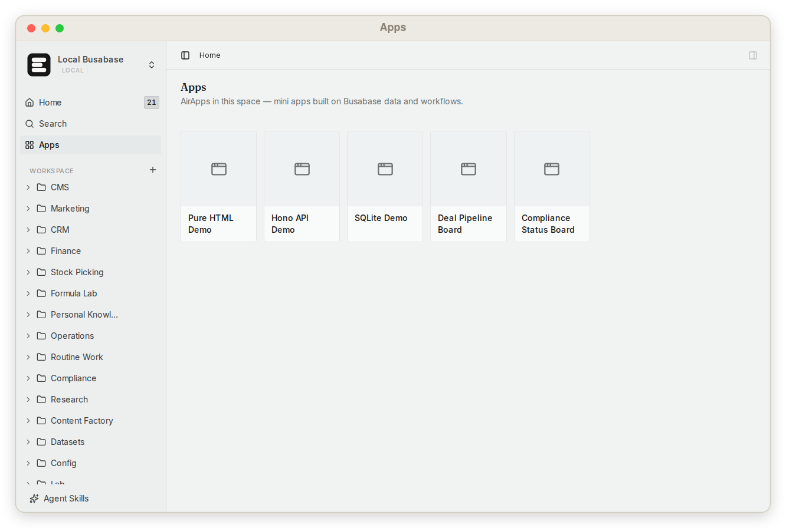 |
| **Skills**：可复用指令与配套文件 | **Apps**：直接使用工作空间数据的专用界面 |
| 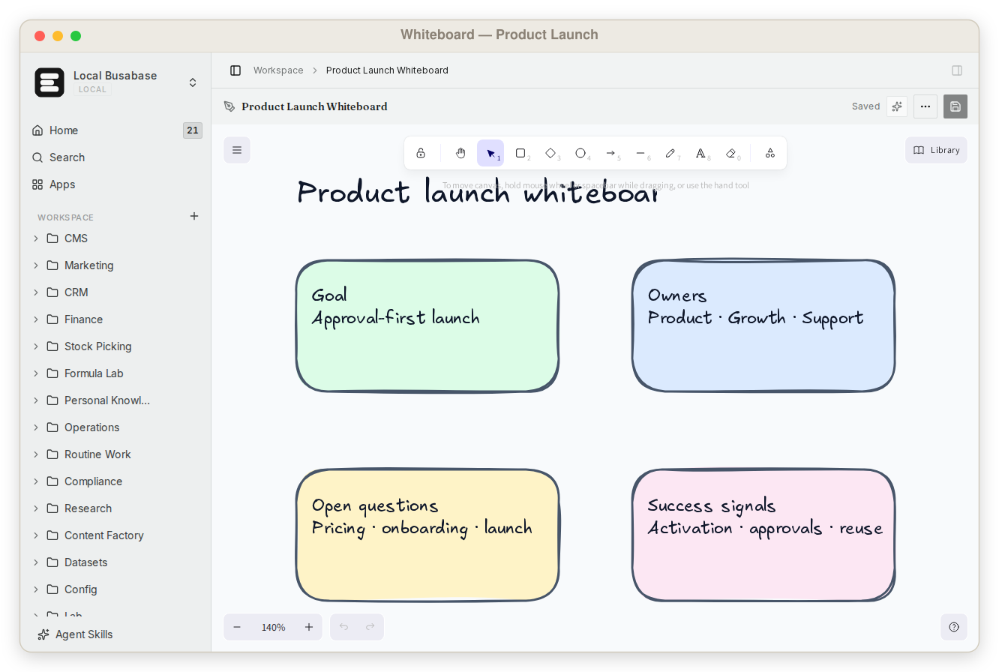 | 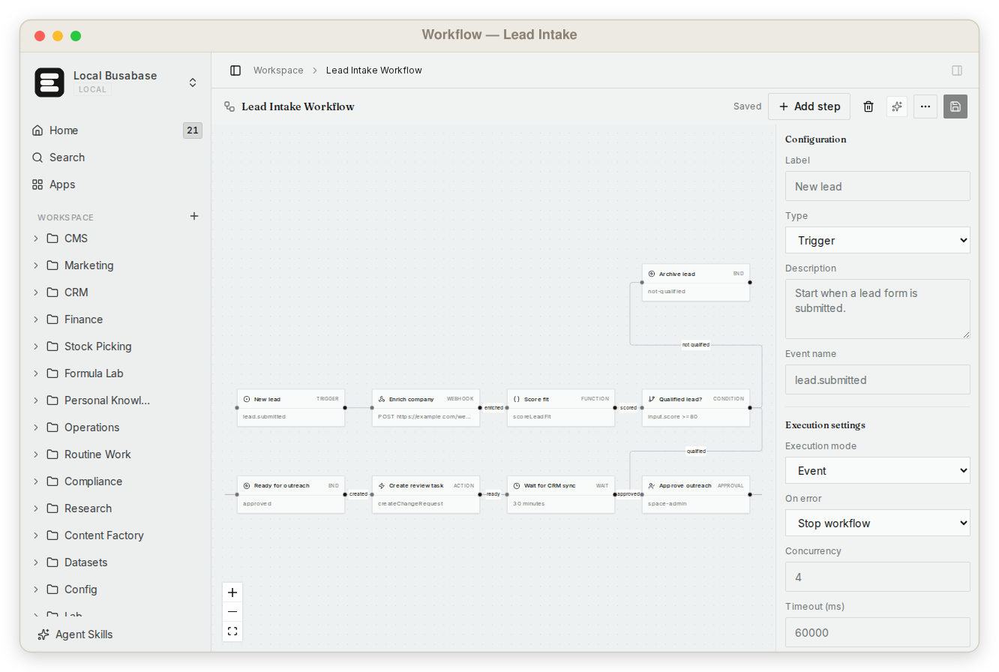 |
| **白板**：人与 Agent 共享的可视化上下文 | **工作流**：和数据、知识放在一起的流程 |
| 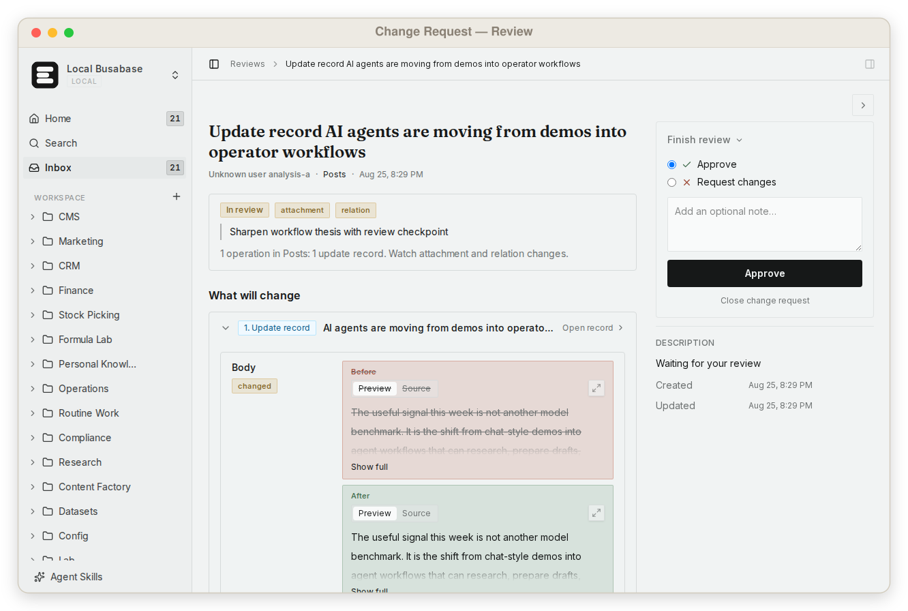 | 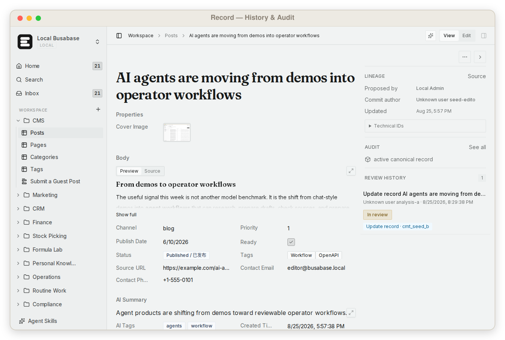 |
| **审核**：合并前看清 Agent 改了什么 | **溯源**：保留来源、审核人、commit 和历史 |

## 连接你的 Agent

Busabase 本身不绑定模型。你可以连接 Claude Code、Codex、Cursor、Gemini CLI、OpenClaw、Hermes、Buda AI、n8n 或自研 Agent。

<details>
<summary><b>复制本地接入提示词</b></summary>

```text
读取并严格遵循 Busabase Agent Skill；它是唯一的操作规范：
http://localhost:15419/SETUP_SKILL.md

按照其中的 onboarding 连接这个工作空间。重要改动必须先创建 ChangeRequest，未经我批准不得 merge。请用中文回复。
```

</details>

**[Claude Code 指南](./claude-code.md)** 介绍本地 Skill 和 Cloud plugin；**[DeepSeek Harness 指南](./deepseek-harness.md)** 介绍 `@busabase/dsh-plugin` 的本地集成；**[Bring Your Own Agent](./bring-your-agent.md)** 介绍通用接入流程。

| 接入方式 | 适合场景 |
| --- | --- |
| **Agent Skill** | 能读取工作空间说明的编码 Agent 与本地 CLI |
| **MCP** | 需要类型化工作空间工具的 Agent 与 IDE |
| **OpenAPI / CLI** | 应用、脚本、自动化与自研 Agent |
| **Agents 视图（ACP）** | 带工具步骤和权限确认的对话式 Agent session |

在侧边栏打开 **Agent Skills**，即可查看当前实例的接入说明、MCP endpoint 和 OpenAPI specification。

## 从工作到可信

```text
Agent 读取工作空间上下文
        ↓
Agent 提议修改数据、Doc、Skill 或 App
        ↓
Change Request 展示准确 diff、来源和影响
        ↓
人类批准、要求修改或拒绝
        ↓
合并后的结果成为正式工作空间知识
```

Change Request 不是 Busabase 的品类定义，而是让 Agent Workspace 值得信任的机制。记录更新、Doc 编辑、Skill 文件、schema 变化和 AirApp package 都可以沿用同一条提议、审核、合并与审计链路。

## 一个完全不同的品类

| 产品类型 | 默认操作者 | Agent 真正工作时缺少什么 |
| --- | --- | --- |
| Airtable、Baserow 等人类数据库 | 人直接编辑行 | Agent 上下文、Skill/App，以及原生提议边界 |
| Notion、Confluence、Obsidian 等知识工具 | 人组织页面 | 跨数据、文件、工具和审核的结构化 Agent 操作 |
| Postgres 等数据库 | 应用读写存储 | 工作空间 UI、知识模型、审核闭环和来源追踪 |
| Agent runtime 与聊天工具 | Agent 执行任务并输出结果 | 跨 Agent、跨 session 的长期 system of record |
| **Busabase** | Agent 与人共同建设一个工作空间 | 数据库 + 知识库 + Skill + App，可信后再进入正式状态 |

## Personal Desktop 与 Cloud

| Personal Desktop / 本地版 | Busabase Cloud |
| --- | --- |
| 免费开源 | 托管的多人工作空间 |
| 本地 PGlite 与文件存储 | 托管 Postgres 与对象存储 |
| 无需登录 | 登录、Space、角色与权限 |
| 可离线运行 | 协作、托管 API 与治理能力 |
| 数据保留在本机 | Web 与移动端访问 |

**Cloud Connect** 可以通过认证 tunnel 把本地工作空间连接到 [Busabase Cloud](https://busabase.com)。数据和本地 Agent 仍在你的电脑上运行，Cloud 与移动端成为受控的远程入口。

## API 与架构

Busabase 通过 **MCP**、**OpenAPI** 和 `busabase-cli` 暴露整个工作空间。机器可读 API 文档位于：

```text
http://localhost:15419/api/v1/doc
```

<div align="center">
  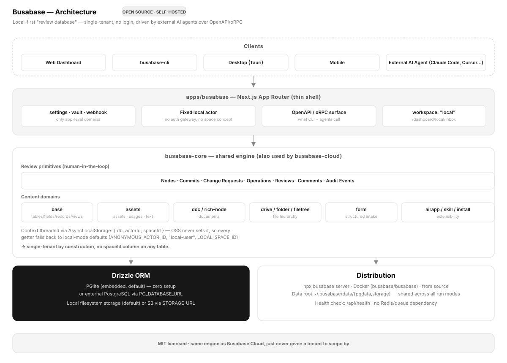
</div>

`apps/busabase` 是本地单工作空间 Next.js shell。工作空间引擎位于 `packages/busabase-core`，包含节点、记录、文件树、富节点、审核原语、搜索、Agents 和 API contract。[Busabase Cloud](https://busabase.com) 使用同一个核心，并增加多租户身份、权限、托管存储和协作。

## 安全

开源 server 适用于可信本机或私有网络。不要在没有认证和反向代理保护的情况下，把写入 endpoint 直接暴露到公网。远程访问应使用 scoped credential 或 Cloud Connect。

## 参与贡献

```bash
pnpm install
pnpm --filter busabase dev
pnpm --filter busabase typecheck
pnpm --filter busabase lint:err
```

欢迎在 [Issues](https://github.com/busabase/busabase/issues) 和 [Discussions](https://github.com/busabase/busabase/discussions) 提交问题、想法与贡献。

## License

[MIT](../../../LICENSE) © Busabase
