<div align="center">

<picture>
  <source media="(prefers-color-scheme: dark)" srcset="../public/icon-dark.svg" />
  
</picture>

<h1>Busabase</h1>

<h3>面向 AI Agent 的记录系统</h3>

<p>不同 Agent，同一个共享底座。<br/>
一个开源的数据库与工作区：Claude Code、Codex、Cursor 和你自研的 Agent，把记录、文档、Skill 和应用都存在这里，下一个任务直接接着用。</p>

<p>
<a href="../README.md">English</a> &nbsp;·&nbsp; <b>中文</b> &nbsp;·&nbsp; <a href="./README_ja.md">日本語</a> &nbsp;·&nbsp; <a href="./README_ko.md">한국어</a>
</p>

<p>
<a href="https://www.npmjs.com/package/busabase"></a>
<a href="https://www.npmjs.com/package/busabase-cli"></a>
<a href="https://hub.docker.com/r/busabase/busabase"></a>
<a href="https://github.com/busabase/busabase/tree/main/packages/busabase-core/tests"></a>
<a href="https://busabase.com/download"></a>
<a href="https://glama.ai/mcp/connectors/com.busabase/busabase"></a>
<a href="https://opensource.org/licenses/MIT"></a>
<a href="https://github.com/busabase/busabase/stargazers"></a>
</p>

<p>
<a href="#快速开始"><b>快速开始</b></a> &nbsp;·&nbsp;
<a href="#功能">功能</a> &nbsp;·&nbsp;
<a href="#连接你的-agent">连接 Agent</a> &nbsp;·&nbsp;
<a href="#使用场景">使用场景</a> &nbsp;·&nbsp;
<a href="https://busabase.com/docs">文档</a> &nbsp;·&nbsp;
<a href="https://community.busabase.com/community">社区</a>
</p>

<br/>

<a href="#功能">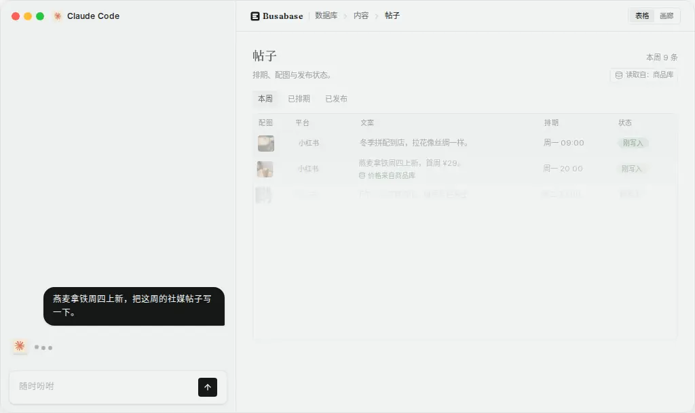</a>

</div>

<br/>

> Busabase 是面向 AI Agent 的开源数据库与工作区——agent 和人共用同一份结构化数据、文档、技能与应用，重要写入经审核成为可信记录。

每个 Agent session 都从零开始。你的 `CLAUDE.md` 锁在一个仓库里，最好的产出死在聊天记录里，换个工具就得把项目从头再讲一遍。

Busabase 让 Agent 保持无状态，让工作留得住：接入任意 Agent，它读到的是团队和其他 Agent 已经留下的同一份记录、文档、Skill 和应用——再把自己的工作写回来，带 diff，留历史。

## 快速开始

```bash
npx busabase server
```

打开 **http://localhost:15419/dashboard/local**——不需要数据库、账号或任何配置。Busabase 会用内嵌的 PGlite、本地文件存储和一个示例工作区启动。

然后把你的 Agent 接上来。把下面这段粘贴到 Claude Code、Codex、Cursor、Gemini CLI，或任何能读取 URL 的 Agent 里：

```text
Read and follow the Busabase Agent Skill — it is the single source of truth:
http://localhost:15419/SETUP_SKILL.md

Follow its onboarding to connect to this workspace. Don't choose a merge policy yourself unless I ask for one — submit the change and let Busabase apply my permissions to decide whether it merges now or waits for review. Reply to me in Simplified Chinese.
```

**试一试**：让一个 Agent 记下某个项目的进展和规范，再打开另一个 Agent 问它：「这个项目这周有什么变化？」它的回答来自工作区，而不是你的剪贴板。

<details>
<summary><b>Docker · 桌面版 · 全局安装 · 从源码运行</b></summary>

```bash
# Docker（Docker Hub: busabase/busabase · GHCR: ghcr.io/busabase/busabase）
docker run --rm -p 15419:15419 -v ~/.busabase/data:/data busabase/busabase

# 全局安装
npm i -g busabase       # 之后直接运行：busabase server
npx busabase-cli --help # 连接任意 Busabase 服务的 API 客户端

# 从源码运行
pnpm install
cp apps/busabase/.env.example apps/busabase/.env
pnpm --filter busabase dev
```

**桌面版**支持 macOS、Windows 和 Linux：**[busabase.com/download](https://busabase.com/download)**——在本机运行，支持离线使用。

本地数据存在 `~/.busabase/data/`（`pgdata/` 是内嵌 PGlite 数据库，`storage/` 是文件）。设置 `BUSABASE_DATA_DIR`、`PG_DATABASE_URL` 或 `STORAGE_URL`，即可换到其他目录、外部 Postgres 或 S3 兼容存储。同一个 PGlite 数据库同一时间只能被一个进程占用。

</details>

## 功能

- **一个工作区，装下各种 Agent 产出**——Base（有类型的记录、关系、视图、表单）、Doc、File、Drive、Skill、AirApp、白板和工作流，全都是同一棵树里的一级节点。[节点类型 →](./node-types.md)
- **Skill 跨 Agent 共享**——把 `SKILL.md` 操作手册和自定义提示词放进工作区。**Playbooks** 把它们汇成一个目录，每个接入的 Agent 动手之前都能先查到。
- **每一次写入都有账可查**——Agent 的写入以 Change Request（变更请求）的形式提交：带说明、字段级 diff、作者和历史。由权限决定改动是当场合并，还是等人审核。
- **基于实时数据的应用**——让 Agent 把一个 Base 变成仪表盘、CRM 或内容工作台。AirApp 运行在 Busabase 里、直接用工作区数据，自带一份下一个 Agent 读得懂的 `SKILL.md`。
- **自带 Agent**——没有内置模型，不绑定任何厂商。通过 Agent Skill、MCP、OpenAPI、CLI 或 ACP 对话 session 接入。
- **模板**——一条命令装好一整套能用的配置（Base、视图、Doc、示例数据、应用，以及给 Agent 的说明书）。
- **本地优先，开源**——MIT 协议，内嵌数据库，支持离线。[Busabase Cloud](https://busabase.com) 跑的也是同一个引擎。

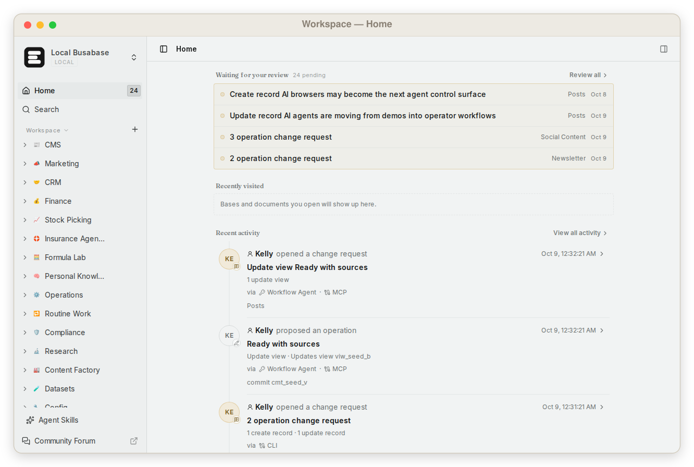

|  |  |
| :---: | :---: |
| 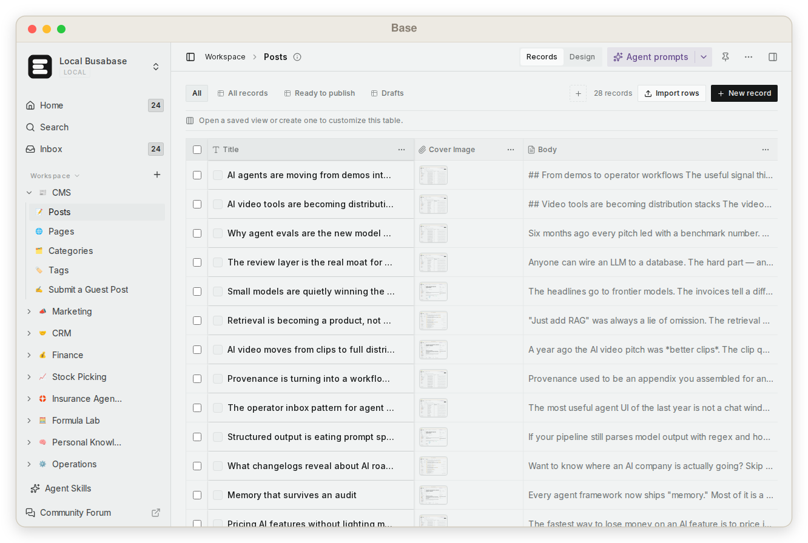 | 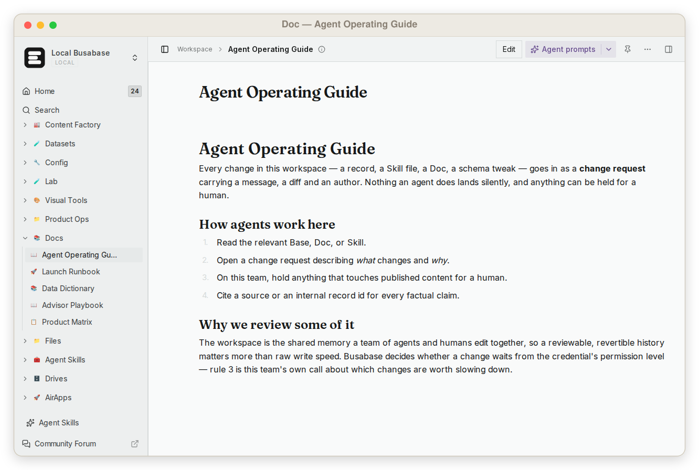 |
| **数据库**——有类型、有关联、可查询的记录 | **知识库**——带版本历史的长期文档 |
| 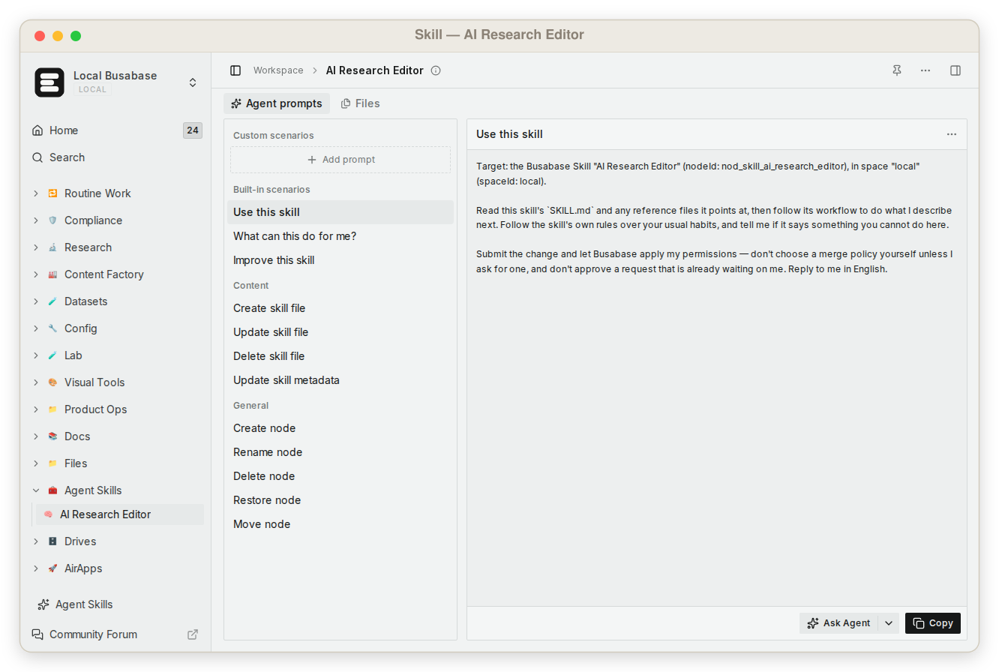 | 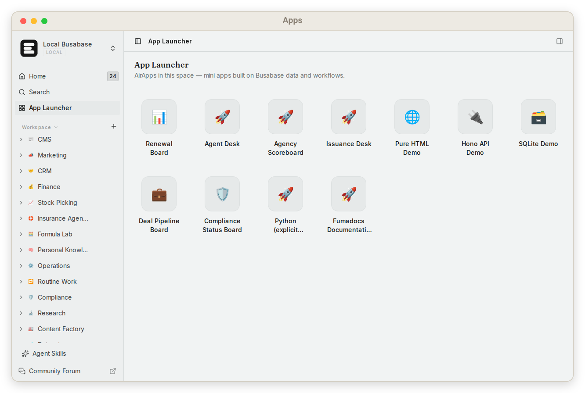 |
| **Skills**——可复用的指令与配套文件 | **Apps**——基于工作区数据的专用界面 |
| 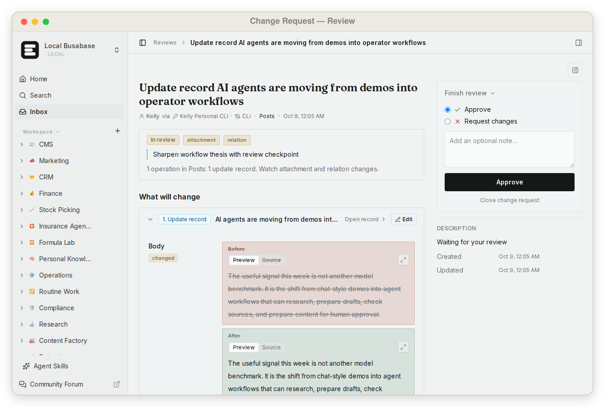 | 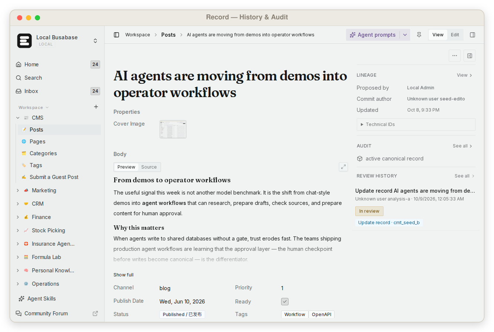 |
| **变更请求**——看清 Agent 到底改了什么 | **历史**——来源、审核人、commit 和时间线 |
| 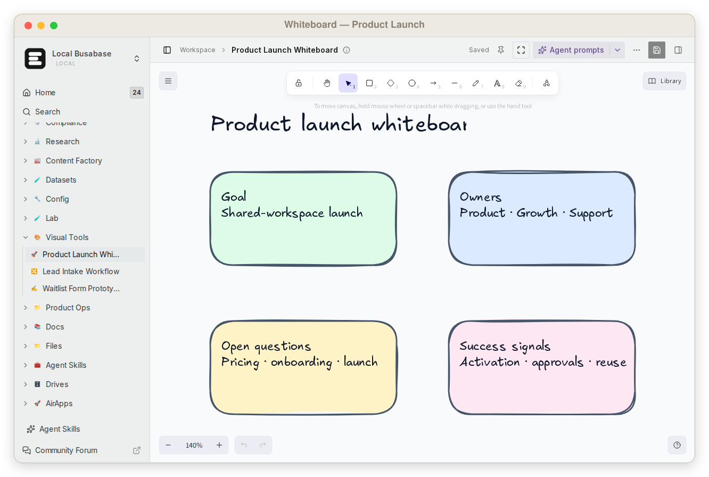 | 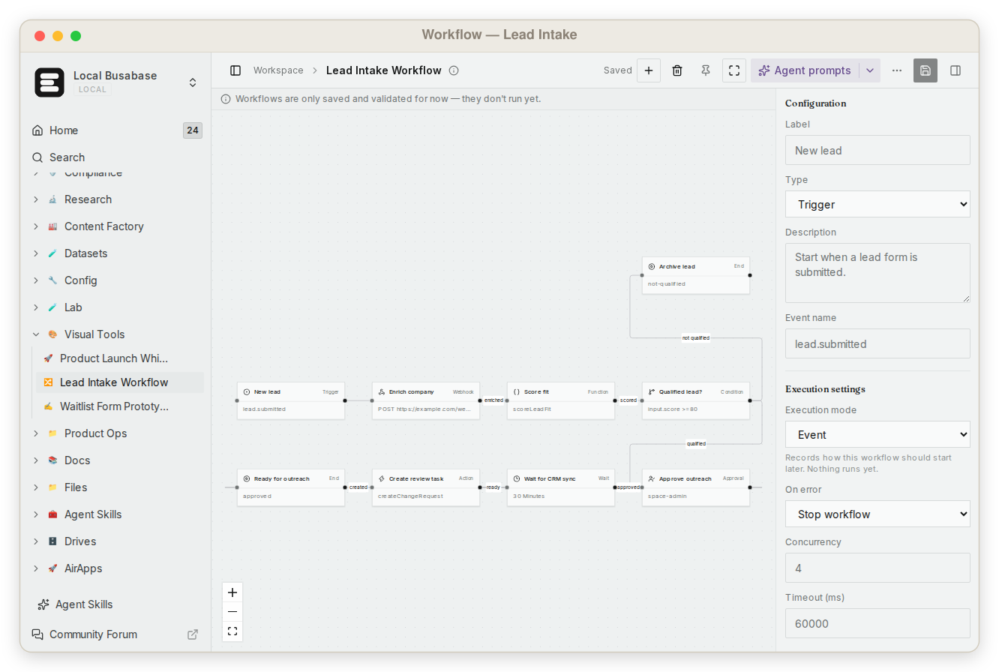 |
| **白板**——与 Agent 共享的可视化上下文 | **工作流**——和数据放在一起的流程 |

<details>
<summary><b>移动端</b></summary>

在 [Busabase 移动应用](https://github.com/busabase/busabase/tree/main/apps/busabase-mobile)里审核 Agent 的 Change Request、打开记录。

<p align="center">
  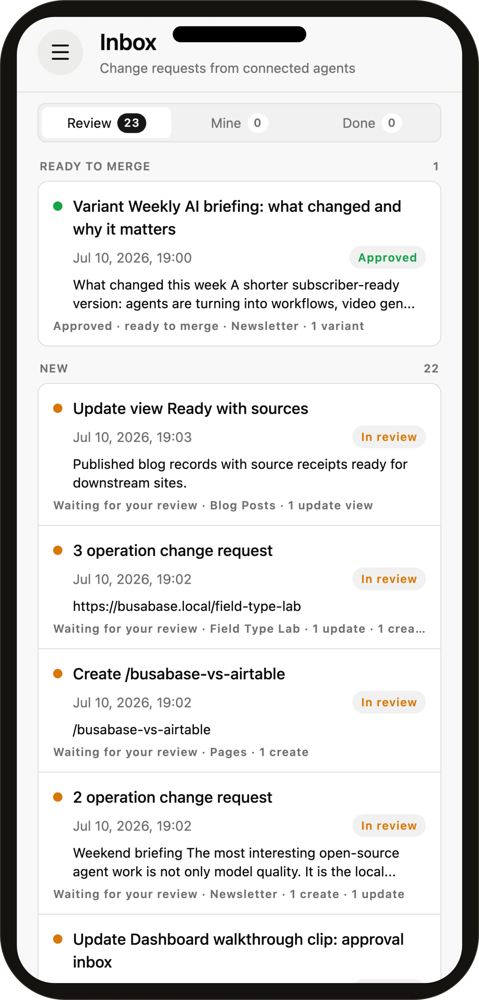
  &nbsp;&nbsp;
  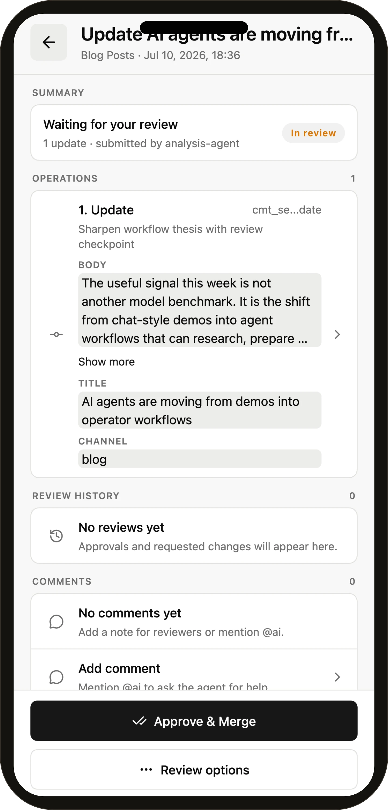
  &nbsp;&nbsp;
  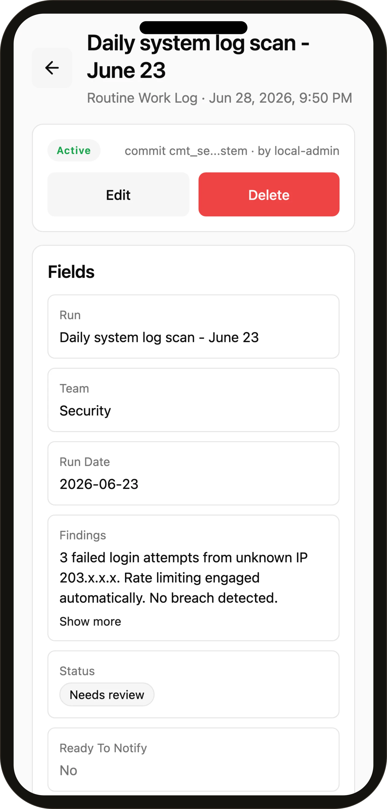
</p>

</details>

## 连接你的 Agent

支持 **Claude Code · Codex · Cursor · Gemini CLI · OpenCode · OpenClaw · Hermes · Buda AI · n8n**——或者你自己的程序。

| 接入方式 | 适合场景 |
| --- | --- |
| **Agent Skill** | 能遵循工作区说明的编码 Agent 与本地 CLI |
| **MCP** | 需要类型化工作区操作的 Agent 与 IDE |
| **OpenAPI / CLI** | 应用、脚本、自动化与自研 Agent |
| **Agents 视图（ACP）** | 带内联工具步骤和权限确认的对话式 session |

指南：[Claude Code](./claude-code.md) · [DeepSeek Harness](./deepseek-harness.md) · [Bring Your Own Agent](./bring-your-agent.md)。在侧边栏打开 **Agent Skills**，即可查看当前运行实例的 MCP endpoint 和 OpenAPI spec（`/api/v1/doc`）。Busabase 也收录在 [Glama MCP 连接器目录](https://glama.ai/mcp/connectors/com.busabase/busabase)中。

<details>
<summary><b>写入是怎么走的</b></summary>

```text
Agent 读取工作区上下文
        ↓
Agent 写入数据、文档、Skill 或应用改动——一律以变更请求的形式提交
        ↓
由你的权限决定：当场合并，或进 Inbox 等待审核
        ↓
无论哪种，改动都可查看、可追溯、可撤回
```

上限为 `changeRequest` 级别的凭据只能提议；单次调用可以用 `autoMerge: false` 主动选择审核；`busabase-cli install … --require-review` 会把 package 的内容留着等人批准。除此之外，有权写入的就直接写入——照样留下 diff 和历史。

</details>

## 使用场景

| 工作区 | Agent 做什么 | Busabase 里沉淀下什么 |
| --- | --- | --- |
| **软件交付** | 把反馈变成任务，写代码、测试、发布，开始下一轮 | 反馈、任务、需求文档、规范、发布说明 |
| **SEO 与内容** | 盯搜索趋势，做计划，在共享 CMS 里起草下一篇文章 | 关键词研究、写作 brief、草稿、已发布页面 |
| **CRM** | 调研潜在客户，跟进，记录每一次拜访 | 公司、联系人、拜访记录、跟进任务 |
| **团队记忆** | 记下决策、来源和运营上下文 | 下一个 Agent 可以直接起步的知识库 |
| **数据集** | 标注样本、附上证据、给质量打分 | 经过审核的训练与评测数据 |

从模板开始——整个应用、它的数据，以及告诉 Agent 怎么用它的说明书，一次装好：

```bash
busabase-cli install https://github.com/busabase/templates/tree/main/templates/busa-crm
```

浏览 [busabase.com/templates](https://busabase.com/templates) 和[全部使用场景](./use-cases_zh-CN.md)。

## 横向对比

| | 为谁设计 | 让 Agent 干活时缺什么 |
| --- | --- | --- |
| Airtable、Notion、Baserow、NocoDB | 人直接编辑 | 原生的 Agent 接入、共享的 Skill 与应用、提议边界 |
| Postgres | 应用读写存储 | 工作区界面、知识模型、审核闭环和溯源 |
| Agent 记忆、向量数据库 | 单个 Agent 回想上下文 | 人能打开、引用和修正的结构化事实 |
| **Busabase** | **人和 Agent 共建同一个工作区** | — |

Busabase 本身就跑在 Postgres（或内嵌 PGlite）上；它是构建在上面的工作区，而不是用来替换你应用的数据库。

## 版本

| 开源版 / Personal Desktop | Busabase Cloud |
| --- | --- |
| MIT 协议，免费 | 托管的多人工作区 |
| 本地 PGlite 与文件存储 | 托管 Postgres 与对象存储 |
| 无需登录，可离线使用 | Space、角色、权限与团队洞察 |
| 数据保留在本机 | Web 与移动端访问 |

**Cloud Connect** 可以通过认证 tunnel 把本地工作区连接到 [Busabase Cloud](https://busabase.com)——数据留在你的机器上，本地 Agent 也在本机运行。详见[定价](https://busabase.com/pricing)。

## 架构

<div align="center">
  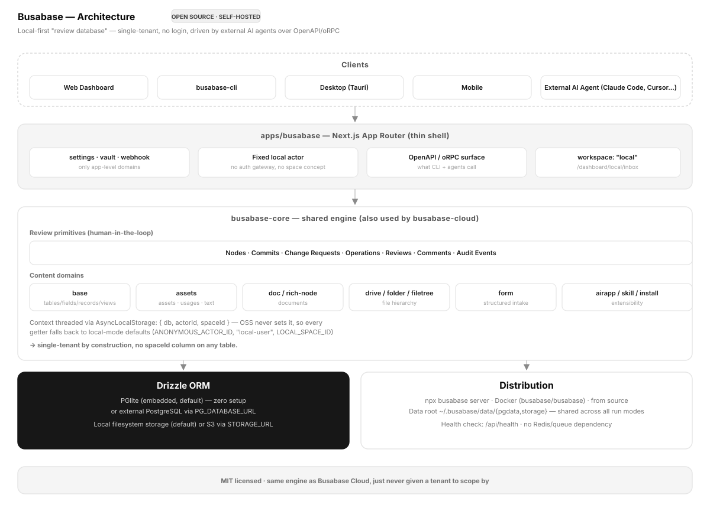
</div>

`apps/busabase` 是本地单工作区的 Next.js shell。工作区引擎在 `packages/busabase-core`：节点、记录、文件树、富节点类型、审核原语、搜索、Agents 和 API contract，通过 MCP、OpenAPI 和 `busabase-cli` 开放出来。Cloud 运行同一个引擎，并加上多租户身份、权限和托管存储。

**安全**：开源 server 是为可信的本机或私有网络设计的。不要在没有认证和反向代理的情况下，把写入 endpoint 暴露到公网；需要远程访问时，请使用限定范围的凭据和 Cloud Connect。

## 参与贡献

```bash
pnpm install
pnpm --filter busabase dev
pnpm --filter busabase typecheck
pnpm --filter busabase lint:err
```

欢迎在 [Issues](https://github.com/busabase/busabase/issues) 和 [Discussions](https://github.com/busabase/busabase/discussions) 提交 bug、想法、文档和 PR。

## 社区

[官网](https://busabase.com) · [文档](https://busabase.com/docs) · [社区论坛](https://community.busabase.com/community) · [YouTube](https://www.youtube.com/@BusabaseAI) · [X](https://x.com/Busabase4agent) · [LinkedIn](https://www.linkedin.com/company/busabase/)

如果 Busabase 对你有用，点个 ⭐ 能帮更多做 Agent 的人找到它。

<a href="https://github.com/busabase/busabase/graphs/contributors"></a>

## License

[MIT](../../../LICENSE) © Busabase
