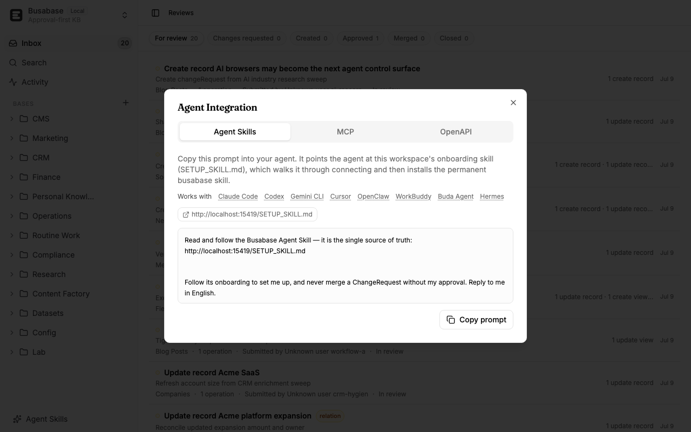
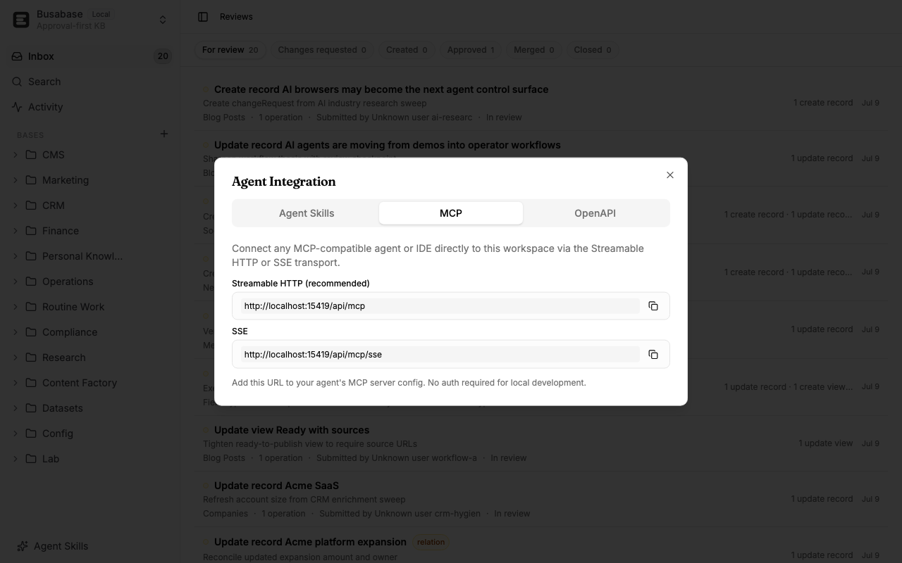

# Bring Your Own Agent

[← Back to the README](../README.md)

Busabase has **no built-in model**. It runs locally and speaks plain HTTP, so you point your own agent at it — Claude Code, Cursor, Codex, Gemini CLI, or anything that can call a REST API. The agent *proposes* changes as **Change Requests**; you stay the one who approves and merges. Everything stays on your machine.

You connect in two moves: **paste one prompt** to onboard, then **install a permanent skill** so the agent just knows Busabase every session.



## Onboard with one prompt

1. **Copy the prompt.** In the dashboard sidebar open **Agent Skills** and copy the short prompt. It points your agent at your local `http://localhost:15419/SETUP_SKILL.md` — a self-contained onboarding script — and tells it to reply in your language and never merge without your approval.
2. **Paste it into your agent.** Instead of dumping commands, it opens with a short welcome — what Busabase is, why the review gate matters — and asks **"what do you want to manage?"** Answer in a sentence (e.g. *"my sales leads / a CRM"*).
3. **It connects.** No account or API key is needed locally; the agent confirms the local server is up and saves the base URL to `~/.busabase/.env` so every future session — and the installed skill — can read it.
4. **It sketches the structure, you confirm, then it builds.** Before creating anything, the agent shows you the planned shape — folders, bases, fields, relations — and waits for your go-ahead. On approval it creates the bases (always more than one node, so the workspace never opens empty); see them in **Graph View**.

   

5. **It seeds sample records — and you approve the first one together.** Starter records arrive as **Change Requests** (never written directly). The agent walks you through approving and merging the first one from the **Inbox**, so you watch the propose → review → merge loop close end to end.

   

## Install the skill for everyday use

Onboarding ends by installing a small, permanent **busabase** skill, so you never re-paste the prompt again:

```bash
npx skills add busabase/skills
```

The generic [`skills` CLI](https://github.com/busabase/skills) detects your agent (Claude Code, Cursor, …) and installs it globally. The skill is thin and evergreen — it reads `~/.busabase/.env` and points at your live API for the full surface, so it never goes stale.

## Everyday: three ways to talk to it

Once connected, pick whichever fits the task — all three read the same `~/.busabase/.env`:

| Method | Best for |
| --- | --- |
| **`busabase-cli`** | The ergonomic everyday loop: `npx busabase-cli bases list`, `change-requests review --change-request-id crq_123 --verdict approved`, `change-requests merge --change-request-id crq_123`. |
| **`curl`** | Quick, zero-install calls against `http://localhost:15419/api/v1`. |
| **MCP / OpenAPI** | The complete, current surface — connect over MCP at `/api/mcp`, or read `/api/v1/openapi.json`. |



The loop never changes: **list → propose a Change Request → you review → merge → read back**. Never bypass review unless you explicitly ask for a direct merge.

---

See also: [Use Cases](./use-cases.md) · [skills repo](https://github.com/busabase/skills)
