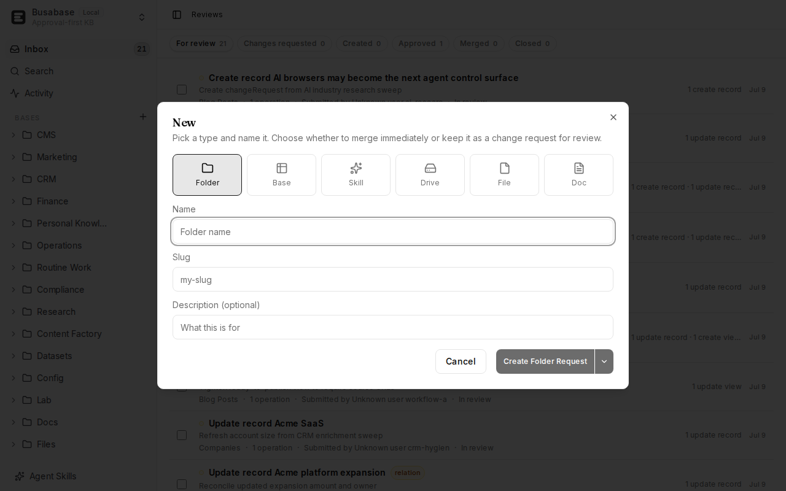
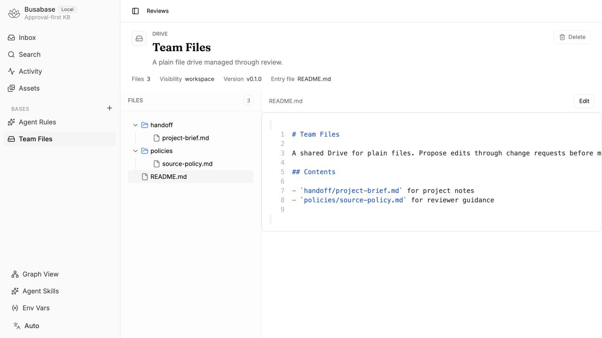
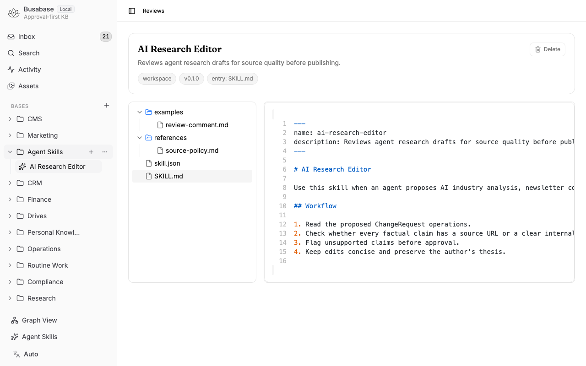
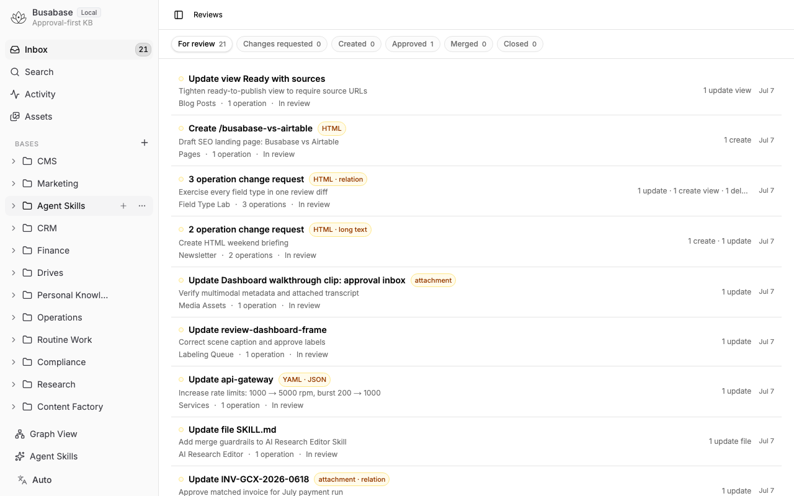

# Busabase Node Types

Busabase organizes trusted knowledge as nodes. Every node appears in the left navigation and can be changed through the same Change Request review flow.

## Current Types

| Type | Use it for | Review behavior |
| --- | --- | --- |
| Folder | Navigation groups for related nodes | Rename, move, create, delete, and restore through node operations |
| Base | Structured records with typed fields | Field, view, record, and schema changes go through review |
| Skill | Agent-readable file trees | Files and metadata are stored in object storage and changed through file-tree operations |
| Drive | Plain file collections | Files are stored in object storage with a seeded `README.md`; no `SKILL.md` or `skill.json` |
| AirApp | Agent-authored, human-runnable web apps | Files are stored the same way as Skill/Drive; the node detail view adds a Run panel that executes the app in-browser |
| Doc | Single approved document pages | Document updates are reviewed before merge |

## Drive

Drive is a pure file-tree node. It uses the same file listing, read, change-request, and merge machinery as Skill, but its seed is intentionally minimal: one `README.md` file.

## Skill

Skill remains backward-compatible. Existing `/skills/*` API routes, `SkillVO`, contract schemas, and core handler exports keep the same names and shapes. The implementation now delegates to the shared file-tree kind.

## AirApp

AirApp is also a file-tree node — same file listing, read, change-request, and merge machinery as Skill and Drive. An agent writes or edits the app's files through the normal ChangeRequest flow; a human opens the node and sees three tabs: **App** (the default — a Run button and a live preview iframe), **Files** (a read-only file browser + code viewer), and **Logs** (streaming install/start output). Clicking Run executes the app in the reviewer's own browser via [Nodepod](https://github.com/R1ck404/Nodepod) (`@scelar/nodepod`), a Web Worker + Service Worker based Node.js runtime — Nodepod installs the app's declared dependencies, starts its server, streams the output into the Logs tab, and once the server reports ready, the App tab's preview iframe points at a same-origin virtual URL (`/__virtual__/...`) serving it.

**What runs inside Nodepod:** Nodepod reimplements Node's API surface to run inside a browser Web Worker — it is not a full Node.js. Anything needing a real OS process, a real native binary, or a real headless browser will not work, no matter how it's configured; pure JavaScript (plus WASM-compiled fallbacks) generally does.

- **Works:** a pure static HTML/CSS/JS project with no `package.json` dependencies, served by a five-line `node:http` file server (the seed template's *simplest* demo — no framework needed at all, and no runner-level special-casing either: `npm install` with nothing to install is reported by Nodepod itself as `added 0 packages in 0.0s`, so this goes through the exact same `npm install && npm run dev` path as every other demo); a plain Node HTTP server with a real dependency (the Hono + `@hono/node-server` seed template, no bundler); `node:sqlite`; Vite pinned to `vite@7.3.1` (older Vite crashes on boot with `Cannot destructure property 'createServer'`) either with `@vitejs/plugin-react` (Babel-based Fast Refresh — fixed in Nodepod `1.9.6`, re-verified working on `1.9.9`) or by skipping it and configuring JSX via Vite's own esbuild transform instead (`esbuild: { jsx: 'automatic' }`, no Fast Refresh but no Babel dependency either). Hono mounted as Vite middleware also works under the same pin.
- **Confirmed broken:** `@vitejs/plugin-react-swc` → `Failed to load native binding` (SWC ships a native binary Nodepod can't load; still broken, identical error, as of `1.9.9`). Any tool needing a platform-native binary at install/boot time should be assumed broken the same way. HeyGen's [HyperFrames](https://github.com/heygen-com/hyperframes) CLI installs cleanly but `hyperframes preview` crashes with `TypeError: require is not a function` (also still broken as of `1.9.9`); its full render pipeline (Puppeteer + FFmpeg) is architecturally incompatible regardless. Next.js hasn't been tested directly — its default compiler (SWC) is still broken for the reason above, but its Babel fallback no longer is.

The seed gallery keeps the working demos (Pure HTML, Hono, two Vite+React variants, Hono+Vite, SQLite) *and* the still-broken ones (SWC, HyperFrames) as live, runnable nodes rather than deleting them — clicking Run on a broken one reproduces the real upstream failure, and if Nodepod fixes it, the demo starts succeeding without any change on the Busabase side, exactly like what happened with the Babel demo.

**Calling busabase's own API from inside a running app requires the `/__busabase_api__/` bridge — a plain relative `fetch()` does not work.** The preview does resolve to a same-origin URL (confirmed via Nodepod's own service worker — not a cross-origin sandbox), so it initially looked like the running app's own `fetch()` calls back to busabase would ride along on the current user's session cookie automatically. Tested directly against a real authenticated busabase-cloud session with a purpose-built probe AirApp: a plain `fetch("/api/rpc/...")` — or any other real busabase route, e.g. `/api/health` — comes back as a flat `404 Not Found` from Nodepod's own virtual server, never reaching the real network. Nodepod's service worker intercepts every request from a claimed preview client and answers it from the sandboxed app's own routes (or its 404 fallback when nothing matches) instead of passing it through, regardless of path — so this has nothing to do with cookies, `SameSite`, or auth; the request simply never leaves the sandbox.

To fix this, `@scelar/nodepod` is patched (`patches/@scelar__nodepod@1.9.9.patch`, applied via pnpm's `patchedDependencies`) to add a reserved bridge prefix to its service worker's fetch dispatch, ahead of any pod-claiming logic: a request to `/__busabase_api__/<real-path>` is never routed to the sandboxed app — the SW strips the prefix and replays the request against `<real-path>` on the real origin with `credentials: "include"`, so it's a genuine browser-native `fetch()` that carries the current user's (possibly `httpOnly`) session cookie automatically. A running app calling busabase's own API must therefore prefix every such call, e.g. `fetch("/__busabase_api__/api/rpc/core/changeRequests/counts", { method: "POST", ... })` instead of `fetch("/api/rpc/core/changeRequests/counts", ...)`. Verified end-to-end against a real busabase-cloud session: the same probe AirApp that got a flat `404` on the plain path got a real `200` with real data through the bridge.

The prefix is deliberately reserved and namespaced (not a bare `/api/*` passthrough) because several seed demos define their own `/api/*` routes on their own sandboxed server (the Hono demo's `/api/greeting`, the SQLite demo's `/api/items`) — those must keep resolving inside the sandbox, not get redirected to busabase's real backend.

**This bridge grants a running AirApp the same API access as the reviewer who clicks Run — there is currently no scoping, allowlist, or capability restriction.** Any agent-authored AirApp that reaches Change Request review and gets merged can, once run, read and write anything the merging reviewer's account can reach through `/api/rpc/*` or `/api/v1/*`, silently, with no separate consent step beyond the normal review. Treat this the same as reviewing any other code change that will execute with your account's privileges — a reviewer who doesn't read the JS bundle for hidden API calls won't catch one from the Run panel alone.

Running always reflects the node's current (merged/HEAD) file tree — previewing a pending, not-yet-merged ChangeRequest's files isn't supported yet for any node type in Busabase.

**Run requires a secure context.** Service Workers — what Nodepod uses to intercept preview/virtual-server requests — only register in a browser "secure context": `https:`, or the literal hostname `localhost`/`127.0.0.1`/`[::1]`. Accessing the dashboard over plain HTTP through any other hostname (a LAN IP, a custom DNS name mapped to your machine, a tunnel domain) is **not** a secure context even though it resolves to the same server, so the service worker silently fails to register and clicking Run 404s. Use `https://` or `http://localhost:<port>` for local development.

## Review Flow

Node changes, file changes, and metadata changes all land in the Inbox as reviewable operations. Reviewers can inspect the proposed change, request edits, approve it, and merge it into the trusted tree.

