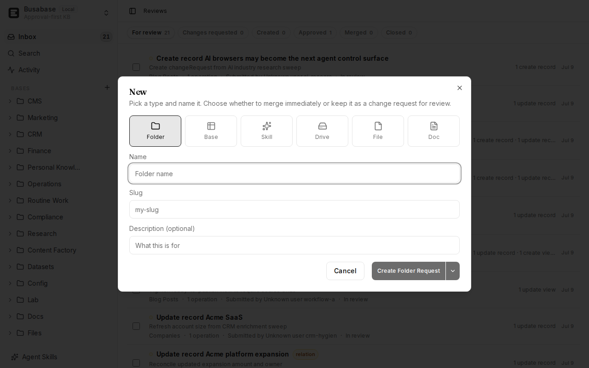
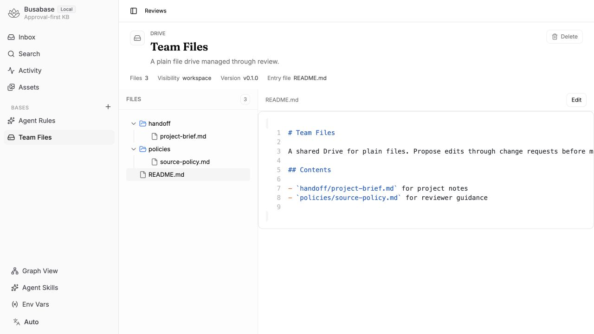
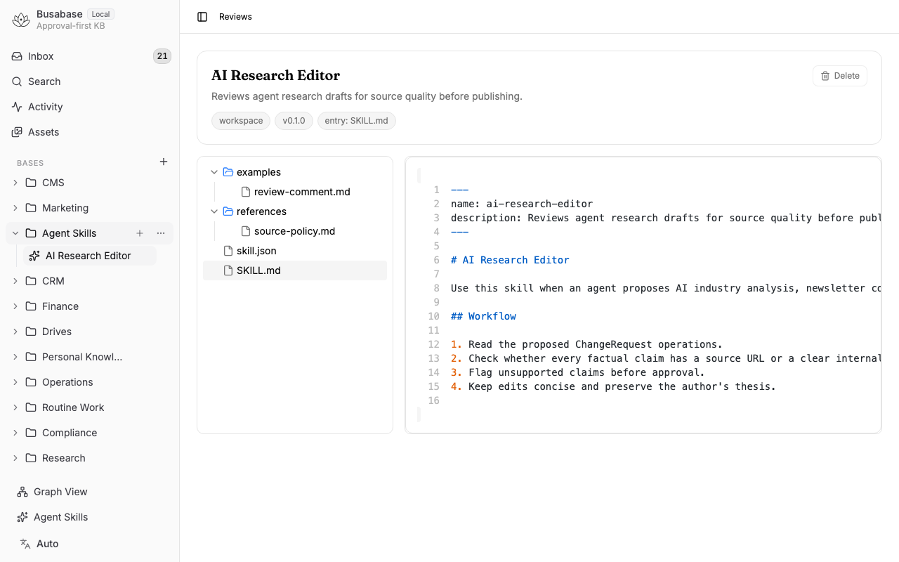
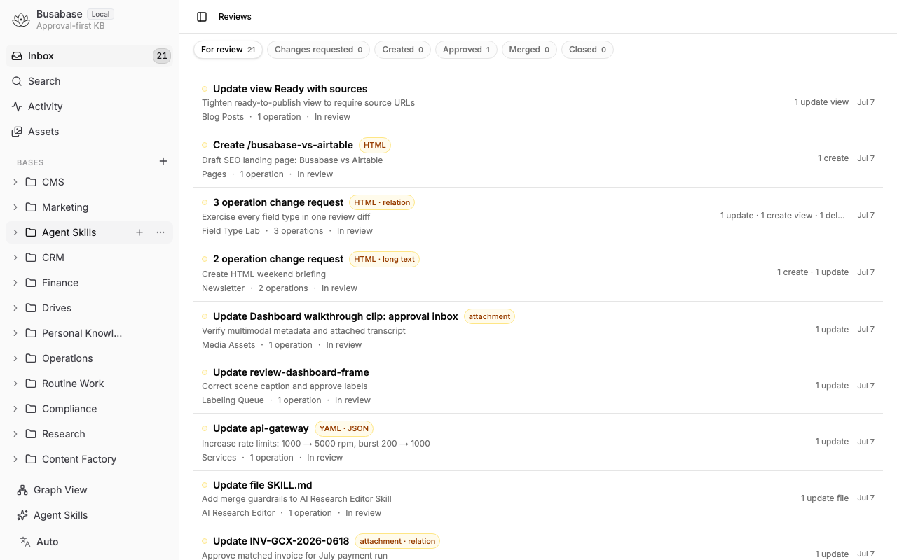

# Busabase Node Types

Busabase organizes trusted knowledge as nodes. Every node appears in the left navigation and can be changed through the same Change Request review flow.



## Current Types

| Type | Use it for | Review behavior |
| --- | --- | --- |
| Folder | Navigation groups for related nodes | Rename, move, create, delete, and restore through node operations |
| Base | Structured records with typed fields | Field, view, record, and schema changes go through review |
| Skill | Agent-readable file trees | Files and metadata are stored in object storage and changed through file-tree operations |
| Drive | Plain file collections | Files are stored in object storage with a seeded `README.md`; no `SKILL.md` or `skill.json` |
| AirApp | Agent-authored, human-runnable web apps | Files are stored the same way as Skill/Drive; the node detail view adds a Run panel that executes the app in-browser |
| Doc | Single approved document pages | Document updates are reviewed before merge |

## Drive

Drive is a pure file-tree node. It uses the same file listing, read, change-request, and merge machinery as Skill, but its seed is intentionally minimal: one `README.md` file.



## Skill

Skill, Drive, and AirApp share the `/file-trees` API. Pass `type=skill` when listing or resolving a slug; node IDs resolve their kind directly. The CLI keeps its separate `skills`, `drives`, and `airapps` command groups.



## AirApp

AirApp is also a file-tree node — same file listing, read, change-request, and merge machinery as Skill and Drive. An agent writes or edits the app's files through the normal ChangeRequest flow; a human opens the node and sees three tabs: **App** (the default — a Run button and a live preview iframe), **Files** (a read-only file browser + code viewer), and **Logs** (streaming install/start output). Clicking Run executes the app through the selected **runtime engine** — the Run panel has an engine picker (default **`browser`**), shown only where a deployment offers more than one — and streams its install/start output into the Logs tab; once the app's server reports ready, the App tab's preview iframe points at it. Each engine resolves the app's **RunPlan** — an install command and a start command, taken from an optional `airapp.json` or inferred from the file tree — then runs it. For a Node app with no manifest that is still exactly `npm install` then `npm run dev`; a Python app gets a per-run virtualenv and its own start command instead. The engines differ in *where* that happens and *what capabilities the running app gets*, never in what language they can run — except `browser`, which is a JavaScript runtime in a browser tab and therefore Node-only by construction.

### Runtime engines (pluggable, divided by capability)

There is a shared `AirAppRunner` interface (`mount → install → start`, plus `onLog`/`onReady`) with **three** implementations, named for where the code runs rather than for the product implementing it (`nodepod-runner.ts`, `sandock-runtime.ts`) — so swapping a provider is an adapter change, not a wire-format change. The engines are **not** interchangeable — they occupy deliberately different niches along a trade-off triangle of **runtime fidelity ↔ isolation ↔ live preview**, and the Run panel's engine picker labels each with its trade-off:

| Engine | Runs where | Runtime fidelity | Isolation | Live preview | busabase data access (`/api/v1`, `createBusabaseClient`) | Best for |
| --- | --- | --- | --- | --- | --- | --- |
| **`browser`** (Nodepod) | In the reviewer's **browser** (Web Worker + Service Worker), same-origin with busabase | Reimplemented Node API surface — **not** a full Node.js (see below) | Browser sandbox | ✅ Yes (SW-served) | ✅ **Yes** — the SW owns the origin and passes `/api/v1/*` straight through; a running app reads the workspace's own live data as the logged-in reviewer | Live-data AirApps (dashboards, CRM widgets, anything that calls busabase's own API). The only engine every deployment always offers, and the only one restricted to JavaScript |
| **`local`** (bare host process) | A **bare** real OS process on the machine hosting busabase — spawned directly, **not** isolated (trust model is that host). Runs whatever the app's `RunPlan` says: Node, Python, anything the host has | Real OS process — real native binaries, real interpreters, real package managers | ⚠️ None (host trust) | ✅ **Yes** — reverse proxy | ✅ **Yes** — busabase **reverse-proxies** the real localhost process to a same-origin sub-path (`/api/airapp-preview/{nodeId}/`), so the app's `/api/v1/…` calls land on busabase's own API with the browser's cookie, no relay needed. A bare process's port IS host-reachable, so this works. Caveats: the app must use **relative** asset paths (an arbitrary app hard-coding absolute `/foo` paths won't render under the sub-path proxy, unlike the browser engine's origin-owning SW); no WebSocket/HMR proxying | Heavier AirApps needing true Node compatibility, or any non-JavaScript app. Offered **only** where the host is the user's own machine (`allowHostProcesses`) — never on shared infrastructure |
| **`remote`** (Sandock today) | A separate machine provisioned **per run**, reached over HTTP. Nothing executes on the busabase host | Real OS process — a container is a machine with a shell, so no per-language support to add | ✅ Yes — a different machine entirely | ✅ **Yes** — the same reverse-proxy path, pointed at the provisioned machine's exposed port | ✅ **Yes** — same same-origin sub-path as `local` | Isolated execution **with** a live preview, and the only option for a cloud deployment that will not run app processes on itself. Requires `SANDOCK_BASE_URL` + `SANDOCK_API_KEY`, and each run is somebody's bill |

**The trade-off, and why there are exactly three:** the axis is *whose machine runs the code*, and each point on it buys something the others can't. `browser` gives up native binaries and every non-JS language, and gets in return a run that is free, instant, and impossible to misconfigure. `local` gives up isolation and gets full fidelity plus a preview. `remote` gives up being free and gets isolation plus full fidelity plus a preview. 

A fourth engine, `srt` (`@anthropic-ai/sandbox-runtime`), used to sit between `local` and `remote`: the same host process wrapped in an OS sandbox (seccomp/bubblewrap on Linux, `sandbox-exec` on macOS). It has been **removed**. Network-isolating the process also made its listening port unreachable from the host reverse proxy, so it could run an app and stream its logs but never preview one — and a picker whose entire purpose is "see your app running" has nothing to do with such an engine. It was consequently never offered by any deployment, and `remote` covers the same need without the dead end: it gets isolation *and* a preview by running somewhere that can expose a port back. Isolated-execution-with-logs-only, if it is ever wanted again, is a capability of `remote`, not a separate engine.

The `browser` and server-side engines both let a running app reach `/api/v1`, via **different mechanisms**: the browser engine's in-browser Service Worker passes the path through, while `local`/`remote` are reverse-proxied onto busabase's own origin so the path simply resolves.

**Why a reverse proxy for the server-side engines (not a second Service Worker):** the `local` preview is a real OS process on `http://localhost:{port}` — a *different origin* from busabase, so its iframe couldn't share busabase's session/origin directly. Rather than replicating Nodepod's SW bridge (which would mean either a *second* Service Worker fighting Nodepod's over the same origin scope — SWs don't cleanly co-exist on one scope — or folding both routing modes into one busabase-owned SW that duplicates the vendored Nodepod patch), busabase reverse-proxies the localhost process to a same-origin sub-path, after which the app's `/api/v1/…` calls simply resolve against busabase's own API — no relay route at all. This is the natural fit for a real-process engine (one server-side layer, no origin-scope collision with Nodepod's SW) and generalizes cleanly to any future out-of-origin engine (which is exactly what the `remote` engine turned out to be). Trade-offs: the proxied app must use relative asset paths, and the port registry is single-process (a run and its proxy requests must hit the same Next.js server) — the same limitation class the removed `srt` engine's process-wide sandbox singleton had.

**What runs inside Nodepod:** Nodepod reimplements Node's API surface to run inside a browser Web Worker — it is not a full Node.js. Anything needing a real OS process, a real native binary, or a real headless browser will not work, no matter how it's configured; pure JavaScript (plus WASM-compiled fallbacks) generally does.

- **Works:** a pure static HTML/CSS/JS project with no `package.json` dependencies, served by a five-line `node:http` file server (the seed template's *simplest* demo — no framework needed at all, and no runner-level special-casing either: `npm install` with nothing to install is reported by Nodepod itself as `added 0 packages in 0.0s`, so this goes through the exact same `npm install && npm run dev` path as every other demo); a plain Node HTTP server with a real dependency (the Hono + `@hono/node-server` seed template, no bundler); `node:sqlite`; Vite pinned to `vite@7.3.1` (older Vite crashes on boot with `Cannot destructure property 'createServer'`) either with `@vitejs/plugin-react` (Babel-based Fast Refresh — fixed in Nodepod `1.9.6`, re-verified working on `1.9.9`) or by skipping it and configuring JSX via Vite's own esbuild transform instead (`esbuild: { jsx: 'automatic' }`, no Fast Refresh but no Babel dependency either). Hono mounted as Vite middleware also works under the same pin.
- **Confirmed broken:** `@vitejs/plugin-react-swc` → `Failed to load native binding` (SWC ships a native binary Nodepod can't load; still broken, identical error, as of `1.9.9`). Any tool needing a platform-native binary at install/boot time should be assumed broken the same way. HeyGen's [HyperFrames](https://github.com/heygen-com/hyperframes) CLI installs cleanly but `hyperframes preview` crashes with `TypeError: require is not a function` (also still broken as of `1.9.9`); its full render pipeline (Puppeteer + FFmpeg) is architecturally incompatible regardless. Next.js hasn't been tested directly — its default compiler (SWC) is still broken for the reason above, but its Babel fallback no longer is.

The seed gallery keeps the working demos (Pure HTML, Hono, two Vite+React variants, Hono+Vite, SQLite) *and* the still-broken ones (SWC, HyperFrames) as live, runnable nodes rather than deleting them — clicking Run on a broken one reproduces the real upstream failure, and if Nodepod fixes it, the demo starts succeeding without any change on the Busabase side, exactly like what happened with the Babel demo.

**A running app calls busabase's own API at the ordinary `/api/v1/…` path — the same path it would use anywhere else.** That is deliberate: the identical AirApp source runs against a developer's own `npm run dev` server, inside the dashboard's Run panel, under the Local engine, and inside a public embed, with no environment switch in the code.

Getting there took a Nodepod patch, because the default behaviour is the opposite. Tested against a real authenticated busabase-cloud session with a purpose-built probe AirApp, a plain `fetch("/api/…")` — including real busabase routes like `/api/health` — came back as a flat `404 Not Found` from Nodepod's own virtual server, never reaching the real network: its service worker intercepts every request from a claimed preview client and answers it from the sandboxed app's own routes (or its 404 fallback), regardless of path. Nothing to do with cookies, `SameSite`, or auth — the request simply never left the sandbox.

So `@scelar/nodepod` is patched (`patches/@scelar__nodepod@1.9.9.patch`, applied via pnpm's `patchedDependencies`) to check `/api/v1/*` in its service worker's fetch dispatch ahead of any pod-claiming logic and let it through to the real origin. Because it is a genuine browser-native same-origin fetch, the current user's (possibly `httpOnly`) session cookie rides along automatically — `/api/v1` accepts the ambient session for same-origin browser requests, alongside the `Authorization: Bearer` key that CLI/SDK callers use.

`/api/v1/*` specifically — not a bare `/api/*` passthrough — because several seed demos define their own `/api/*` routes on their own sandboxed server (the Hono demo's `/api/greeting`, the SQLite demo's `/api/items`), and those must keep resolving inside the sandbox. `/api/v1` is reserved: an AirApp must not define its own route there.

**Prefer `busabase-sdk`'s `createBusabaseClient` over hand-writing `fetch()` calls.** It is the same npm package and the same function `busabase-cli` and server code already use — fully typed against the contract, with real error decoding:

```ts
import { createBusabaseClient } from "busabase-sdk";

// Same origin: no apiKey, the ambient session authenticates. Works identically
// self-hosted and on Busabase Cloud — /api/v1 is stable across both.
const client = createBusabaseClient({ baseUrl: window.location.origin });
const counts = await client.changeRequests.counts();
```

**Running an AirApp grants it the same API access as the reviewer who clicks Run — there is no scoping, allowlist, or capability restriction on that path.** Any agent-authored AirApp that reaches Change Request review and gets merged can, once run, read and write anything the merging reviewer's account can reach through `/api/v1/*`, silently, with no separate consent step beyond the normal review. Treat this the same as reviewing any other code change that will execute with your account's privileges — a reviewer who doesn't read the JS bundle for hidden API calls won't catch one from the Run panel alone.

**A public embed is the exception, and fails closed.** An embedded AirApp's `/api/v1` calls are relayed by the embed host page to a capability-scoped, read-only route that strips `cookie`/`authorization` server-side, so it sees the embed's scope rather than the viewer's session. The service-worker patch refuses (`403`) any `/api/v1` request it cannot positively attribute to a non-embed pod, so a request engineered to bypass the relay — a raw `XMLHttpRequest`, say — does not fall back to the viewer's session.

Running always reflects the node's current (merged/HEAD) file tree — previewing a pending, not-yet-merged ChangeRequest's files isn't supported yet for any node type in Busabase.

**Run requires a secure context.** Service Workers — what Nodepod uses to intercept preview/virtual-server requests — only register in a browser "secure context": `https:`, or the literal hostname `localhost`/`127.0.0.1`/`[::1]`. Accessing the dashboard over plain HTTP through any other hostname (a LAN IP, a custom DNS name mapped to your machine, a tunnel domain) is **not** a secure context even though it resolves to the same server, so the service worker silently fails to register and clicking Run 404s. Use `https://` or `http://localhost:<port>` for local development.

## Review Flow

Node changes, file changes, and metadata changes all land in the Inbox as reviewable operations. Reviewers can inspect the proposed change, request edits, approve it, and merge it into the trusted tree.


